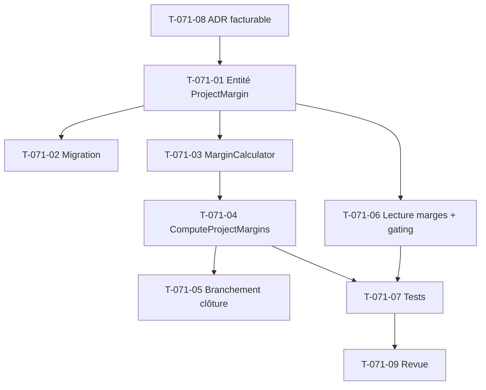

# Tâches — US-071 : Moteur de marge réelle par projet à la clôture

## Informations US
- **Epic** : EPIC-005 · **Persona** : P6 (Directeur financier), P2 (Marc) · **Points** : 8 · **Sprint** : sprint-009-finance-rentabilite

## Décision d'entrée (à acter avant dev)
**Produit facturable = CA reconnu** (proxy PO). Le CA reconnu par projet est déjà figé au Sprint 8
(`fact_project_revenue`). Marge = CA reconnu − coût valorisé. → **ADR léger** (T-071-08) en préambule.

## Vue d'ensemble des tâches

| ID | Type | Tâche | Estimation | Dépend de | Statut |
|----|------|-------|------------|-----------|--------|
| T-071-08 | [DOC] | **ADR léger** « facturable = CA reconnu » (périmètre, limite, évolution) | 1h | - | 🔲 |
| T-071-01 | [DB] | Entité snapshot `ProjectMargin` (tenant, period, projet, revenue/cost/margin cents, valuedCount, partial, closedAt) + port repo | 3h | T-071-08 | 🔲 |
| T-071-02 | [DB] | Migration `project_margin` (RLS tenant, unique `(tenant,period,project)`, écriture réservée au moteur) | 2h | T-071-01 | 🔲 |
| T-071-03 | [BE] | `MarginCalculator` (domaine pur) : marge = CA − coût, taux de marge, borne CA=0 | 2h | T-071-01 | 🔲 |
| T-071-04 | [BE] | Use case `ComputeProjectMargins` : à la clôture, agrège CA (`fact_project_revenue`) + coût (join `time_entry_valuation ↔ time_entry`) par projet → fige `ProjectMargin` (partiel si MISSING_RATE) | 4h | T-071-03 | 🔲 |
| T-071-05 | [BE] | Branchement clôture (US-057) : déclenche `ComputeProjectMargins` en async à la clôture de période (réutilise le pattern messenger/coalescence T-060-09) | 2h | T-071-04 | 🔲 |
| T-071-06 | [BE] | Lecture des marges figées par tenant/période (repo + gating HAB-1 coût/marge) | 2h | T-071-01 | 🔲 |
| T-071-07 | [TEST] | Tests unitaires : `MarginCalculator`, `ComputeProjectMargins` (nominal, non-rétroactivité INV-2, partiel CA-4, gating CA-5) | 3h | T-071-04, T-071-06 | 🔲 |
| T-071-09 | [REV] | Revue de clôture (`symfony-reviewer`) | 1h | T-071-07 | 🔲 |

**Total estimé : 20h** _(mobile hors périmètre — lecture desktop uniquement, cohérent S8)_

## Points d'accroche (réutilisation Sprint 8)
- **CA reconnu** : `fact_project_revenue` (grain tenant/période/projet, `RevenueRecognized`).
- **Coût valorisé par projet** : `DoctrineTimeEntryValuationRepository::projectBreakdownFor()` (join snapshot↔time_entry) + `ProjectValuationLine`.
- **Clôture** : `ClosePeriod` / `PeriodClosed` (US-057) comme déclencheur ; async via messenger (routing existant).
- **Non-rétroactivité** : figer la marge en snapshot `project_margin` (comme `time_entry_valuation`), jamais recalculée hors réouverture.

## Graphe de dépendances

## Résumé
| Type | Tâches | Heures |
|------|--------|--------|
| [DOC] | 1 | 1h |
| [DB] | 2 | 5h |
| [BE] | 4 | 10h |
| [TEST] | 1 | 3h |
| [REV] | 1 | 1h |
| **TOTAL** | **9** | **20h** |
