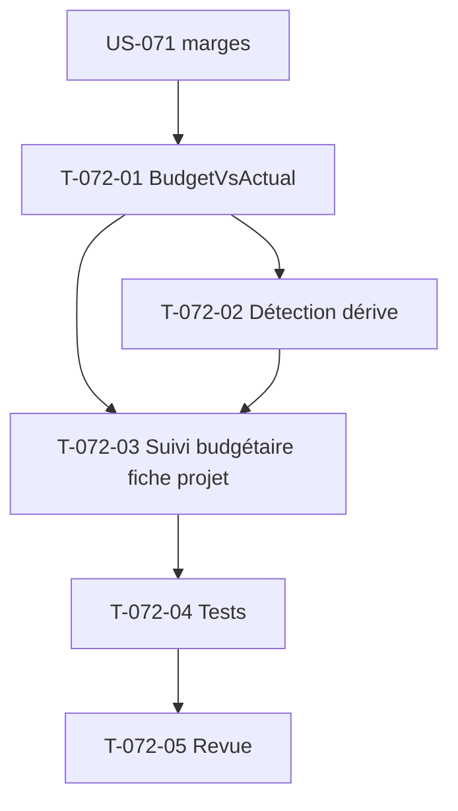

# Tâches — US-072 : Budget vs réalisé et alerte de dérive financière

## Informations US
- **Epic** : EPIC-005 · **Persona** : P2 (Marc), P6 (Directeur financier) · **Points** : 5 · **Sprint** : sprint-009-finance-rentabilite

## Vue d'ensemble des tâches

| ID | Type | Tâche | Estimation | Dépend de | Statut |
|----|------|-------|------------|-----------|--------|
| T-072-01 | [BE] | Service `BudgetVsActual` : rapproche budget projet (US-033) et réalisé valorisé (marge US-071) ; écarts absolus/%, consommation budgétaire | 3h | US-071 (T-071-06) | 🔲 |
| T-072-02 | [BE] | Détection de dérive financière : seuil paramétrable (US-018 si dispo, sinon paramètre tenant, défaut 5 pts OBJ-6) ; distincte de la dérive de charge (US-036) | 2h | T-072-01 | 🔲 |
| T-072-03 | [FE-WEB] | Section « Suivi budgétaire » sur la fiche projet : budget vs réel (coût/CA/marge), écarts colorés + libellé (a11y US-065), badge de dérive ; gating coût HAB-1 | 3h | T-072-01, T-072-02 | 🔲 |
| T-072-04 | [TEST] | Tests fonctionnels : comparaison nominale, alerte au franchissement de seuil, projet sans budget (CA-4), gating | 2h | T-072-03 | 🔲 |
| T-072-05 | [REV] | Revue de clôture (`symfony-reviewer`) | 1h | T-072-04 | 🔲 |

**Total estimé : 11h**

## Points d'accroche
- **Budget projet** : US-033 (`budget_cents`, contract_type sur `Project` — déjà présent) et US-036 (atterrissage/dérive de charge) — **mutualiser** le mécanisme d'alerte si US-036 en fournit un.
- **Réalisé** : marge figée d'US-071 (`ProjectMargin`).
- **Seuil** : idéalement US-018 (référentiel seuils) ; repli paramètre tenant `finance.margin_drift_threshold_points` (défaut 5).

## Graphe de dépendances

## Résumé
| Type | Tâches | Heures |
|------|--------|--------|
| [BE] | 2 | 5h |
| [FE-WEB] | 1 | 3h |
| [TEST] | 1 | 2h |
| [REV] | 1 | 1h |
| **TOTAL** | **5** | **11h** |
