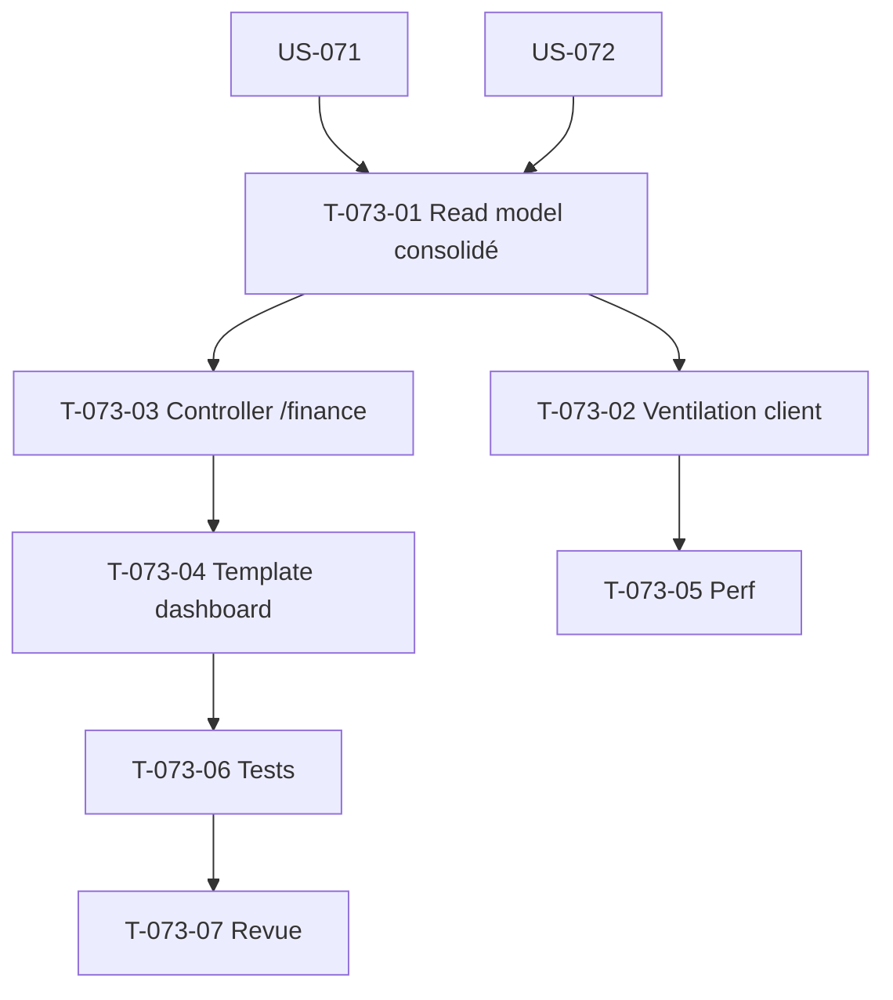

# Tâches — US-073 : Tableau de bord finance consolidé (direction)

## Informations US
- **Epic** : EPIC-005 · **Persona** : P6 (Directeur financier), P7 (Dirigeant) · **Points** : 8 · **Sprint** : sprint-009-finance-rentabilite

## Vue d'ensemble des tâches

| ID | Type | Tâche | Estimation | Dépend de | Statut |
|----|------|-------|------------|-----------|--------|
| T-073-01 | [BE] | Read model consolidé tenant : totaux CA/coût/marge + ventilation **par projet** (réutilise S8) et agrégats de dérive (US-072) | 3h | US-071, US-072 | 🔲 |
| T-073-02 | [BE] | Ventilation **par client** : join projet → client (US-014) ; agrégats CA/coût/marge par client, triables | 3h | T-073-01 | 🔲 |
| T-073-03 | [FE-WEB] | Contrôleur + route `/finance` (habilitation `VIEW_PROJECT_FINANCIALS`, 403 habillée deny-by-default) + sélection période/filtre client | 2h | T-073-01 | 🔲 |
| T-073-04 | [FE-WEB] | Template dashboard consolidé : totaux tenant, ventilation client + projet, dérives, distinction figé/provisoire ; gating coût HAB-1 ; a11y | 4h | T-073-03 | 🔲 |
| T-073-05 | [BE/TEST] | Perf : requêtes agrégées sur `fact_project_revenue` + index `idx_time_entry_project` (T-060-09) ; test de charge indicatif < 3 s (ENF-PERF-3) | 2h | T-073-02 | 🔲 |
| T-073-06 | [TEST] | Tests fonctionnels : accès 403 (non habilité), gating coût, consolidation client/projet, période provisoire vs figée | 3h | T-073-04 | 🔲 |
| T-073-07 | [REV] | Revue de clôture (`symfony-reviewer`) | 1h | T-073-06 | 🔲 |

**Total estimé : 18h**

## Points d'accroche
- **Consolidation** : `fact_project_revenue` (déjà agrégé) + `ProjectMargin` (US-071) ; éviter de dupliquer le moteur de marge (ARC-6).
- **Dimension client** : `Project.clientName` (déjà présent) ou US-014 (clients/contacts) si structuré.
- **Cohérence UI** : réutiliser les composants de `/valorisation` (KPI vedette, gating, tabular-nums, Tailwind).
- ⚠️ **Décision possible** : projection dédiée `fact_project_margin` si la perf l'exige (ADR léger) — ne pas recalculer la marge côté dashboard.

## Graphe de dépendances

## Résumé
| Type | Tâches | Heures |
|------|--------|--------|
| [BE] | 3 | 8h |
| [FE-WEB] | 2 | 6h |
| [TEST] | 1 | 3h |
| [REV] | 1 | 1h |
| **TOTAL** | **7** | **18h** |
