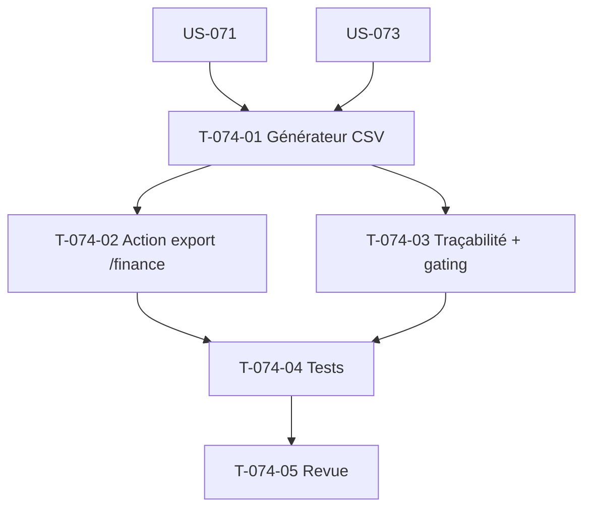

# Tâches — US-074 : Export comptable configurable (RÉSERVE)

## Informations US
- **Epic** : EPIC-005 · **Persona** : P6 (Directeur financier) · **Points** : 5 · **Sprint** : sprint-009 (**réserve** — Could)

> À prendre uniquement si US-071/072/073 terminées avant la fin du sprint.

## Vue d'ensemble des tâches

| ID | Type | Tâche | Estimation | Dépend de | Statut |
|----|------|-------|------------|-----------|--------|
| T-074-01 | [BE] | Générateur d'export CSV configurable (séparateur/encodage/entêtes) des marges figées par projet/client/période (montants centimes, sans perte) | 3h | US-071, US-073 | 🔲 |
| T-074-02 | [FE-WEB] | Action d'export depuis `/finance` : choix format + périmètre ; refus si période non clôturée (CA-4) | 2h | T-074-01 | 🔲 |
| T-074-03 | [BE] | Traçabilité de l'export (audit HAB-6 : auteur, périmètre, date) + gating HAB-1 | 1.5h | T-074-01 | 🔲 |
| T-074-04 | [TEST] | Tests : export période clôturée, refus non-clôturée, gating/traçabilité | 2h | T-074-02, T-074-03 | 🔲 |
| T-074-05 | [REV] | Revue de clôture | 1h | T-074-04 | 🔲 |

**Total estimé : 9.5h**

## Graphe de dépendances

## Résumé
| Type | Tâches | Heures |
|------|--------|--------|
| [BE] | 2 | 4.5h |
| [FE-WEB] | 1 | 2h |
| [TEST] | 1 | 2h |
| [REV] | 1 | 1h |
| **TOTAL** | **5** | **9.5h** |
