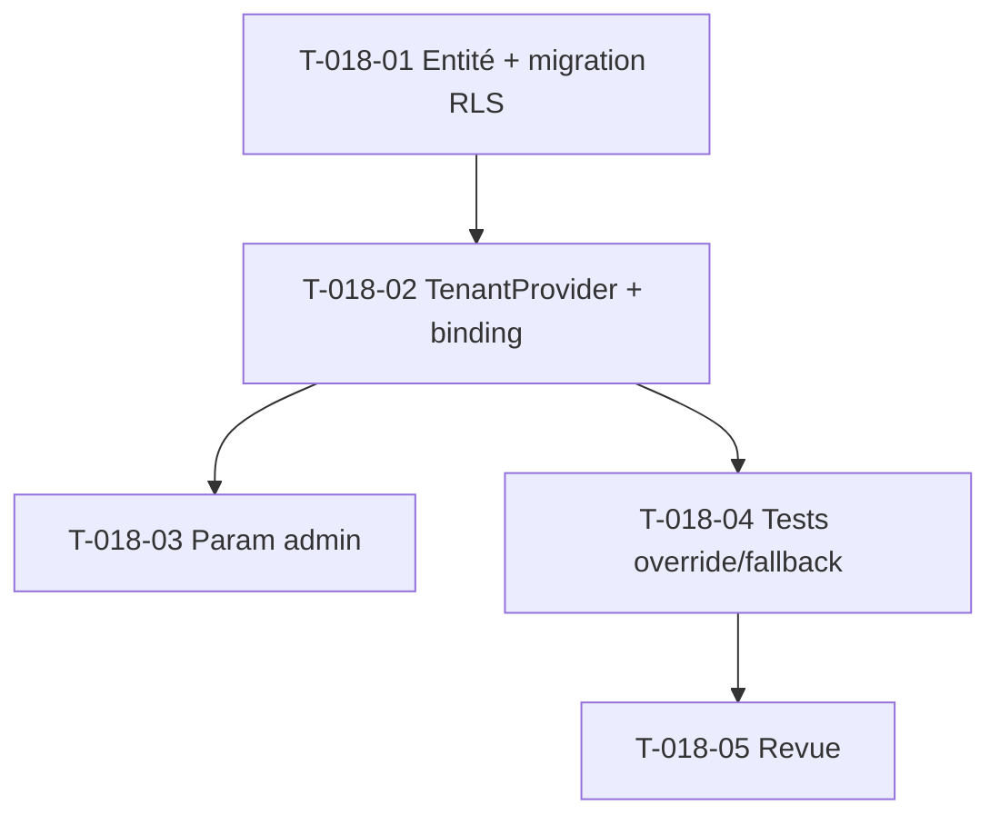

# Tâches — US-018 : Seuils d'alerte paramétrables par tenant (Should)

## Informations US
- **Epic** : EPIC-001 · **Persona** : ADMIN, P2 · **Points** : 3 · **Sprint** : sprint-010 (🟡 Should — si capacité)

## Tranche S10
Cibler **le seuil de dérive de marge paramétrable par tenant**, qui **remplace** l'implémentation par
défaut d'US-072 (`DefaultMarginDriftThresholdProvider`, 5 pts). Les seuils occupation / retard de saisie
sont des tranches ultérieures.

## Vue d'ensemble des tâches

| ID | Type | Tâche | Estimation | Dépend de | Statut |
|----|------|-------|------------|-----------|--------|
| T-018-01 | [DB] | Entité `MarginDriftThreshold` (une par tenant, bornée) + migration RLS — patron `ReminderRule` | 2h | - | 🔲 |
| T-018-02 | [BE] | `TenantMarginDriftThresholdProvider` implémentant `MarginDriftThresholdProvider` (lit l'entité, fallback défaut) + binding services.yaml | 2h | T-018-01 | 🔲 |
| T-018-03 | [FE-WEB] | Paramétrage admin du seuil (formulaire, gating `MANAGE_*`) | 1.5h | T-018-02 | 🔲 |
| T-018-04 | [TEST] | Override du seuil (dérive US-072 recalculée), fallback défaut si non configuré | 1.5h | T-018-02 | 🔲 |
| T-018-05 | [REV] | Revue de clôture | 0.5h | T-018-04 | 🔲 |

**Total estimé : ~7.5h** (≈ 3 pts).

## Point d'accroche
Le port `App\Domain\Budget\MarginDriftThresholdProvider` (US-072) est **déjà en place** : US-018 fournit
une **seconde implémentation** (tenant-backed) et rebranche le binding — aucun changement du moteur de
dérive (`BudgetTrackingCalculator`), conforme à DIP/OCP.

## Graphe de dépendances

