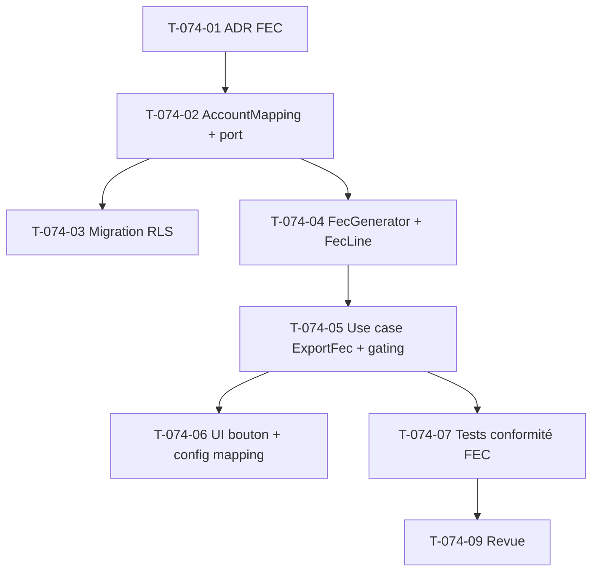

# Tâches — US-074 : Export comptable au format FEC

## Informations US
- **Epic** : EPIC-005 · **Persona** : P6 (Directeur financier) · **Points** : 8 · **Sprint** : sprint-010-export-qualite

## Décision d'entrée (à acter en préambule)
Export **FEC** (norme légale) = **écritures équilibrées** (débit=crédit) générées depuis les marges figées
(US-071) via un **mapping de comptes configurable par tenant**. Ce n'est pas une compta en partie double
complète. → **ADR léger T-074-01** avant le code.

## Vue d'ensemble des tâches

| ID | Type | Tâche | Estimation | Dépend de | Statut |
|----|------|-------|------------|-----------|--------|
| T-074-01 | [DOC] | **ADR léger** « périmètre export FEC » (écritures équilibrées, mapping, limite) | 1h | - | 🔲 |
| T-074-02 | [DB] | Entité `AccountMapping` (tenant : compte produit, tiers/client, charge, contrepartie) + port repo | 3h | T-074-01 | 🔲 |
| T-074-03 | [DB] | Migration `account_mapping` (RLS tenant, unique par tenant) | 1h | T-074-02 | 🔲 |
| T-074-04 | [BE] | `FecLine` (VO 18 champs) + `FecGenerator` (domaine) : écritures équilibrées, format FEC (décimales virgule, dates AAAAMMJJ) | 4h | T-074-02 | 🔲 |
| T-074-05 | [BE] | Use case `ExportFec` : lit marges d'une période **clôturée** + mapping → contenu FEC ; gating HAB-1, trace HAB-6 ; refuse période ouverte / mapping absent | 3h | T-074-04 | 🔲 |
| T-074-06 | [FE-WEB] | Bouton « Export FEC » sur `/finance` + route de téléchargement gated (nom `<SIREN>FEC<AAAAMMJJ>.txt`) + écran config mapping | 3h | T-074-05 | 🔲 |
| T-074-07 | [TEST] | Conformité 18 champs/ordre/encodage, équilibre débit=crédit, nommage, gating 403, période non clôturée, mapping absent | 3h | T-074-05 | 🔲 |
| T-074-09 | [REV] | Revue de clôture (`symfony-reviewer`) | 1h | T-074-07 | 🔲 |

**Total estimé : ~19h** (≈ 8 pts).

## Points d'accroche (réutilisation)
- **Marges figées** : `App\Domain\Margin\ProjectMargin` + `ProjectMarginRepository::findForPeriod()` (US-071) — source des montants (CA/coût par projet/période).
- **Gating** : `Authorizer` (`ensureCan(VIEW_PROJECT_FINANCIALS)` + `authorizeSensitiveRead(VIEW_COLLABORATOR_COST, …)`), page 403 (US-073).
- **Clôture** : statut de période (US-057) pour n'exporter que du figé.
- **Modèle entité + RLS** : calquer `ProjectMargin`/migration (pattern A RLS) pour `AccountMapping`.

## Graphe de dépendances

## Résumé
| Type | Tâches | Heures |
|------|--------|--------|
| [DOC] | 1 | 1h |
| [DB] | 2 | 4h |
| [BE] | 2 | 7h |
| [FE-WEB] | 1 | 3h |
| [TEST] | 1 | 3h |
| [REV] | 1 | 1h |
| **TOTAL** | **8** | **19h** |

## Rappel — 18 champs FEC obligatoires (ordre normé)
`JournalCode · JournalLib · EcritureNum · EcritureDate · CompteNum · CompteLib · CompAuxNum · CompAuxLib ·
PieceRef · PieceDate · EcritureLib · Debit · Credit · EcritureLet · DateLet · ValidDate · Montantdevise · Idevise`
