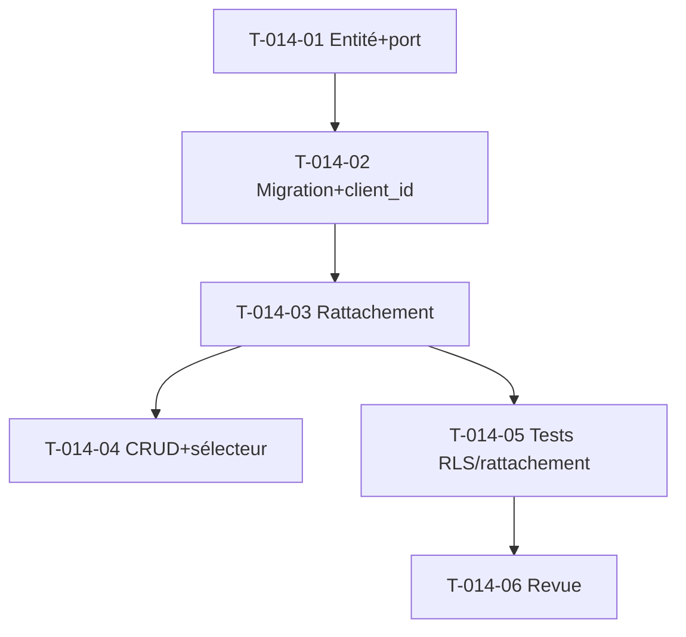

# Tâches — US-014 : Client structuré (tranche minimale S11)

## Informations US
- **Epic** : EPIC-005 · **Points** : 5 · **Sprint** : sprint-011-facturation · **Entrée du sprint** (prérequis facturation)

## Périmètre S11 (ADR-0022)
Entité `Client` (tenant, nom, SIREN optionnel) + rattachement `Project → Client`. **Hors S11** :
hiérarchie groupe/filiale, contacts, recherche avancée, migration des ventilations finance.

## Tâches

| ID | Type | Tâche | Est. | Dépend de | Statut |
|----|------|-------|------|-----------|--------|
| T-014-01 | [DB] | Entité `Client` (immuable, `TenantOwned`) + port `ClientRepository` | 2h | - | 🔲 |
| T-014-02 | [DB] | Migration `client` (RLS pattern A) + `project.client_id` nullable + migration | 2h | T-014-01 | 🔲 |
| T-014-03 | [BE] | Rattachement `Project → Client` (use case gated + `Project::attachClient`) | 1.5h | T-014-02 | 🔲 |
| T-014-04 | [FE-WEB] | CRUD minimal client (liste + création) + sélecteur client à la création/édition projet | 3h | T-014-03 | 🔲 |
| T-014-05 | [TEST] | Entité + RLS cross-tenant (modèle `DoctrineProjectMarginRepositoryTest`) + rattachement + gating | 2h | T-014-03 | 🔲 |
| T-014-06 | [REV] | Revue de clôture (`symfony-reviewer`) | 1h | T-014-05 | 🔲 |

## Accroches
- Modèle entité + RLS : calquer `ProjectMargin`/`FecConfiguration` (pattern A). Gating : `Authorizer`.
- `Project` a déjà `clientName` + `defineClient()` (US-072/seed) → ajouter `client_id` sans casser l'existant (coexistence).

## Graphe

