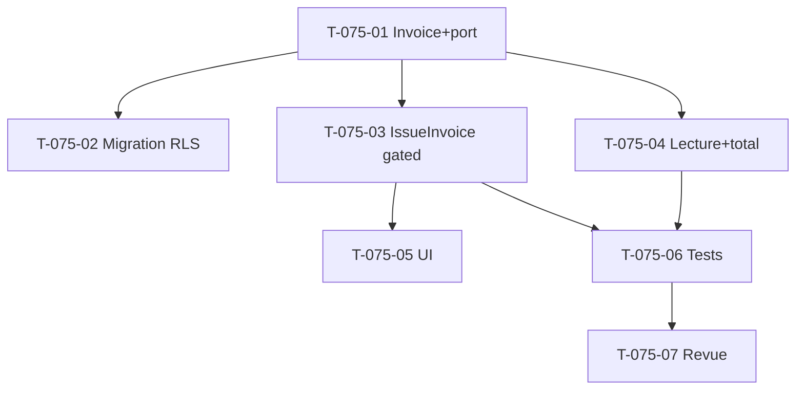

# Tâches — US-075 : Émission manuelle de factures par projet/période

## Informations US
- **Epic** : EPIC-005 · **Points** : 8 · **Sprint** : sprint-011-facturation · **Dépend de** US-014

## Tâches

| ID | Type | Tâche | Est. | Dépend de | Statut |
|----|------|-------|------|-----------|--------|
| T-075-01 | [DB] | Entité `Invoice` (tenant, client, project_ref, period, amount_cents, status `issued`, issued_at) immuable + port | 3h | US-014 | 🔲 |
| T-075-02 | [DB] | Migration `invoice` (RLS pattern A, index tenant/projet/période) | 1h | T-075-01 | 🔲 |
| T-075-03 | [BE] | Use case `IssueInvoice` : période **clôturée** (`PeriodClosureStatus`), montant > 0 (pré-rempli CA reconnu ajustable), figée (INV-2), gating HAB-1 + trace HAB-6 | 3h | T-075-01 | 🔲 |
| T-075-04 | [BE] | Lecture factures + **total facturé** par (projet, période) (repo) | 2h | T-075-01 | 🔲 |
| T-075-05 | [FE-WEB] | UI émission (form montant pré-rempli) + liste des factures (fiche projet / `/finance`) ; gating | 3h | T-075-03 | 🔲 |
| T-075-06 | [TEST] | Nominal, refus période non clôturée/montant ≤ 0, gating 403, isolation tenant | 3h | T-075-03, T-075-04 | 🔲 |
| T-075-07 | [REV] | Revue de clôture (`symfony-reviewer`) | 1h | T-075-06 | 🔲 |

## Accroches
- **Pré-remplissage** : CA reconnu de la période via la valorisation/`ProjectMargin` (US-071) — proposé, pas imposé.
- **Clôture** : `PeriodClosureStatus::isClosed()` (comme `ExportFec`). **Gating** : `Authorizer` (`VIEW_PROJECT_FINANCIALS`).
- **RLS** : pattern A (modèle `time_entry_valuation`/`project_margin`).

## Graphe

