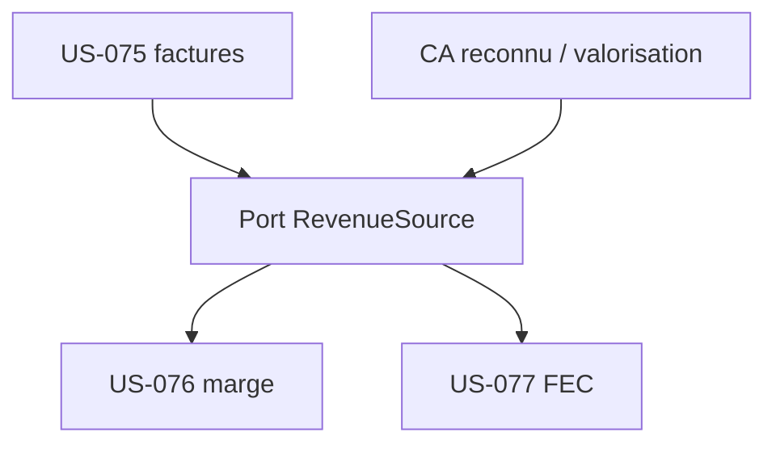

# Tâches — US-076 & US-077 : facturé réel comme source (marge + FEC)

## US-076 — Facturé réel comme source de marge (Must, 5 pts)

| ID | Type | Tâche | Est. | Dépend de | Statut |
|----|------|-------|------|-----------|--------|
| T-076-01 | [BE] | Port `RevenueSource` (Domain) : `revenueFor(tenant, projectRef, period)` = facturé réel si présent, sinon CA reconnu | 2h | US-075 | 🔲 |
| T-076-02 | [BE] | Impl (total facturé US-075 + repli valorisation) + branchement `ComputeProjectMargins` (US-071) via le port — **moteur inchangé** (ARC-6) | 3h | T-076-01 | 🔲 |
| T-076-03 | [TEST] | Marge sur facturé, repli CA reconnu, non-rétro (INV-2), pas de double comptage | 2h | T-076-02 | 🔲 |
| T-076-04 | [REV] | Revue de clôture | 0.5h | T-076-03 | 🔲 |

## US-077 — Export FEC sur facturé réel (Should, 5 pts)

| ID | Type | Tâche | Est. | Dépend de | Statut |
|----|------|-------|------|-----------|--------|
| T-077-01 | [BE] | `FecGenerator`/`ExportFec` alimentés par la source unique via `ProjectMargin` re-figé (US-076) — acquis par construction ; libellé produit rendu neutre (« Revenu retenu ») | 2h | US-076 | ✅ |
| T-077-02 | [TEST] | FEC sur facturé, repli, **cohérence FEC ↔ marge** (même source) — `FecReflectsBilledRevenueTest` | 2h | T-077-01 | ✅ |
| T-077-03 | [REV] | Revue de clôture | 0.5h | T-077-02 | ✅ |

## Principe (ADR-0022, ARC-6)
Un **seul** point applique la règle « facturé réel s'il existe, sinon CA reconnu » : le port
`RevenueSource`. La marge (US-076) et le FEC (US-077) le consomment → cohérence garantie, aucun moteur
réécrit. Le figeage de marge reste non-rétroactif (INV-2).

