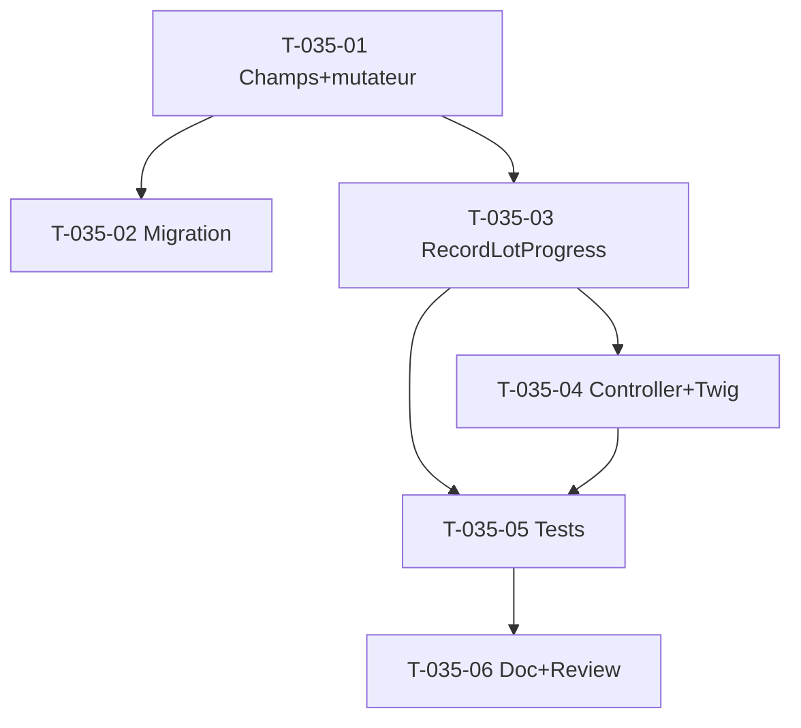

# Tâches — US-035 : Avancement physique & RAF par lot

## Informations US
- **Epic** : EPIC-002 · **Persona** : P2 (Marc — Chef de projet) · **Points** : 8 · **Sprint** : 12

## Résumé
**En tant que** chef de projet **je veux** saisir l'avancement physique (%) et le RAF (jours) par lot
**afin de** piloter la trajectoire indépendamment de la consommation (INV-4).

## Vue d'ensemble des tâches

| ID | Type | Tâche | Est. | Dépend | Statut |
|----|------|-------|------|--------|--------|
| T-035-01 | [DB] | `ProjectLot` : champs `physicalProgressPercent` (?int) + `remainingWorkDays` (?int) + mutateur `recordProgress(?int %, ?int rafDays)` | 2h | - | 🔲 |
| T-035-02 | [DB] | Migration `ALTER TABLE project_lot` (colonnes nullable) + `schema:validate` + `make cache-dev` | 1h | T-035-01 | 🔲 |
| T-035-03 | [BE] | Use case `RecordLotProgress` (Application), gated `EDIT_PROJECT` | 2h | T-035-01 | 🔲 |
| T-035-04 | [FE-WEB] | Action `ProjectPageController::updateLotProgress` (POST, CSRF) + édition dans l'onglet Structure de `show.html.twig` | 3h | T-035-03 | 🔲 |
| T-035-05 | [TEST] | Unit `ProjectLotTest` (invariants) + `RecordLotProgressTest` (gating/refus) + Functional `ProjectPageTest` (édition, INV-4) | 3h | T-035-03/04 | 🔲 |
| T-035-06 | [DOC/REV] | PHPDoc + revue de clôture | 1h | T-035-05 | 🔲 |

**Total estimé** : 12h

## Détail

### T-035-01 [DB] — Champs & mutateur `ProjectLot`
- Fichier : `src/Domain/Project/ProjectLot.php`
- Ajouter `#[ORM\Column(nullable: true)] private ?int $physicalProgressPercent` et `?int $remainingWorkDays`.
- Mutateur `recordProgress(?int $percent, ?int $rafDays)` : invariants **0 ≤ % ≤ 100**, **RAF ≥ 0** (sinon exception domaine) ; appeler la garde de modifiabilité (statut projet — cf. `Project::assertModifiable`, à répercuter au niveau lot/use case).
- Getters `physicalProgressPercent()`, `remainingWorkDays()`.
- **Validation** : invariants testés ; immuabilité des autres champs préservée.

### T-035-02 [DB] — Migration
- `migrations/VersionYYYYMMDDHHMMSS.php` : `ALTER TABLE project_lot ADD COLUMN physical_progress_percent INT NULL, ADD COLUMN remaining_work_days INT NULL;` (pas de RLS à ajouter — policy `project_lot` existante).
- `make` : `doctrine:migrations:migrate` + `schema:validate` + `make cache-dev`.

### T-035-03 [BE] — Use case `RecordLotProgress`
- Fichier : `src/Application/Project/RecordLotProgress.php`
- Signature : `record(User $user, string $projectId, string $lotId, ?int $percent, ?int $rafDays): void`.
- `Authorizer::ensureCan($user, Permission::EDIT_PROJECT)` ; charge le projet (garde clôture) + le lot (tenant) ; `recordProgress` ; `save`.
- Exception si projet clôturé (RG-PRJ-5) ou lot introuvable.

### T-035-04 [FE-WEB] — Contrôleur + template
- `src/UI/Http/Controller/ProjectPageController.php` : action POST `project_update_lot_progress` (CSRF), invoque `RecordLotProgress`, flash + redirect `project_show#panel-structure`.
- `templates/project/show.html.twig` (onglet Structure, via `structureView()`) : par lot, champ avancement % + RAF éditable (si `EDIT_PROJECT`), affichage sinon.
- **Attention** : placer le `<form>` après les formulaires dont un test lit `input[name="_token"]` en `.first()` (piège `ProjectPageTest`).

### T-035-05 [TEST]
- `tests/Unit/Domain/Project/ProjectLotTest.php` : recordProgress nominal, refus %>100 / %<0 / RAF<0.
- `tests/Unit/Application/Project/RecordLotProgressTest.php` : nominal, 403 sans EDIT_PROJECT, refus projet clôturé.
- `tests/Functional/Web/ProjectPageTest.php` : saisie avancement ; **INV-4** — vérifier que l'avancement n'altère ni la consommation ni le RAF. Ajouter `ProjectLot` au schéma du test si absent.

### T-035-06 [DOC/REV]
- PHPDoc classes/méthodes ; revue `symfony-reviewer` (verdict direct, sans nouvel appel d'outil).

## Graphe

