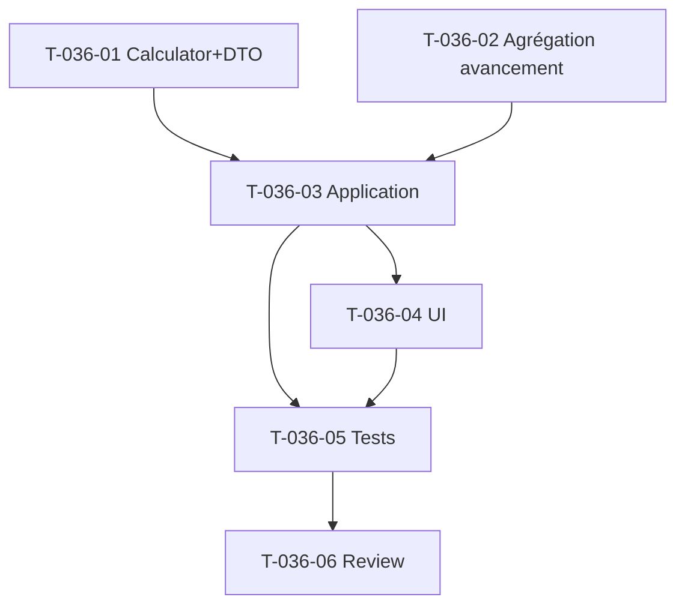

# Tâches — US-036 : Atterrissage charge & alerte de dérive précoce

## Informations US
- **Epic** : EPIC-002 · **Persona** : P2 / Direction · **Points** : 8 · **Sprint** : 12

## Résumé
**En tant que** chef de projet **je veux** l'atterrissage charge + une alerte dès qu'un dépassement > 10 %
est projeté avant 50 % de consommation **afin de** réagir tôt (OBJ-2).

## Vue d'ensemble des tâches

| ID | Type | Tâche | Est. | Dépend | Statut |
|----|------|-------|------|--------|--------|
| T-036-01 | [BE] | Domaine `ChargeLandingCalculator` + DTO `ChargeLanding` (EAC, overrun%, conso%, isEarlyDrift ; constantes 10 %/50 %) | 3h | US-035 | 🔲 |
| T-036-02 | [BE] | Agrégation avancement projet = moyenne pondérée des lots par `budgetDays` | 1.5h | T-035-01 | 🔲 |
| T-036-03 | [BE] | Application : enrichir `ViewProjectBudgetTracking` avec l'atterrissage (gating HAB-1) | 2.5h | T-036-01/02 | 🔲 |
| T-036-04 | [FE-WEB] | UI atterrissage + badge alerte (onglet Suivi budgétaire) + compteur dérive charge `/finance` | 3h | T-036-03 | 🔲 |
| T-036-05 | [TEST] | Unit `ChargeLandingCalculatorTest` (matrice OBJ-2, cas manquants) + Application (HAB-1) + Functional | 3h | T-036-03/04 | 🔲 |
| T-036-06 | [REV] | Revue de clôture | 0.5h | T-036-05 | 🔲 |

**Total estimé** : 13.5h

## Détail

### T-036-01 [BE] — Calculateur domaine
- Fichiers : `src/Domain/Budget/ChargeLandingCalculator.php`, `src/Domain/Budget/ChargeLanding.php`.
- `land(?int $budgetCostCents, int $consumedCostCents, ?int $physicalProgressPercent): ChargeLanding`.
- Constantes : `public const float OVERRUN_ALERT_PERCENT = 10.0;`, `public const float EARLY_CONSUMPTION_GATE_PERCENT = 50.0;`.
- EAC = `consumedCostCents / (progress/100)` si progress > 0 ; sinon **indisponible** (flag).
- `overrunPercent` = `(EAC - budget) / budget × 100` (si budget > 0, sinon indisponible).
- `consumptionPercent` = `consumed / budget × 100`.
- `isEarlyDrift` = `overrunPercent > 10 ET consumptionPercent < 50` (uniquement si calculable).
- **Modèle de test/structure** : imiter `BudgetTrackingCalculator`/`BudgetTracking`.

### T-036-02 [BE] — Agrégation avancement projet
- Moyenne pondérée des `physicalProgressPercent` des lots par `budgetDays` (lots sans avancement = exclus ou 0 % selon règle documentée). Placer sur un petit service domaine ou méthode agrégeant `ProjectLotRepository::findForProject()`.
- Lots sans budget jours → poids nul.

### T-036-03 [BE] — Exposition Application
- Enrichir `src/Application/Budget/ViewProjectBudgetTracking.php` (+ `ProjectBudgetTrackingView.php`) avec l'atterrissage charge.
- Réutiliser `TimeEntryValuationRepository::projectBreakdownFor()` (coût consommé), `Project::budgetCents()`, agrégation T-036-02.
- **Gating HAB-1** : `authorizeSensitiveRead` (coût) déjà en place ; ne jamais exposer de coût unitaire.

### T-036-04 [FE-WEB] — UI
- `templates/project/show.html.twig` (onglet « Suivi budgétaire ») : atterrissage charge + **badge alerte dérive précoce** (si `isEarlyDrift`), état « indisponible » sinon.
- `/finance` (`ConsolidatedFinanceReport` + `templates/finance/index.html.twig`) : compteur de projets en dérive charge (pattern existant du compteur `$drifting`).

### T-036-05 [TEST]
- `tests/Unit/Domain/Budget/ChargeLandingCalculatorTest.php` : matrice (overrun >/≤ 10 %) × (conso </≥ 50 %) → `isEarlyDrift` vrai **uniquement** sur (>10 % ET <50 %) ; cas budget/avancement manquants → indisponible, pas de division par zéro.
- Application : gating HAB-1 (CP sans coût ne voit pas de coût unitaire), atterrissage présent.
- `tests/Functional/Web/ProjectBudgetTrackingTest.php` : panneau affiche atterrissage + alerte.

### T-036-06 [REV]
- Revue de clôture `symfony-reviewer`.

## Graphe

