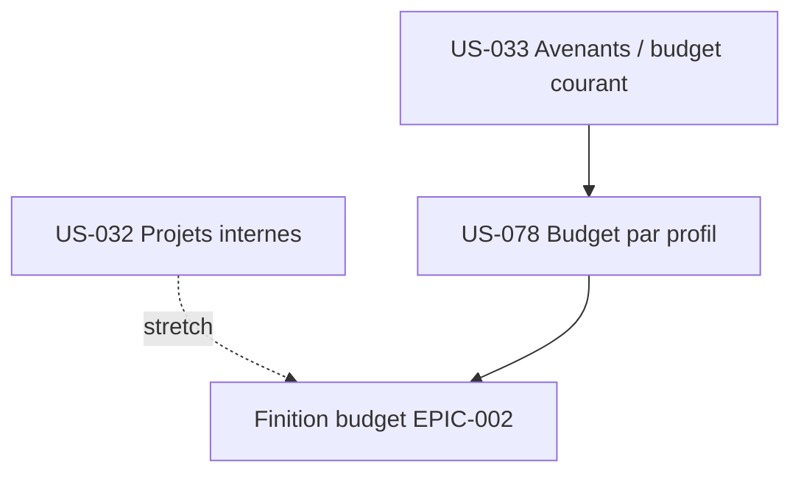

# Sprint 13 : Gestion budgétaire complète — avenants & budget par profil (EPIC-002)

## Informations

| Attribut | Valeur |
|----------|--------|
| Numéro | 13 |
| Préparé le | 2026-09-06 |
| Début | 2027-02-04 *(provisoire)* |
| Fin | 2027-02-17 *(provisoire)* |
| Durée | 10 jours ouvrés |
| Capacité (prévision) | ~20 points (1 dev ; vélocité récente ~22 hors S10, sécurité 10 %) |
| Base git | `main` (après clôture S12, PR #67/#68) |
| EPIC | EPIC-002 (Projets & delivery) — finition budget (capacités *Must* restantes) |
| Statut | 🟢 **Décomposé — tâches prêtes, exécution en cours** |

## Sprint Goal

> « La **gestion budgétaire des projets est complète** : chaque budget se pilote par **avenants datés**
> (budget initial → budget courant, avec motif et historique) et se **ventile par profil**, reliant charge
> et montant aux taux en vigueur (EF-PRJ-8/9). »

**Positionnement** : la MMF d'EPIC-002 est atteinte (S6 + S12). Ce sprint solde les **deux dernières
capacités *Must*** du CDC restées non couvertes (avenants EF-PRJ-8, budget charge par profil EF-PRJ-9),
identifiées par l'analyse d'écart (#68). Débloque **INV-8** (volet avenants) et le critère « un avenant
modifie le budget sans altérer les imputations historiques ».

## Definition of Done (rappel projet)

- [ ] Revue de clôture approuvée (`symfony-reviewer` par lot)
- [ ] Tests (couverture ≥ 80 % **gardée en CI**), `make ci` vert (PHPStan max, Deptrac, gitleaks)
- [ ] **INV-2/INV-3** : un avenant n'altère jamais les imputations/valorisations figées (cible budgétaire seule évolue)
- [ ] **RG-PRJ-4** : modification de budget d'un projet actif = motif obligatoire, tracé
- [ ] Migration + RLS pour toute nouvelle entité ; **UI ne dépend jamais de l'Infra** (Deptrac)
- [ ] Réutilise le référentiel profils/taux **historisés** d'EPIC-001 (US-078) — pas de duplication
- [ ] Recette navigateur sur seed enrichi (avenant + budget par profil) tracée dans `.recette/`

## Sprint Backlog

| Priorité | ID | Titre | Points | Statut |
|----------|-----|-------|--------|--------|
| 🔴 Must | US-033 | Budget — initial, avenants & budget courant (EF-PRJ-8) | 8 | 🔵 To Do |
| 🔴 Must | US-078 | Budget charge par profil (EF-PRJ-9) | 8 | 🔵 To Do |
| 🟡 Should (stretch) | US-032 | Projets internes non facturables (EF-PRJ-5) | 5 | 🔵 To Do |

**Engagé : 16 pts Must (US-033 + US-078).** US-032 (Should) en *stretch* si capacité.
**Hors sprint** : US-079 (raffinements pilotage export/courbe/seuil, S) → réserve S14.

## Ordre d'exécution (dépendances)

1. **US-033** (avenants) — établit budget initial/courant + historique ; le **budget courant** devient la référence du suivi (US-072) et de l'atterrissage (US-036).
2. **US-078** (charge par profil) — se branche sur le budget ; réutilise profils/taux EPIC-001.
3. **US-032** (projets internes) — indépendant (stretch).

## Risques identifiés

| Risque | Probabilité | Impact | Mitigation |
|--------|-------------|--------|------------|
| Migration douce du budget existant (`budgetCents` → budget initial) | Moyenne | Moyen | Initial = `budgetCents` actuel ; budget courant dérivé ; tests de non-régression suivi budgétaire |
| Couplage US-033 ↔ US-072/US-036 (le budget courant remplace `budgetCents`) | Moyenne | Élevé | Faire US-033 en premier ; rebrancher `ViewProjectBudgetTracking`/atterrissage sur le budget courant |
| Taux historisés par profil (US-078) mal datés | Moyenne | Moyen | Date de référence explicite ; cas « taux manquant » testé (CA-4) |
| Occupation facturable (US-032) casse la définition US-060 | Moyenne | Moyen | Ajouter une mesure « facturable », ne pas remplacer l'occupation existante |

## Cérémonies

| Cérémonie | Moment |
|-----------|--------|
| Planning P1 (QUOI) + P2 (COMMENT) | Début de sprint |
| Daily | Quotidien (`daily-notes/`) |
| Review + Rétro | Fin de sprint |

## Notes

- Solo dev : cérémonies = jalons d'auto-discipline (docs), pas de réunions.
- Convention run-sprint : 1 PR/story, TDD → `make ci` vert → migration+`schema:validate`+`make cache-dev` si entité → PR → CI → merge squash → MAJ board/story/`sprint-status.yaml`.
- À aligner dans une story ultérieure (US-079) : l'atterrissage US-036 = consommé/avancement% ; le CDC EF-PRJ-14 le définit « consommé + RAF ».
