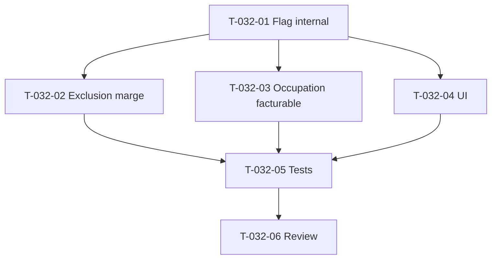

# Tâches — US-032 : Projets internes non facturables (stretch)

## Informations US
- **Epic** : EPIC-002 · **Persona** : P2 / P3 · **Points** : 5 · **Sprint** : 13 (stretch) · **EF** : EF-PRJ-5 / RG-PRJ-6

## Vue d'ensemble

| ID | Type | Tâche | Est. | Dépend | Statut |
|----|------|-------|------|--------|--------|
| T-032-01 | [DB] | Champ `Project::internal` (bool, défaut false) + fabrique/mutateur + migration | 1.5h | - | 🔲 |
| T-032-02 | [BE] | Exclusion des projets internes du calcul de marge (filtre DQL `projectBreakdownFor`/`ForPeriod`) | 1.5h | T-032-01 | 🔲 |
| T-032-03 | [BE] | Occupation **facturable** : `valuedBillableDayCountByUser` (exclut internes) + ligne overview, sans casser `forTenant` | 2h | T-032-01 | 🔲 |
| T-032-04 | [FE-WEB] | Marquage « interne » création/édition + distinction liste + occupation facturable affichée | 2h | T-032-01 | 🔲 |
| T-032-05 | [TEST] | Exclusion marge, occupation facturable, capacité consommée inchangée, gating | 2.5h | T-032-02/03/04 | 🔲 |
| T-032-06 | [REV] | Revue de clôture | 0.5h | T-032-05 | 🔲 |

**Total** : ~10h

## Détail

### T-032-01 [DB] — Flag `internal`
- `src/Domain/Project/Project.php` : champ `internal` (bool, défaut false) + `markInternal()`/paramètre de fabrique. Un projet interne peut être créé sans CA cible facturable.
- Migration `ALTER TABLE project ADD internal BOOLEAN DEFAULT FALSE NOT NULL` + `schema:validate` + `make cache-dev`.

### T-032-02 [BE] — Exclusion marge
- `src/Infrastructure/Persistence/Doctrine/DoctrineTimeEntryValuationRepository.php` : ajouter `AND p.internal = false` aux DQL `projectBreakdownFor` (~L114-140) et `projectBreakdownForPeriod` (~L142-171). Le `Project p` est déjà joint.
- Effet : `ComputeProjectMargins` et le dashboard finance excluent les internes (aucun CA reconnu attendu).

### T-032-03 [BE] — Occupation facturable
- Port valuation : `valuedBillableDayCountByUser(tenant, from, to)` (exclut `p.internal = true`), en parallèle de `valuedDayCountByUser` (inchangé → capacité/occupation totale préservée).
- `src/Application/Valuation/OccupationReport.php` : ajouter une mesure « facturable » sur `OccupationLine`/overview sans modifier la sémantique de `forTenant` (RG-PRJ-6 : capacité consommée inchangée).

### T-032-04 [FE-WEB]
- Création/édition projet : case « interne non facturable ». Liste projets : badge/distinction. Dashboard occupation : afficher l'occupation **facturable**.

### T-032-05 [TEST]
- Marge : un projet interne valorisé n'apparaît pas dans la marge/dashboard.
- Occupation : facturable = jours facturables / capacité (internes exclus du numérateur) ; capacité consommée inchangée.
- Gating création/marquage.

## Graphe

