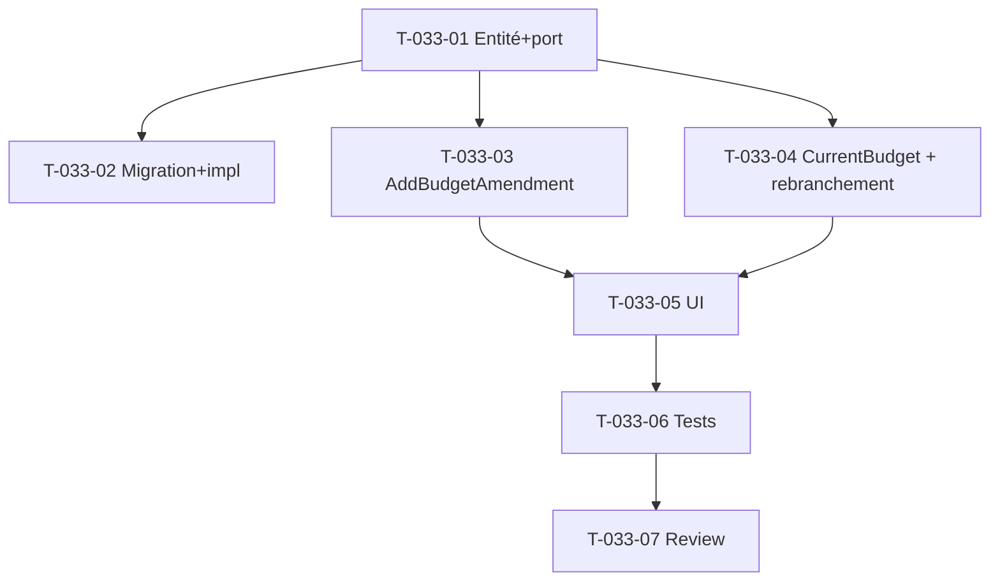

# Tâches — US-033 : Budget initial, avenants & budget courant

## Informations US
- **Epic** : EPIC-002 · **Persona** : P2 / P6 · **Points** : 8 · **Sprint** : 13 · **EF** : EF-PRJ-8

## Vue d'ensemble

| ID | Type | Tâche | Est. | Dépend | Statut |
|----|------|-------|------|--------|--------|
| T-033-01 | [DB] | Entité `BudgetAmendment` (tenant, projet, deltaCostCents, deltaRevenueCents, motif, auteur, date) + port `BudgetAmendmentRepository` (save, findForProject, sumForProject) | 2h | - | 🔲 |
| T-033-02 | [DB] | Migration `budget_amendment` + RLS (patron `Version20260905110000`) + impl Doctrine | 2h | T-033-01 | 🔲 |
| T-033-03 | [BE] | Use case `AddBudgetAmendment` (gated `EDIT_PROJECT`, motif obligatoire RG-PRJ-4, refus projet clôturé, audit) | 2h | T-033-01 | 🔲 |
| T-033-04 | [BE] | `CurrentProjectBudget` (Domain, initial + Σ avenants) + rebranchement `ViewProjectBudgetTracking` / `ConsolidatedFinanceReport::isDrifting` / `ProjectPageController` | 3h | T-033-01 | 🔲 |
| T-033-05 | [FE-WEB] | Formulaire d'avenant + historique daté (onglet Suivi budgétaire), gated `EDIT_PROJECT` | 3h | T-033-03/04 | 🔲 |
| T-033-06 | [TEST] | Unit (entité, calculator, use case, INV-2/3 non-altération) + Functional (avenant → budget courant) | 3h | T-033-03/04/05 | 🔲 |
| T-033-07 | [REV] | Revue de clôture | 0.5h | T-033-06 | 🔲 |

**Total** : ~15,5h

## Détail

### T-033-01 [DB] — Entité + port
- `src/Domain/Project/BudgetAmendment.php` : `implements TenantOwned`, id uuid v7, fabrique `record(tenant, projectId, ?deltaCostCents, ?deltaRevenueCents, reason, authorId, at)` avec invariants (au moins un delta non nul, motif non vide).
- `src/Domain/Project/BudgetAmendmentRepository.php` : `save`, `findForProject(tenant, projectId): list`, `sumForProject(tenant, projectId): array{cost:int, revenue:int}` (ou renvoyer les deltas et sommer côté calculateur).

### T-033-02 [DB] — Migration + impl
- Migration `budget_amendment` (RLS pattern A). Impl `DoctrineBudgetAmendmentRepository`. `schema:validate` + `make cache-dev`.

### T-033-03 [BE] — `AddBudgetAmendment`
- `src/Application/Project/AddBudgetAmendment.php` : `ensureCan(EDIT_PROJECT)`, projet existant + `assertModifiable()` (refus clôturé), **motif obligatoire** (RG-PRJ-4), save + `SecurityAuditLogger::record('project_budget_amended', …)`.

### T-033-04 [BE] — Budget courant + rebranchement
- `src/Domain/Project/CurrentProjectBudget.php` : `current(?int initialCost, ?int initialRevenue, iterable amendments): array{cost:?int, revenue:?int}` (initial + Σ deltas).
- Rebrancher les 3 lecteurs sur le budget courant (au lieu de `Project::budgetCents()` brut) : `ViewProjectBudgetTracking` (L64/65/73), `ConsolidatedFinanceReport::isDrifting` (L132/133), `ProjectPageController` (L169/382). `Project::budgetCents()` reste le **budget initial**.

### T-033-05 [FE-WEB]
- Action web `project_budget_amend` (POST, CSRF) + affichage historique (initial → avenants datés → courant) dans l'onglet Suivi budgétaire de `templates/project/show.html.twig` (gated `EDIT_PROJECT` pour l'ajout).

### T-033-06 [TEST]
- Unit : `BudgetAmendmentTest` (invariants), `CurrentProjectBudgetTest` (somme), `AddBudgetAmendmentTest` (gating, motif, refus clôturé).
- **INV-2/3** : test prouvant qu'ajouter un avenant ne modifie ni les `TimeEntryValuation` figées ni `ProjectMargin`.
- Functional : ajout d'avenant → budget courant reflété dans le suivi budgétaire.

## Graphe

