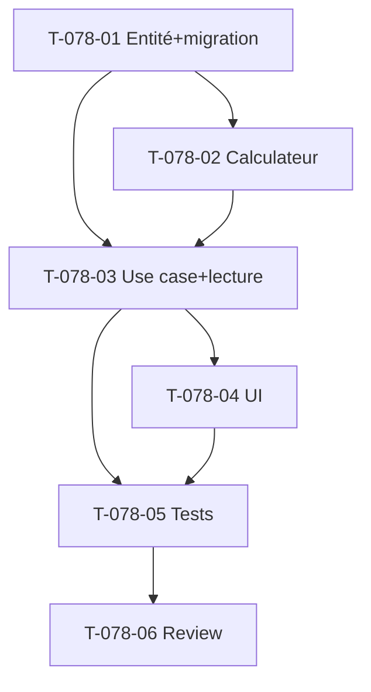

# Tâches — US-078 : Budget charge par profil

## Informations US
- **Epic** : EPIC-002 · **Persona** : P2 · **Points** : 8 · **Sprint** : 13 · **EF** : EF-PRJ-9

## Vue d'ensemble

| ID | Type | Tâche | Est. | Dépend | Statut |
|----|------|-------|------|--------|--------|
| T-078-01 | [DB] | Entité `LotProfileBudget` (tenant, lotId, profileId, days) + port + migration RLS + impl Doctrine | 2.5h | - | 🔲 |
| T-078-02 | [BE] | `ProfileBudgetCalculator` (Domain) : jours × taux vente/coût via `RateResolver::resolveAt(date réf)` ; agrégation lot/projet ; cas taux manquant | 2.5h | T-078-01 | 🔲 |
| T-078-03 | [BE] | Use case `DefineLotProfileBudget` (gated `EDIT_PROJECT`) + lecture agrégée €vente/€coût (date réf = début projet) | 2h | T-078-01/02 | 🔲 |
| T-078-04 | [FE-WEB] | Saisie budget par profil sur le lot (onglet Structure) + affichage équivalents + réconciliation | 3h | T-078-03 | 🔲 |
| T-078-05 | [TEST] | Unit (conversion multi-profils, taux historisé, taux manquant CA-4, réconciliation) + use case + Functional | 3h | T-078-03/04 | 🔲 |
| T-078-06 | [REV] | Revue de clôture | 0.5h | T-078-05 | 🔲 |

**Total** : ~13,5h

## Détail

### T-078-01 [DB] — Entité + port + migration
- `src/Domain/Project/LotProfileBudget.php` : `implements TenantOwned`, id uuid v7, `(tenant, lotId, profileId, days)`, invariant `days >= 0`, mutateur `changeDays()`.
- Port `LotProfileBudgetRepository` : `save`, `findForLot(tenant, lotId): list`, `findForProject(tenant, projectId)` (via jointure lot) — ou agrégation côté calculateur.
- Migration RLS `lot_profile_budget` + impl Doctrine.

### T-078-02 [BE] — Calculateur
- `src/Domain/Project/ProfileBudgetCalculator.php` (Domain — dépend du port `RateResolver` de Pricing) : pour chaque ligne `{profileId, days}`, `RateResolver::resolveAt(tenant, profileId, refDate)` → `sellingPriceCents`/`costPriceCents` × days.
- Agrège €vente / €coût par lot et projet. `NoEffectiveRateException` → ligne « taux manquant » (ne compte pas comme 0, CA-4).
- DTO résultat (jours, €vente, €coût, lignes manquantes).

### T-078-03 [BE] — Use case + lecture
- `src/Application/Project/DefineLotProfileBudget.php` : `ensureCan(EDIT_PROJECT)`, lot existant (tenant), `assertModifiable` du projet, save.
- Lecture agrégée : date de référence = `Project::startDate()` (repli `clock->now()`).

### T-078-04 [FE-WEB]
- Onglet Structure de `templates/project/show.html.twig` : par lot, saisie des lignes `{profil, jours}` + affichage €vente/€coût dérivés + total réconcilié (EF-PRJ-2).
- Sélecteur de profils depuis `ProfileRepository::findByTenant` (profils actifs).

### T-078-05 [TEST]
- Unit `ProfileBudgetCalculatorTest` : multi-profils (40j senior + 20j junior → €vente/€coût), taux **à la date de référence** (historisé), profil sans taux → manquant.
- Use case gating ; Functional (saisie → équivalents affichés).

## Graphe

