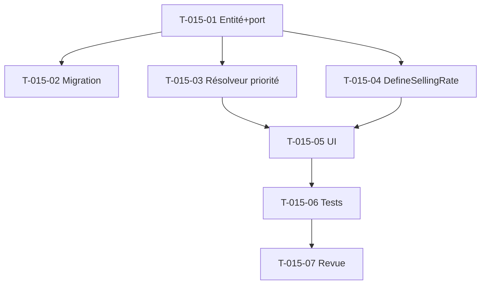

# Tâches — US-015 : Taux de vente multi-niveaux + priorité

## Informations US
- **Epic** : EPIC-001 · **Persona** : P4 / Direction · **Points** : 5 · **Sprint** : 14 · **EF** : EF-REF-19

## Vue d'ensemble

| ID | Type | Tâche | Est. | Dépend | Statut |
|----|------|-------|------|--------|--------|
| T-015-01 | [DB] | Entité `SellingRate` (scope profile/client/project + refId, `EffectivePeriod`, sellingPriceCents) + port | 2.5h | - | 🔲 |
| T-015-02 | [DB] | Migration `selling_rate` + RLS + impl Doctrine | 2h | T-015-01 | 🔲 |
| T-015-03 | [BE] | `SellingRateResolver` (Domain) : priorité projet > client > profil, repli `ProfileRate`, à une date → {cents, niveau} | 2.5h | T-015-01 | 🔲 |
| T-015-04 | [BE] | Use case `DefineSellingRate` (gated `MANAGE_PRICING`, anti-chevauchement, rétroactivité tracée) | 2h | T-015-01 | 🔲 |
| T-015-05 | [FE-WEB] | UI surcharges de taux (client/projet) + affichage de la règle appliquée | 3h | T-015-03/04 | 🔲 |
| T-015-06 | [TEST] | Unit résolveur (3 niveaux + repli + INV-2), use case gating, functional | 3h | T-015-03/04/05 | 🔲 |
| T-015-07 | [REV] | Revue de clôture | 0.5h | T-015-06 | 🔲 |

## Détail

### T-015-01/02 — Modèle
- `src/Domain/Pricing/SellingRate.php` : `implements TenantOwned`, id uuid v7, `scope` (enum `RateScope`: PROFILE/CLIENT/PROJECT), `scopeRefId` (guid : profileId, clientId ou projectId), `profileId` (toujours présent : le taux s'applique à un profil), `EffectivePeriod`, `sellingPriceCents`. Invariants (cents > 0). Port `SellingRateRepository` (`save`, `findForProfile(tenant, profileId)` filtrable par scope).
- Migration `selling_rate` + RLS (patron `Version20260905110000`) + impl Doctrine.

### T-015-03 — Résolveur de priorité (unique, ARC-6)
- `src/Domain/Pricing/SellingRateResolver.php` : `resolve(tenant, profileId, ?clientId, ?projectId, date): ResolvedSellingRate {cents, level}`.
- Ordre : cherche un `SellingRate` PROJECT (scopeRefId=projectId) contains(date) → sinon CLIENT → sinon PROFILE (`SellingRate` scope profil) → **repli** sur `ProfileRate.sellingPriceCents` (US-011) via `RateResolver`.
- Expose le **niveau retenu** (« projet »/« client »/« profil »).

### T-015-04 — Use case
- `src/Application/Pricing/DefineSellingRate.php` : gated `MANAGE_PRICING`, garde anti-chevauchement (`EffectivePeriod::overlaps`) par (scope, refId, profil), rétroactivité tracée — **patron `DefineProfileRate`**.

### T-015-05 — UI
- Écran/section de gestion des surcharges (client/projet) ; à l'affichage d'un chiffrage, montrer la règle appliquée (niveau).

### T-015-06 — Tests
- Unit `SellingRateResolverTest` : projet>client>profil, repli ProfileRate, taux historisé à date (INV-2). Use case gating. Functional.

## Graphe

