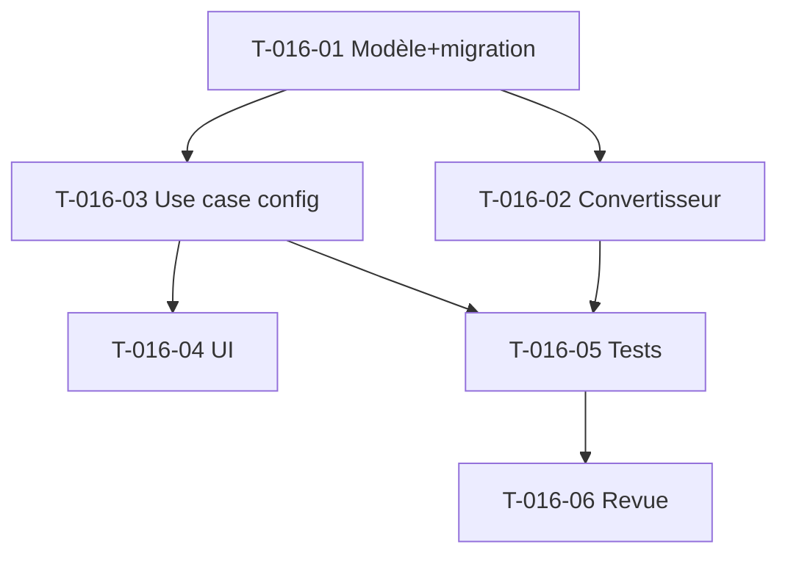

# Tâches — US-016 : Devises & devise de référence

## Informations US
- **Epic** : EPIC-001 · **Persona** : P6 (Direction financière) · **Points** : 3 · **Sprint** : 14 · **EF** : EF-REF-22

## Vue d'ensemble

| ID | Type | Tâche | Est. | Dépend | Statut |
|----|------|-------|------|--------|--------|
| T-016-01 | [DB] | `Currency` + `ExchangeRate` (daté, devise→référence) + devise de référence tenant (défaut EUR) + ports + migration RLS | 3h | - | 🔲 |
| T-016-02 | [BE] | `CurrencyConverter` (Domain) : `(cents, currency, date) → cents référence` ; taux manquant signalé | 2h | T-016-01 | 🔲 |
| T-016-03 | [BE] | Use case config devise de référence + taux (gated `MANAGE_ORGANIZATION`, historisé) | 1.5h | T-016-01 | 🔲 |
| T-016-04 | [FE-WEB] | UI config devise de référence + taux de change | 2h | T-016-03 | 🔲 |
| T-016-05 | [TEST] | Unit conversion/historisé/taux manquant/défaut EUR, gating, functional | 2.5h | T-016-02/03 | 🔲 |
| T-016-06 | [REV] | Revue de clôture | 0.5h | T-016-05 | 🔲 |

## Détail

### T-016-01 — Modèle
- `src/Domain/Currency/Currency.php` (code ISO 4217, tenant), `TenantReferenceCurrency` (devise de référence par tenant, défaut EUR), `ExchangeRate` (tenant, code devise, `EffectivePeriod`, `rateToReferenceBasisPoints` ou millièmes). Ports + migration RLS.
- Stockage du taux en **base points / millièmes** (entier) pour éviter les flottants.

### T-016-02 — Convertisseur
- `src/Domain/Currency/CurrencyConverter.php` : `toReference(int cents, string currency, DateTimeImmutable date): ConversionResult {cents, available}`. Devise = référence → identité. Taux manquant → `available = false` (pas de conversion silencieuse).

### T-016-03 — Use case
- Configuration (devise de référence + taux) gated `MANAGE_ORGANIZATION`, historisée (anti-chevauchement `EffectivePeriod`).

### T-016-04 — UI
- Écran de configuration (devise de référence + table des taux de change datés).

### T-016-05 — Tests
- Unit `CurrencyConverterTest` : conversion au taux daté (CHF→EUR), taux historisé à date, taux manquant signalé, défaut EUR (identité). Use case gating. Functional.

## Note de portée
Montants internes **inchangés** (centimes) : conversion à l'affichage/consolidation seulement. Facturation
en devise = tranche ultérieure.

## Graphe

