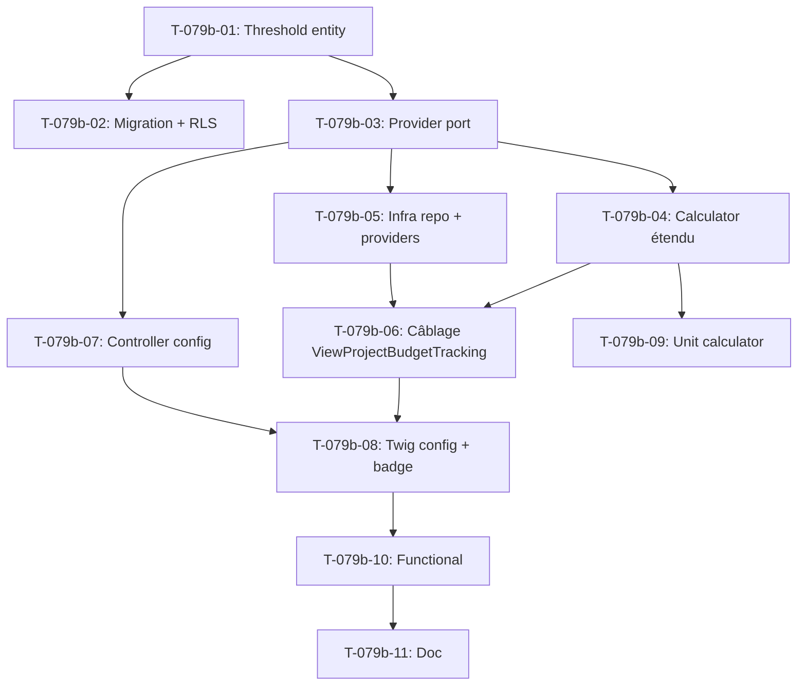

# Tâches - US-079b : Seuil de dérive charge par type de projet + 2e seuil direction

## Informations US
- **Epic** : EPIC-002 (Projets & delivery)
- **Persona** : P2 (Marc — Chef de projet) / P6 (Direction)
- **Story Points** : ~5
- **Sprint** : sprint-015-finition-pilotage
- **Priorité** : 🟡 Should
- **Traçabilité** : EF-PRJ-15 (seuil par type + 2e seuil escalade)

## Résumé de la US
**En tant que** chef de projet (P2) et directeur (P6)
**Je veux** paramétrer le **seuil de dérive de charge par type de projet** (forfait/régie) avec un
**2e seuil** d'escalade à la direction
**Afin d'** adapter la sensibilité de l'alerte au contrat et d'escalader les dérives majeures.

## Critères d'acceptance cibles
```gherkin
# CA-3 (seuil par type)
GIVEN un type de projet « forfait » à 8 % et « régie » à 15 %
WHEN la dérive d'un projet forfait dépasse 8 %
THEN l'alerte est émise selon le seuil du type (pas une constante globale)

# CA-4 (2e seuil direction)
GIVEN un 2e seuil (escalade) supérieur au 1er
WHEN la dérive dépasse ce 2e seuil
THEN l'alerte est également escaladée à la direction
```

## Décision de conception (sprint-goal S15)
Le seuil visé est celui du **dépassement de charge** aujourd'hui **en dur** dans
`App\Domain\Budget\ChargeLandingCalculator` (`OVERRUN_ALERT_PERCENT = 10.0`,
`EARLY_CONSUMPTION_GATE_PERCENT = 50.0` — décision S12/OBJ-2). ⚠️ À ne pas confondre avec
`MarginDriftThreshold` (dérive de *marge*, en points).

Approche : **réutiliser le pattern** `MarginDriftThreshold` (entité tenant + provider + controller)
pour une **nouvelle notion** `ChargeDriftThreshold` par **(tenant × `ContractType`)**, avec :
- **1er seuil** (alerte) et **2e seuil** (escalade direction),
- **repli** = constantes OBJ-2 par défaut (via un provider par défaut dans le Domaine/Infra).

> **Invariant DoD** : le repli par défaut = constantes `ChargeLandingCalculator` ; gating HAB-1
> préservé ; **UI ne dépend jamais de l'Infra** (Deptrac → défaut porté par le Domaine).

## Vue d'ensemble des tâches

| ID | Type | Tâche | Estimation | Dépend de | Statut |
|----|------|-------|------------|-----------|--------|
| T-079b-01 | [DB] | Entité `ChargeDriftThreshold` (tenant, contractType, alert%, escalation%) + port repository | 2h | - | 🔲 |
| T-079b-02 | [DB] | Migration + policy RLS | 1.5h | T-079b-01 | 🔲 |
| T-079b-03 | [BE] | Port `ChargeDriftThresholdProvider` (résolution tenant×type, `DEFAULT` = OBJ-2) | 2h | T-079b-01 | 🔲 |
| T-079b-04 | [BE] | Étendre `ChargeLandingCalculator` (seuils injectés + drapeau escalade) | 3h | T-079b-03 | 🔲 |
| T-079b-05 | [INFRA] | Repository Doctrine + provider tenant (bind) + provider défaut | 2h | T-079b-03 | 🔲 |
| T-079b-06 | [BE] | Câbler `ViewProjectBudgetTracking` (seuils selon type du projet, exposer escalade) | 2h | T-079b-04, T-079b-05 | 🔲 |
| T-079b-07 | [FE-WEB] | Page config `/finance/config-derive-charge` (gating `MANAGE_ORGANIZATION`, CSRF) | 2.5h | T-079b-03 | 🔲 |
| T-079b-08 | [FE-WEB] | Twig config + badge escalade dans le pilotage | 2h | T-079b-06, T-079b-07 | 🔲 |
| T-079b-09 | [TEST] | Unit calculator : alerte par type, escalade 2e seuil, repli constantes | 2h | T-079b-04 | 🔲 |
| T-079b-10 | [TEST] | Functional : CRUD config + gating ; pilotage reflète le seuil du type | 3h | T-079b-08 | 🔲 |
| T-079b-11 | [DOC] | PHPDoc + note EF-PRJ-15 | 0.5h | T-079b-10 | 🔲 |

**Total estimé** : ~24.5h

---

## Détail des tâches

### Couche Base de données [DB]

#### T-079b-01 : Entité `ChargeDriftThreshold` + port repository
- **Type** : [DB] · **Estimation** : 2h · **Dépend de** : -

**Description** : seuil de dérive de charge configurable par `(tenant, ContractType)`. Deux seuils :
alerte (1er) et escalade direction (2e), avec invariant `escalade ≥ alerte`.

**Fichiers** :
- `src/Domain/Budget/ChargeDriftThreshold.php` (entité `TenantOwned`, calquée sur `MarginDriftThreshold`)
- `src/Domain/Budget/ChargeDriftThresholdRepository.php` (port : `save()`, `findForTenant(tenant): array`, `findFor(tenant, ContractType)`)

**Champs** : `id`, `tenant_id`, `contract_type (enum ContractType)`, `alert_percent (float)`,
`escalation_percent (float)`.

**Critères** :
- [ ] Unicité `(tenant_id, contract_type)`
- [ ] Garde : `0 ≤ alert ≤ escalation ≤ 100`
- [ ] Implémente `TenantOwned`

---

#### T-079b-02 : Migration + policy RLS
- **Type** : [DB] · **Estimation** : 1.5h · **Dépend de** : T-079b-01

**Fichiers** :
- `migrations/VersionXXXX.php`

**Critères** :
- [ ] Table `charge_drift_threshold` + index unique `(tenant_id, contract_type)`
- [ ] **Policy RLS** activée
- [ ] Migration testée up/down

---

### Couche Domaine/Application [BE]

#### T-079b-03 : Port `ChargeDriftThresholdProvider`
- **Type** : [BE] · **Estimation** : 2h · **Dépend de** : T-079b-01

**Description** : port de résolution des seuils par `(tenant, ContractType)`. Constantes par
défaut (= OBJ-2) exposées sur le port, de sorte que **l'UI/Application ne dépende jamais de l'Infra**
pour le repli (cf. leçon S10 : override par constante sur le port du domaine).

**Fichiers** :
- `src/Domain/Budget/ChargeDriftThresholdProvider.php`
- `src/Domain/Budget/ResolvedChargeDriftThreshold.php` (VO : `alertPercent`, `escalationPercent`)

**Modèle** (calqué sur `MarginDriftThresholdProvider`) :
```php
interface ChargeDriftThresholdProvider
{
    public const float DEFAULT_ALERT_PERCENT = ChargeLandingCalculator::OVERRUN_ALERT_PERCENT;      // 10.0
    public const float DEFAULT_ESCALATION_PERCENT = 25.0; // valeur direction par défaut (à confirmer PO)

    public function resolve(TenantId $tenant, ?ContractType $type): ResolvedChargeDriftThreshold;
}
```

**Critères** :
- [ ] Repli constantes OBJ-2 si aucun seuil configuré (ou `type` null)
- [ ] Valeur d'escalade par défaut confirmée avec le PO (préambule story)

---

#### T-079b-04 : Étendre `ChargeLandingCalculator`
- **Type** : [BE] · **Estimation** : 3h · **Dépend de** : T-079b-03

**Description** : `land()` consomme désormais des **seuils résolus** (alerte + escalade) au lieu des
constantes en dur. Ajouter le drapeau `isEscalated` à `ChargeLanding`. Conserver les constantes
comme **valeur de repli par défaut** (compat ascendante : appel sans seuils = comportement actuel).

**Fichiers** :
- `src/Domain/Budget/ChargeLandingCalculator.php`
- `src/Domain/Budget/ChargeLanding.php` (ajout `public bool $isEscalated`)

**Critères** :
- [ ] `isEarlyDrift` calculé sur le **seuil d'alerte du type** (plus la constante globale)
- [ ] `isEscalated = overrunPercent > escalationPercent`
- [ ] Constantes conservées comme défaut → aucun appelant existant cassé sans migration
- [ ] Signature évoluée de façon rétrocompatible (paramètre seuils optionnel ou VO par défaut)

---

#### T-079b-05 : Infra — repository Doctrine + providers
- **Type** : [INFRA] · **Estimation** : 2h · **Dépend de** : T-079b-03

**Fichiers** :
- `src/Infrastructure/Persistence/Doctrine/DoctrineChargeDriftThresholdRepository.php`
- `src/Infrastructure/Budget/TenantChargeDriftThresholdProvider.php` (lit le repo, repli défaut)
- `src/Infrastructure/Budget/DefaultChargeDriftThresholdProvider.php` (constantes) + binding

**Critères** :
- [ ] Binding du provider tenant (cf. `TenantMarginDriftThresholdProvider`)
- [ ] **Deptrac vert** : UI → Domaine uniquement, jamais Infra

---

#### T-079b-06 : Câbler `ViewProjectBudgetTracking`
- **Type** : [BE] · **Estimation** : 2h · **Dépend de** : T-079b-04, T-079b-05

**Description** : résoudre les seuils selon le `contractType` du projet et les passer à
`ChargeLandingCalculator::land()`. Exposer `isEscalated` dans `ProjectBudgetTrackingView`.

**Fichiers** :
- `src/Application/Budget/ViewProjectBudgetTracking.php`
- `src/Application/Budget/ProjectBudgetTrackingView.php` (ajout escalade)

**Critères** :
- [ ] Le pilotage utilise le seuil du **type du projet** (repli OBJ-2 si non configuré)
- [ ] `isEscalated` disponible pour la vue

---

### Couche Frontend Web [FE-WEB]

#### T-079b-07 : Page de configuration `/finance/config-derive-charge`
- **Type** : [FE-WEB] · **Estimation** : 2.5h · **Dépend de** : T-079b-03

**Description** : calque de `MarginDriftThresholdController` : édition des seuils (alerte + escalade)
**par type de projet**. Gating `MANAGE_ORGANIZATION`, CSRF.

**Fichiers** :
- `src/UI/Http/Controller/ChargeDriftThresholdController.php`

**Routes** :
| Route | Méthode | Action |
|-------|---------|--------|
| `/finance/config-derive-charge` | GET | edit |
| `/finance/config-derive-charge` | POST | save |

**Critères** :
- [ ] `ensureCan(MANAGE_ORGANIZATION)` (deny-by-default, gating HAB-1)
- [ ] Validation CSRF **avant** toute écriture
- [ ] Un couple (alerte, escalade) par `ContractType` ; garde `escalade ≥ alerte`

---

#### T-079b-08 : Twig config + badge escalade
- **Type** : [FE-WEB] · **Estimation** : 2h · **Dépend de** : T-079b-06, T-079b-07

**Fichiers** :
- `templates/finance/charge-drift-config.html.twig`
- `templates/project/show.html.twig` (badge « Escaladé direction » quand `isEscalated`)

**Critères** :
- [ ] Tailwind v4, cohérent design system, WCAG 2.2 AA
- [ ] Badge escalade distinct du simple drapeau dérive
- [ ] Formulaire par type (forfait/régie)

---

### Couche Tests [TEST]

#### T-079b-09 : Unit calculator
- **Type** : [TEST] · **Estimation** : 2h · **Dépend de** : T-079b-04

**Fichiers** :
- `tests/Unit/Domain/Budget/ChargeLandingCalculatorTest.php` (compléter)

**Critères** :
- [ ] Alerte déclenchée sur le seuil du **type** (forfait 8 % vs régie 15 %)
- [ ] `isEscalated` sur le 2e seuil
- [ ] **Repli** : sans seuil configuré → constantes OBJ-2 (comportement S12 inchangé)

---

#### T-079b-10 : Functional — config + pilotage
- **Type** : [TEST] · **Estimation** : 3h · **Dépend de** : T-079b-08

**Fichiers** :
- `tests/Functional/Budget/ChargeDriftThresholdConfigTest.php`

**Critères** :
- [ ] CRUD config : GET/POST, CSRF, gating `MANAGE_ORGANIZATION` (403 sinon)
- [ ] Le pilotage reflète le seuil du type + badge escalade
- [ ] **Piège schéma** (mémoire) : rebrancher un provider impose d'ajouter sa table
  (`ChargeDriftThreshold::class`) au `SchemaTool` des tests fonctionnels atteignant la fiche
  projet / le pilotage.

---

### Documentation [DOC]

#### T-079b-11 : PHPDoc + note EF-PRJ-15
- **Type** : [DOC] · **Estimation** : 0.5h · **Dépend de** : T-079b-10

**Critères** :
- [ ] PHPDoc provider/controller (réf. EF-PRJ-15, distinction charge vs marge)
- [ ] Note : généralisation des constantes S12 (10 %/50 %) → seuil par type

---

## Graphe de dépendances



## Résumé

| Couche | Nb tâches | Heures |
|--------|-----------|--------|
| [DB] | 2 | 3.5h |
| [BE] | 3 | 7h |
| [INFRA] | 1 | 2h |
| [FE-WEB] | 2 | 4.5h |
| [TEST] | 2 | 5h |
| [DOC] | 1 | 0.5h |
| **TOTAL** | **11** | **~24.5h** |
