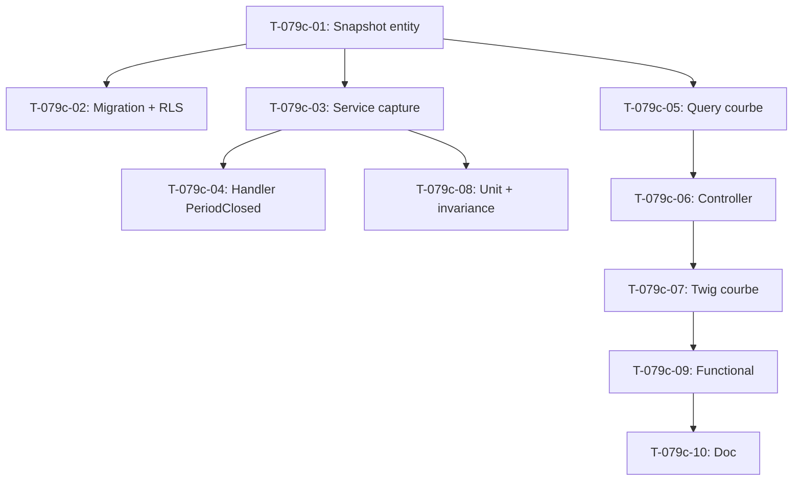

# Tâches - US-079c : Courbe d'atterrissage historisée (capture légère)

## Informations US
- **Epic** : EPIC-002 (Projets & delivery)
- **Persona** : P2 (Marc — Chef de projet) / P6 (Direction)
- **Story Points** : ~5
- **Sprint** : sprint-015-finition-pilotage
- **Priorité** : 🔴 Must
- **Traçabilité** : EF-PRJ-16 (courbe)

## Résumé de la US
**En tant que** chef de projet (P2) et directeur (P6)
**Je veux** voir la **courbe d'atterrissage** dans le temps (pas seulement la valeur courante)
**Afin de** comprendre *quand* la trajectoire de charge s'est dégradée.

## Critère d'acceptance cible (CA-2)
```gherkin
GIVEN un projet dont l'atterrissage a été recalculé sur plusieurs périodes
WHEN je consulte la courbe d'atterrissage
THEN je vois son évolution dans le temps (pas seulement la valeur courante)
```

## Décision de conception (rétro S14 → sprint-goal S15)
L'historisation ne doit **pas** alourdir `ComputeProjectMargins` (handler cœur du figeage de
marge — c'est ce qui avait fait reporter la story en S14). Approche retenue : **un handler
séparé** sur le même déclencheur (`PeriodClosed`), calqué sur le pattern existant
`App\Application\Margin\FreezeProjectMarginsOnPeriodClosed`. Il enregistre un
`ChargeLandingSnapshot` **idempotent** par `(tenant, projet, période)`. La courbe lit la série.

> **Invariant DoD** : `ComputeProjectMargins` reste **inchangé** (signature + comportement) — un
> test le prouve (T-079c-08).

## Vue d'ensemble des tâches

| ID | Type | Tâche | Estimation | Dépend de | Statut |
|----|------|-------|------------|-----------|--------|
| T-079c-01 | [DB] | Entité `ChargeLandingSnapshot` + port repository | 2h | - | 🔲 |
| T-079c-02 | [DB] | Migration + policy RLS | 1.5h | T-079c-01 | 🔲 |
| T-079c-03 | [BE] | Service de capture idempotent (réutilise `ChargeLandingCalculator`) | 3h | T-079c-01 | 🔲 |
| T-079c-04 | [BE] | Handler `CaptureChargeLandingOnPeriodClosed` sur `PeriodClosed` | 1.5h | T-079c-03 | 🔲 |
| T-079c-05 | [BE] | Query `ViewChargeLandingCurve` (série par projet) | 2h | T-079c-01 | 🔲 |
| T-079c-06 | [FE-WEB] | Intégration `ProjectPageController` + endpoint courbe | 1.5h | T-079c-05 | 🔲 |
| T-079c-07 | [FE-WEB] | Vue Twig courbe (Tailwind, accessible, gating coût) | 3h | T-079c-06 | 🔲 |
| T-079c-08 | [TEST] | Unit : idempotence + preuve `ComputeProjectMargins` inchangé | 2h | T-079c-03 | 🔲 |
| T-079c-09 | [TEST] | Functional : handler + re-clôture + rendu courbe | 3h | T-079c-07 | 🔲 |
| T-079c-10 | [DOC] | PHPDoc + note décision (handler séparé) | 0.5h | T-079c-09 | 🔲 |

**Total estimé** : ~22h

---

## Détail des tâches

### Couche Base de données [DB]

#### T-079c-01 : Entité `ChargeLandingSnapshot` + port repository
- **Type** : [DB] · **Estimation** : 2h · **Dépend de** : -

**Description** : capturer, par période close, la photo d'atterrissage d'un projet (les valeurs
utiles à la courbe). Entité `TenantOwned` (isolation multi-tenant), immuable par snapshot.

**Fichiers à créer** :
- `src/Domain/Budget/ChargeLandingSnapshot.php` (entité Doctrine `TenantOwned`)
- `src/Domain/Budget/ChargeLandingSnapshotRepository.php` (port : `save()`, `findForProject(tenant, projectId): array`, `findOne(tenant, projectId, period)`)

**Champs** : `id (guid)`, `tenant_id (guid)`, `project_id (guid)`, `period (string YYYY-MM)`,
`landing_cost_cents (int nullable)`, `cost_budget_cents (int nullable)`, `overrun_percent (float nullable)`,
`consumption_percent (float nullable)`, `physical_progress_percent (smallint nullable)`,
`is_early_drift (bool)`, `captured_at (datetime_immutable)`.

**Critères de validation** :
- [ ] Contrainte d'unicité `(tenant_id, project_id, period)` (support de l'idempotence)
- [ ] Implémente `TenantOwned`
- [ ] Port repository dans le Domaine (pas d'implémentation Doctrine ici)

---

#### T-079c-02 : Migration + policy RLS
- **Type** : [DB] · **Estimation** : 1.5h · **Dépend de** : T-079c-01

**Fichiers** :
- `migrations/VersionXXXX.php`
- Implémentation Doctrine du repository : `src/Infrastructure/Persistence/Doctrine/DoctrineChargeLandingSnapshotRepository.php`

**Critères** :
- [ ] Table `charge_landing_snapshot` créée, index unique `(tenant_id, project_id, period)`
- [ ] **Policy RLS** activée sur la table (calquer les migrations récentes tenant-scoped)
- [ ] Migration testée up/down

**Commandes** :
```bash
docker compose exec app php bin/console doctrine:migrations:diff
docker compose exec app php bin/console doctrine:migrations:migrate
```

---

### Couche Application/Domaine [BE]

#### T-079c-03 : Service de capture idempotent
- **Type** : [BE] · **Estimation** : 3h · **Dépend de** : T-079c-01

**Description** : pour un tenant + période, calcule l'atterrissage de chaque projet (via
`ChargeLandingCalculator` + budget courant + progression physique, comme
`ViewProjectBudgetTracking`) et **upsert** le snapshot : si `(tenant, projet, période)` existe → le
**remplacer** (pas d'ajout). Aucune dépendance à `ComputeProjectMargins`.

**Fichiers** :
- `src/Application/Budget/CaptureChargeLandingSnapshots.php`

**Critères** :
- [ ] Idempotent par `(tenant, projet, période)` — remplace, n'ajoute pas (mitige la re-clôture)
- [ ] Réutilise `ChargeLandingCalculator::land()` (pas de duplication de la règle OBJ-2)
- [ ] Aucun couplage à la logique de figeage de marge

---

#### T-079c-04 : Handler `CaptureChargeLandingOnPeriodClosed`
- **Type** : [BE] · **Estimation** : 1.5h · **Dépend de** : T-079c-03

**Description** : `#[AsMessageHandler]` sur `App\Application\Period\Message\PeriodClosed`, **distinct**
de `FreezeProjectMarginsOnPeriodClosed`. Délègue au service de capture.

**Fichiers** :
- `src/Application/Budget/CaptureChargeLandingOnPeriodClosed.php`

**Modèle** (pattern existant `FreezeProjectMarginsOnPeriodClosed`) :
```php
#[AsMessageHandler]
final readonly class CaptureChargeLandingOnPeriodClosed
{
    public function __construct(private CaptureChargeLandingSnapshots $capture) {}

    public function __invoke(PeriodClosed $message): void
    {
        $this->capture->forClosedPeriod($message->tenantId(), $message->period());
    }
}
```

**Critères** :
- [ ] Deux handlers indépendants réagissent à `PeriodClosed` (figeage marge + capture atterrissage)
- [ ] `ComputeProjectMargins` / `FreezeProjectMarginsOnPeriodClosed` non modifiés

---

#### T-079c-05 : Query `ViewChargeLandingCurve`
- **Type** : [BE] · **Estimation** : 2h · **Dépend de** : T-079c-01

**Description** : retourne la série de snapshots d'un projet (ordonnée par période) pour affichage,
avec gating coût (masquer `landing_cost_cents` sans `VIEW_COLLABORATOR_COST`).

**Fichiers** :
- `src/Application/Budget/ViewChargeLandingCurve.php`
- `src/Application/Budget/ChargeLandingCurveView.php` (DTO : points de la courbe)

**Critères** :
- [ ] `ensureCan(VIEW_PROJECT_FINANCIALS)`
- [ ] Gating coût sur les montants (aligné sur `ViewProjectBudgetTracking`)
- [ ] Série ordonnée par période croissante

---

### Couche Frontend Web [FE-WEB]

#### T-079c-06 : Intégration `ProjectPageController` + endpoint courbe
- **Type** : [FE-WEB] · **Estimation** : 1.5h · **Dépend de** : T-079c-05

**Fichiers** :
- `src/UI/Http/Controller/ProjectPageController.php` (injecter `ViewChargeLandingCurve`, passer la série à la fiche projet)

**Critères** :
- [ ] La série est disponible dans la page pilotage (onglet fiche projet)
- [ ] `IsGranted` cohérent avec le suivi budgétaire existant

---

#### T-079c-07 : Vue Twig courbe
- **Type** : [FE-WEB] · **Estimation** : 3h · **Dépend de** : T-079c-06

**Fichiers** :
- `templates/project/show.html.twig` (bloc courbe) et/ou `templates/project/_charge_landing_curve.html.twig`

**Critères** :
- [ ] Tailwind v4 (pas de Bootstrap), cohérent avec le design system
- [ ] Accessible WCAG 2.2 AA : **table de données** + visualisation (SVG inline / sparkline), pas de dépendance JS externe non validée
- [ ] Gating coût respecté (montants masqués si non autorisé)
- [ ] État vide géré (aucun snapshot encore)

> **Piège boucle front** (mémoire) : en debug=false, vérifier via `make tailwind` + `cache:clear` + restart app.

---

### Couche Tests [TEST]

#### T-079c-08 : Unit — idempotence + preuve d'invariance
- **Type** : [TEST] · **Estimation** : 2h · **Dépend de** : T-079c-03

**Fichiers** :
- `tests/Unit/Application/Budget/CaptureChargeLandingSnapshotsTest.php`
- `tests/Unit/Application/Margin/ComputeProjectMarginsUnchangedTest.php` (ou assertion de signature)

**Critères** :
- [ ] Deux captures sur la même `(tenant, projet, période)` → 1 seul snapshot (remplacement)
- [ ] **Test prouvant que `ComputeProjectMargins` n'a pas changé** (signature publique / comportement)

---

#### T-079c-09 : Functional — handler, re-clôture, rendu courbe
- **Type** : [TEST] · **Estimation** : 3h · **Dépend de** : T-079c-07

**Fichiers** :
- `tests/Functional/Budget/ChargeLandingCurveTest.php`

**Critères** :
- [ ] `PeriodClosed` déclenche l'écriture d'un snapshot
- [ ] Re-clôture de la même période → remplace (pas de doublon)
- [ ] La page pilotage rend la courbe (série multi-périodes)
- [ ] **Piège schéma** (mémoire) : ajouter `ChargeLandingSnapshot::class` (et toute table rebranchée) au `SchemaTool` des tests fonctionnels atteignant la fiche projet / le pilotage.

---

### Documentation [DOC]

#### T-079c-10 : PHPDoc + note décision
- **Type** : [DOC] · **Estimation** : 0.5h · **Dépend de** : T-079c-09

**Critères** :
- [ ] PHPDoc handler/service (référence EF-PRJ-16 + décision « handler séparé »)
- [ ] Note dans la story / sprint-goal confirmant l'invariant `ComputeProjectMargins` inchangé

---

## Graphe de dépendances



## Résumé

| Couche | Nb tâches | Heures |
|--------|-----------|--------|
| [DB] | 2 | 3.5h |
| [BE] | 3 | 6.5h |
| [FE-WEB] | 2 | 4.5h |
| [TEST] | 2 | 5h |
| [DOC] | 1 | 0.5h |
| **TOTAL** | **10** | **~22h** |
