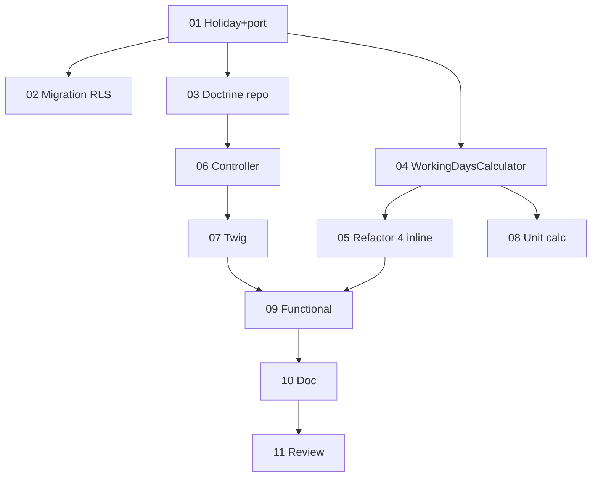

# Tâches - US-012 : Jours fériés & calcul unifié des jours ouvrés

## Informations US
- **Epic** : EPIC-001 · **Persona** : P-ADMIN · **Points** : 5 · **Sprint** : sprint-016
- **Traçabilité** : EF-REF-6, RG-REF-1 · **Ordre** : #1 (fondateur — jours ouvrés partout)

## Résumé
**En tant qu'** administrateur, **je veux** déclarer les jours fériés et un calcul unifié des jours
ouvrés qui les intègre, **afin que** capacité/occupation/complétude reflètent les jours réellement travaillés.

## Vue d'ensemble des tâches

| ID | Type | Tâche | Est. | Dépend | Statut |
|----|------|-------|------|--------|--------|
| T-012-01 | [DB] | Entité `Domain\Calendar\Holiday` (TenantOwned) + port `HolidayRepository` | 2h | - | 🔲 |
| T-012-02 | [DB] | Migration + policy RLS (`holiday`, unique tenant+date) | 1.5h | 01 | 🔲 |
| T-012-03 | [INFRA] | `DoctrineHolidayRepository` + binding services.yaml | 1.5h | 01 | 🔲 |
| T-012-04 | [BE] | Service Domaine `WorkingDaysCalculator` (week-end + fériés) — TDD | 3h | 01 | 🔲 |
| T-012-05 | [BE] | Refactor DRY : brancher les 4 usages inline sur `WorkingDaysCalculator` | 3h | 04 | 🔲 |
| T-012-06 | [FE-WEB] | Controller `/parametrage/jours-feries` (liste/ajout/suppr, gating, CSRF) | 2h | 03 | 🔲 |
| T-012-07 | [FE-WEB] | Template Twig (liste triée + formulaire d'ajout) | 2h | 06 | 🔲 |
| T-012-08 | [TEST] | Unit `WorkingDaysCalculator` (week-end, fériés, isolation) | 2h | 04 | 🔲 |
| T-012-09 | [TEST] | Functional page admin (CRUD, doublon, 403) + impact occupation | 3h | 05,07 | 🔲 |
| T-012-10 | [DOC] | PHPDoc + note refactor (4 duplications supprimées) | 0.5h | 09 | 🔲 |
| T-012-11 | [REV] | Code review + `make ci` | 1.5h | 10 | 🔲 |

**Total estimé** : ~22h

---

## Détails clés

### T-012-01 [DB] — Entité Holiday + port
- `src/Domain/Calendar/Holiday.php` (`TenantOwned` : `tenantId`, `date` (date_immutable), `label`) ; unicité `(tenant_id, date)`.
- `src/Domain/Calendar/HolidayRepository.php` : `save`, `delete`, `findForTenant(tenant): list`, `datesForTenantInRange(tenant, from, to): list<DateTimeImmutable>` (pour le calculateur), `existsForDate(tenant, date): bool` (doublon).

### T-012-02 [DB] — Migration + RLS
- Table `holiday` (id guid, tenant_id, date, label), index unique `(tenant_id, date)`, `ENABLE/FORCE ROW LEVEL SECURITY` + policy `tenant_isolation` (pattern standard).

### T-012-04 [BE] — WorkingDaysCalculator (cœur, TDD)
- `src/Domain/Calendar/WorkingDaysCalculator.php` : `workingDaysBetween(TenantId, from, to): int`, `isWorkingDay(TenantId, day): bool`.
- Exclut samedi/dimanche (`format('N') > 5`) **ET** les fériés du tenant (via `HolidayRepository::datesForTenantInRange`).
- ⚠️ Charger les fériés de la période **une fois** (pas de requête par jour) → set de dates comparées.

### T-012-05 [BE] — Refactor DRY (remplacer 4 inline)
Brancher le service sur : `Application\Valuation\OccupationReport`, `Application\Completeness\CompletenessGrid`,
`Application\Activity\ActivitySummary`, `Application\Reminder\ScheduleReminders`. Injecter le calculateur ;
supprimer `isWeekday()`/`isBusinessDay()`/boucles locales. **Ne pas** changer la formule occupation
(`capacité = jours ouvrés − absences`) — seuls les jours ouvrés deviennent nets de fériés.
> Piège : ces services sont couverts par des tests fonctionnels — vérifier qu'ils passent après refactor
> (et ajouter `Holiday::class` aux SchemaTool des tests occupation/complétude, sinon 500).

### T-012-06/07 [FE-WEB] — UI admin
- `src/UI/Http/Controller/HolidayController.php` : `GET /parametrage/jours-feries` (liste + form), `POST` (ajout), `POST /{id}/suppression` (ou DELETE via form). Gating `MANAGE_ORGANIZATION`, CSRF avant écriture.
- `templates/parametrage/holidays.html.twig` (Tailwind, WCAG : table + form labellisé).

### T-012-08/09 [TEST]
- Unit : week-end exclu, férié exclu, isolation multi-tenant (fériés de A n'impactent pas B).
- Functional : CRUD admin, doublon refusé (CA-5), 403 sans habilitation (CA-6), et un test prouvant qu'un férié réduit les jours ouvrés d'occupation (CA-1/CA-2).

## Graphe de dépendances

## Résumé
| Couche | Tâches | Heures |
|--------|--------|--------|
| [DB] | 2 | 3.5h |
| [INFRA] | 1 | 1.5h |
| [BE] | 2 | 6h |
| [FE-WEB] | 2 | 4h |
| [TEST] | 2 | 5h |
| [DOC]/[REV] | 2 | 2h |
| **TOTAL** | **11** | **~22h** |
