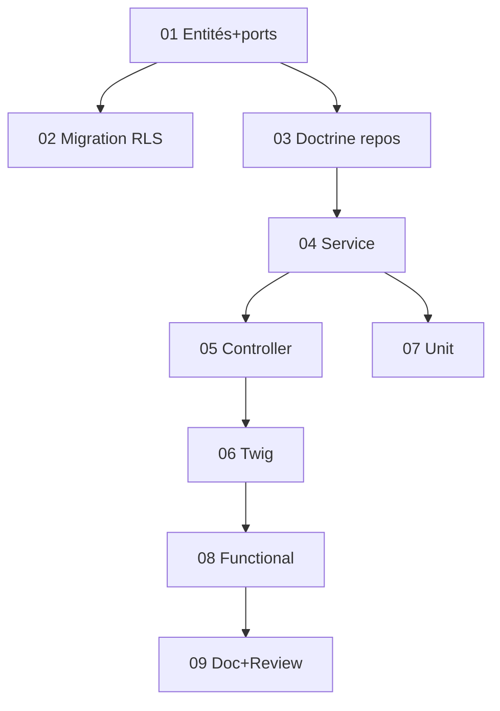

# Tâches - US-013 : Référentiel de compétences & niveaux

## Informations US
- **Epic** : EPIC-001 · **Persona** : P-ADMIN (gestion) / P3 (lecture) · **Points** : 3 · **Sprint** : sprint-016
- **Traçabilité** : EF-REF-10/11, RG-REF-1 · **Ordre** : #2

## Résumé
**En tant qu'** administrateur, **je veux** un référentiel de compétences (catégorie + libellé) avec une
échelle de niveaux paramétrable et l'association aux collaborateurs, **afin de** qualifier les profils
(le staffing/recherche est hors périmètre — module RES).

## Vue d'ensemble des tâches

| ID | Type | Tâche | Est. | Dépend | Statut |
|----|------|-------|------|--------|--------|
| T-013-01 | [DB] | Entités `Skill` (enum `SkillCategory`, `active`), `SkillLevelScale`, `SkillAssignment` + ports | 3h | - | 🔲 |
| T-013-02 | [DB] | Migration + RLS (3 tables, unicités) | 1.5h | 01 | 🔲 |
| T-013-03 | [INFRA] | Repositories Doctrine + bindings | 2h | 01 | 🔲 |
| T-013-04 | [BE] | Service application (créer compétence, config échelle, associer, désactiver) + normalisation/unicité | 3h | 03 | 🔲 |
| T-013-05 | [FE-WEB] | Controller `/parametrage/competences` (gating, CSRF) | 2h | 04 | 🔲 |
| T-013-06 | [FE-WEB] | Templates Twig (référentiel par catégorie, échelle, association) | 2.5h | 05 | 🔲 |
| T-013-07 | [TEST] | Unit (normalisation/unicité, échelle) | 1.5h | 04 | 🔲 |
| T-013-08 | [TEST] | Functional (CRUD, désactivation, doublon, 403) | 2.5h | 06 | 🔲 |
| T-013-09 | [DOC]+[REV] | PHPDoc + review + `make ci` | 1.5h | 08 | 🔲 |

**Total estimé** : ~21.5h *(story 3 pts : la charge inclut 3 entités + UI ; garder les tâches sobres)*

---

## Détails clés

### T-013-01 [DB] — Domaine
- `src/Domain/Skill/Skill.php` (`TenantOwned` : `SkillCategory` enum [TECHNIQUE, FONCTIONNEL, METHODOLOGIQUE, LINGUISTIQUE, SECTORIEL], `label`, `active`) ; unicité `(tenant_id, category, normalized_label)`.
- `src/Domain/Skill/SkillLevelScale.php` (`TenantOwned` : niveaux ordonnés, défaut 4) ; 1 par tenant.
- `src/Domain/Skill/SkillAssignment.php` (`TenantOwned` : `userId`, `skillId`, `level`) ; unicité `(tenant_id, user_id, skill_id)`.
- Ports repository associés (Domaine).

### T-013-04 [BE] — Service
- Normalisation du libellé (trim + casse) pour l'unicité (CA-5) ; désactivation (jamais suppression, CA-3/RG-REF-1) ; garde d'échelle (ne pas casser les associations existantes).

### T-013-05/06 [FE-WEB]
- `SkillController` : `/parametrage/competences` (liste par catégorie + compteur collaborateurs, form ajout, échelle, association). Gating `MANAGE_ORGANIZATION`, CSRF.
- `templates/parametrage/skills.html.twig` (Tailwind, WCAG).

### T-013-07/08 [TEST]
- Unit : unicité insensible à la casse, ordre d'échelle.
- Functional : création, désactivation (n'apparaît plus en saisie / historiques conservés), doublon refusé, 403 ; **ajouter les 3 entités aux SchemaTool** des tests concernés.

## Graphe de dépendances

## Résumé
| Couche | Tâches | Heures |
|--------|--------|--------|
| [DB] | 2 | 4.5h |
| [INFRA] | 1 | 2h |
| [BE] | 1 | 3h |
| [FE-WEB] | 2 | 4.5h |
| [TEST] | 2 | 4h |
| [DOC]/[REV] | 1 | 1.5h |
| **TOTAL** | **9** | **~21.5h** |
