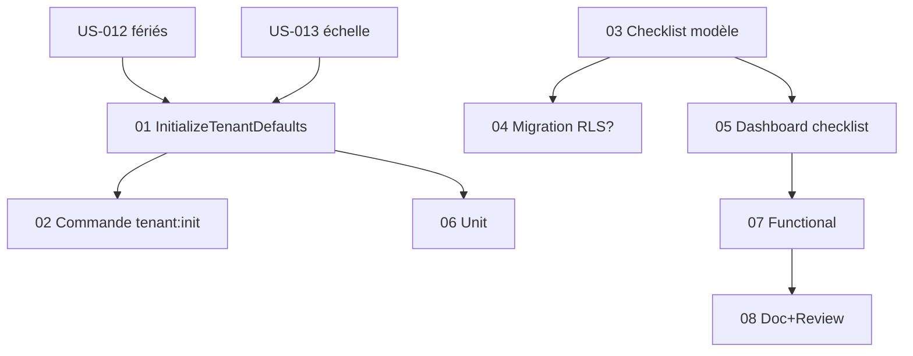

# Tâches - US-019 : Onboarding tenant — défauts & mise en route

## Informations US
- **Epic** : EPIC-001 · **Persona** : P-ADMIN · **Points** : 5 · **Sprint** : sprint-016
- **Traçabilité** : EF-REF-29, RG-REF-3 · **Ordre** : #4 (**en dernier** — provisionne les défauts d'US-012/013/016)

## Résumé
**En tant qu'** administrateur d'un tenant neuf, **je veux** des défauts provisionnés automatiquement +
une checklist de mise en route, **afin de** créer un projet et saisir un temps immédiatement, sans config.

## Vue d'ensemble des tâches

| ID | Type | Tâche | Est. | Dépend | Statut |
|----|------|-------|------|--------|--------|
| T-019-01 | [BE] | Service `Application\Onboarding\InitializeTenantDefaults` (idempotent) | 4h | US-012, US-013 | 🔲 |
| T-019-02 | [OPS] | Commande console `tenant:init` (lookup tenant, erreur si absent) | 2h | 01 | 🔲 |
| T-019-03 | [DB] | Suivi de checklist : entité `TenantOnboarding` (TenantOwned) **ou** dérivation par comptage — décider | 2h | - | 🔲 |
| T-019-04 | [DB] | Migration + RLS (si entité checklist retenue) | 1h | 03 | 🔲 |
| T-019-05 | [FE-WEB] | Bandeau/checklist onboarding sur le dashboard (gating admin, étapes auto-cochées) | 3h | 03 | 🔲 |
| T-019-06 | [TEST] | Unit (idempotence, tenant inexistant) | 2h | 01 | 🔲 |
| T-019-07 | [TEST] | Functional (checklist dashboard, isolation, parcours projet→temps sans config) | 3h | 05 | 🔲 |
| T-019-08 | [DOC]+[REV] | PHPDoc + review + `make ci` | 1.5h | 07 | 🔲 |

**Total estimé** : ~20.5h

---

## Détails clés

### T-019-01 [BE] — InitializeTenantDefaults (idempotent)
Orchestration, chaque défaut créé seulement s'il n'existe pas (upsert) :
- Rôles : réutiliser `Application\Authorization\InitializeDefaultRoles` (existant).
- Profil par défaut « Consultant » (`Pricing\Profile`, taux à renseigner).
- Client interne (`Client`).
- Devise de référence EUR (US-016 — défaut déjà présent ; s'assurer de la cohérence).
- Échelle de compétences 4 niveaux (US-013 `SkillLevelScale`).
- Jours fériés de l'année civile en cours (US-012 `Holiday`).
> Statuts projet : **aucun** provisioning (enum `ProjectStatus`).

### T-019-02 [OPS] — Commande `tenant:init`
- `src/UI/Console/InitializeTenantCommand.php` : argument tenantId ; erreur explicite si tenant introuvable (CA-5) ; appelle le service ; idempotent (CA-4).

### T-019-03/04 [DB] — Checklist
- **Décision** : entité `TenantOnboarding` (état des étapes + dismissed) **ou** dérivation live par comptage (projets, saisies). **Recommandé** : dérivation par comptage (KISS, pas de nouvelle table) + un flag « bandeau masqué » minimal si besoin. Si entité retenue → migration + RLS (T-019-04) ; sinon T-019-04 sans objet.

### T-019-05 [FE-WEB] — Dashboard
- Encart checklist : (1) profil par défaut, (2) créer un projet, (3) saisir un temps ; étapes cochées via comptages (projets/saisies du tenant) ; se replie une fois complète (CA-3). Gating administrateur.

### T-019-06/07 [TEST]
- Unit : rejouer `tenant:init` ne crée pas de doublon (CA-4) ; tenant inexistant → erreur (CA-5).
- Functional : checklist affichée/mise à jour, isolation multi-tenant (CA-6), et un parcours prouvant qu'après `tenant:init` on peut créer un projet et saisir un temps **sans étape de config** (CA-1).

## Graphe de dépendances

## Résumé
| Couche | Tâches | Heures |
|--------|--------|--------|
| [BE] | 1 | 4h |
| [OPS] | 1 | 2h |
| [DB] | 2 | 3h |
| [FE-WEB] | 1 | 3h |
| [TEST] | 2 | 5h |
| [DOC]/[REV] | 1 | 1.5h |
| **TOTAL** | **8** | **~20.5h** |
