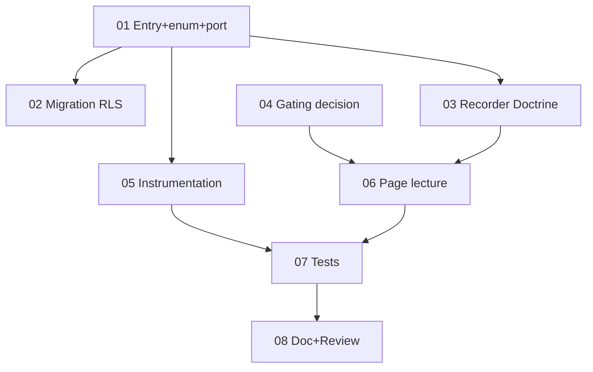

# Tâches - US-020 : Journal d'audit du paramétrage

## Informations US
- **Epic** : EPIC-001 · **Persona** : P-ADMIN (écriture implicite) / P6 (lecture) · **Points** : 3 · **Sprint** : sprint-016
- **Traçabilité** : EF-REF-33, INV-7, HAB-6 · **Ordre** : #3 (instrumente US-012/013 + seuils existants)

## Résumé
**En tant qu'** administrateur, **je veux** un journal d'audit **immuable** (qui/quoi/avant/après/quand)
des changements de paramétrage, **afin de** garantir la traçabilité et faciliter les audits.

## Vue d'ensemble des tâches

| ID | Type | Tâche | Est. | Dépend | Statut |
|----|------|-------|------|--------|--------|
| T-020-01 | [DB] | Entité `Domain\Audit\ConfigAuditEntry` (TenantOwned) + enum `AuditAction` + port `ConfigAuditRecorder` (append-only) | 2.5h | - | 🔲 |
| T-020-02 | [DB] | Migration + RLS (`config_audit_entry`) | 1.5h | 01 | 🔲 |
| T-020-03 | [INFRA] | Recorder Doctrine + binding (record + lecture, **aucune** update/delete) | 1.5h | 01 | 🔲 |
| T-020-04 | [BE] | Décider le gating de lecture (HAB-6) : perm `VIEW_AUDIT_LOG` ou rôles ADMIN/Dirigeant | 1h | - | 🔲 |
| T-020-05 | [BE] | Instrumenter le recorder (seuils charge/marge + hooks US-012 fériés, US-013 compétences) | 2.5h | 01 | 🔲 |
| T-020-06 | [FE-WEB] | Page `/parametrage/audit` (lecture gated, filtres objet/auteur, tri desc) | 2.5h | 03,04 | 🔲 |
| T-020-07 | [TEST] | Unit (recorder capture avant/après) + Functional (journalisation modif seuil, isolation, 403, pas de route d'édition) | 3h | 05,06 | 🔲 |
| T-020-08 | [DOC]+[REV] | PHPDoc (INV-7 append-only) + review + `make ci` | 1.5h | 07 | 🔲 |

**Total estimé** : ~16h

---

## Détails clés

### T-020-01 [DB] — Domaine
- `ConfigAuditEntry` (`TenantOwned`) : `actorUserId`, `action` (enum `AuditAction`: CREATION/MODIFICATION/SUPPRESSION/DESACTIVATION), `objectType`, `objectLabel`, `field` (nullable), `valueBefore`/`valueAfter` (nullable string), `recordedAt`.
- Port `ConfigAuditRecorder` : **`record(...)` + lecture** (`findForTenant(filters): list`). **Aucune** méthode d'update/delete (INV-7).

### T-020-03 [INFRA] — Append-only
- Recorder Doctrine (persist+flush). Pas de route/commande d'édition/suppression. (GRANT INSERT-ONLY PostgreSQL = durcissement infra noté pour plus tard.)

### T-020-04 [BE] — Gating (décision)
- Trancher : nouvelle permission `VIEW_AUDIT_LOG` (ajoutée à `DefaultRoleMatrix` pour Administrateur + Dirigeant) **ou** contrôle direct sur ces deux rôles. **Recommandé** : permission dédiée `VIEW_AUDIT_LOG` (cohérent RBAC).

### T-020-05 [BE] — Instrumentation
- Appeler `record(...)` depuis `ChargeDriftThresholdController::save`, `MarginDriftThresholdController::save`, et les écritures US-012 (ajout/suppr férié) / US-013 (création/désactivation compétence). Capturer valeur avant (relire l'existant) + après.
> Coordination : US-012 et US-013 précèdent US-020 dans l'ordre → leurs points d'écriture existent déjà quand on instrumente.

### T-020-06 [FE-WEB] — Lecture
- `AuditLogController` : `GET /parametrage/audit`, gating (T-020-04), filtres `objectType` + `actor`, tri `recordedAt` desc. Template `templates/parametrage/audit.html.twig` (table, filtres).

### T-020-07 [TEST]
- Unit : le recorder capte avant/après sur une modif de seuil.
- Functional : une modif de seuil crée une entrée ; isolation multi-tenant ; 403 pour un rôle non habilité ; **absence** de route d'édition/suppression (immuabilité) ; ajouter `ConfigAuditEntry::class` aux SchemaTool.

## Graphe de dépendances

## Résumé
| Couche | Tâches | Heures |
|--------|--------|--------|
| [DB] | 2 | 4h |
| [INFRA] | 1 | 1.5h |
| [BE] | 2 | 3.5h |
| [FE-WEB] | 1 | 2.5h |
| [TEST] | 1 | 3h |
| [DOC]/[REV] | 1 | 1.5h |
| **TOTAL** | **8** | **~16h** |
