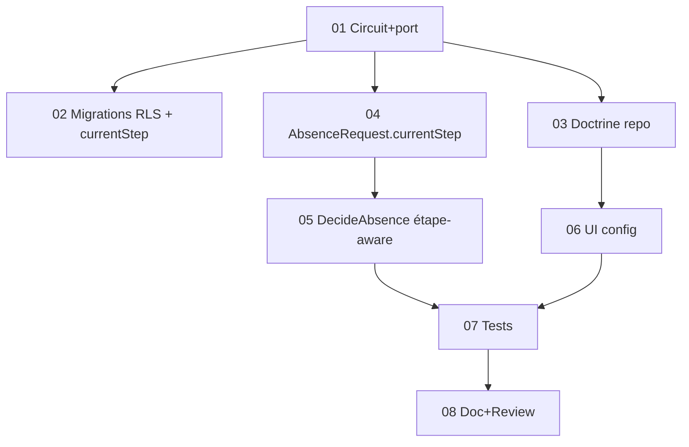

# Tâches - US-017 : Circuit de validation des absences paramétrable

## Informations US
- **Epic** : EPIC-001 · **Persona** : P-ADMIN / valideurs · **Points** : 8 · **Sprint** : sprint-017 · **Ordre** : #3
- **Traçabilité** : EF-REF-25 (flux pilote absences) · réutilise `DecideAbsence` + pattern `ReminderRule`

## Résumé
**En tant qu'** administrateur, **je veux** paramétrer le circuit de validation des absences (1 ou 2 étapes, validateur par rôle), **afin d'** adapter le niveau de contrôle.

## Vue d'ensemble des tâches

| ID | Type | Tâche | Est. | Dépend | Statut |
|----|------|-------|------|--------|--------|
| T-017-01 | [DB] | Entité `Domain\Validation\AbsenceValidationCircuit` (steps JSON ≤2 rôles) + port + factory `default()` | 2.5h | - | 🔲 |
| T-017-02 | [DB] | Migration + RLS (`absence_validation_circuit`) + **migration additive** `current_step` sur `absence_request` | 2h | 01 | 🔲 |
| T-017-03 | [INFRA] | Repository Doctrine + binding | 1.5h | 01 | 🔲 |
| T-017-04 | [BE] | `AbsenceRequest` : champ `currentStep` (défaut 1) + logique d'avancement | 2h | 01 | 🔲 |
| T-017-05 | [BE] | `DecideAbsence` étape-aware : résout le circuit, vérifie le rôle de l'étape courante, avance, valide au terme | 3h | 04 | 🔲 |
| T-017-06 | [FE-WEB] | Controller `/parametrage/circuits-validation` + Twig (nb étapes + rôle/étape, gating, CSRF) | 2.5h | 03 | 🔲 |
| T-017-07 | [TEST] | Unit (avancement, refus, mauvais rôle, repli 1 étape) + Functional (config, parcours 2 étapes, 403) | 3.5h | 05,06 | 🔲 |
| T-017-08 | [DOC]+[REV] | PHPDoc + review + `make ci` | 1.5h | 07 | 🔲 |

**Total estimé** : ~18.5h

## Détails clés
- **T-017-01** : `AbsenceValidationCircuit` (`steps` JSON = liste ordonnée de noms de rôle, 1..2) ; unique (tenant) ; `default(TenantId)` = 1 étape (rôle validateur d'absence par défaut) ; `reconfigure(steps)` garde (1..2, rôle non vide). Pattern `ReminderRule`.
- **T-017-04** : `AbsenceRequest.currentStep` (int, défaut 1) ; méthode d'avancement `advanceStep()` ; `VALIDATED` quand `currentStep > nbÉtapes`. Migration additive (colonne avec défaut 1 pour les lignes existantes).
- **T-017-05** : `DecideAbsence::approve()` — charge le circuit ; vérifie que l'acteur possède le **rôle de l'étape courante** (via `Authorizer`/rôles de l'utilisateur) ; si oui, avance ; si dernière étape franchie → `validate()`. `reject()` inchangé (→ REJECTED). Garde anti-auto-décision conservée. Émission `AbsenceValidated`/événements au **terme** seulement.
- **T-017-06** : liste des rôles du tenant pour désigner le validateur de chaque étape (1 ou 2).
- **T-017-07** : **ajouter `AbsenceValidationCircuit::class` aux SchemaTool** des tests d'absence ; couvrir la non-régression du flux mono-étape par défaut.

## Graphe

## Résumé
| Couche | Tâches | Heures |
|--------|--------|--------|
| [DB] | 2 | 4.5h |
| [INFRA] | 1 | 1.5h |
| [BE] | 2 | 5h |
| [FE-WEB] | 1 | 2.5h |
| [TEST] | 1 | 3.5h |
| [DOC]/[REV] | 1 | 1.5h |
| **TOTAL** | **8** | **~18.5h** |
