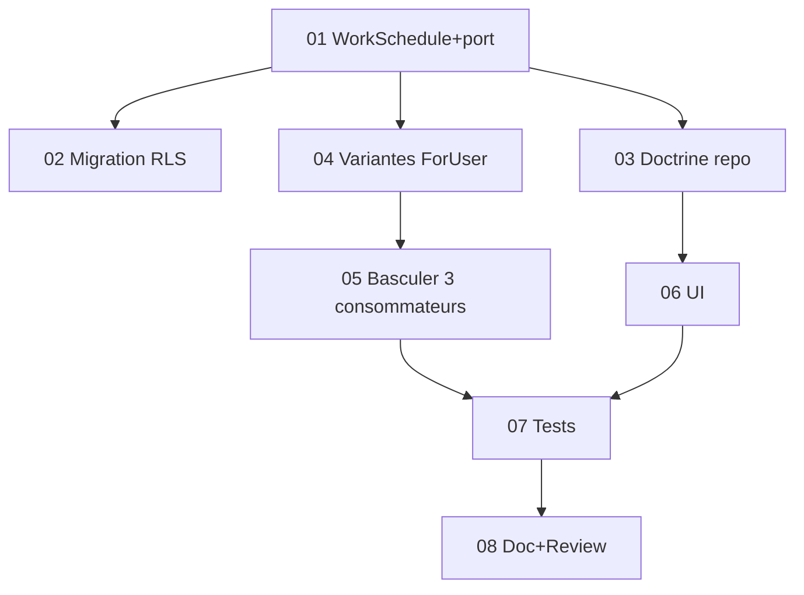

# Tâches - US-021 : Calendriers de travail différenciés (temps partiel)

## Informations US
- **Epic** : EPIC-001 · **Persona** : P-ADMIN · **Points** : 8 · **Sprint** : sprint-017 · **Ordre** : #2
- **Traçabilité** : EF-REF-7 (tranche temps partiel) · **invasif** (calcul jours ouvrés par utilisateur)

## Résumé
**En tant qu'** administrateur, **je veux** définir le régime de travail d'un collaborateur (jours travaillés), **afin que** sa capacité/occupation reflète son temps partiel.

## Vue d'ensemble des tâches

| ID | Type | Tâche | Est. | Dépend | Statut |
|----|------|-------|------|--------|--------|
| T-021-01 | [DB] | Entité `Domain\Calendar\WorkSchedule` (userId, workingWeekdays JSON) + port | 2h | - | 🔲 |
| T-021-02 | [DB] | Migration + RLS (`work_schedule`, unique tenant+user) | 1.5h | 01 | 🔲 |
| T-021-03 | [INFRA] | `DoctrineWorkScheduleRepository` + binding | 1.5h | 01 | 🔲 |
| T-021-04 | [BE] | `WorkingDaysCalculator` : variantes **par utilisateur** (`isWorkingDayForUser`, `workingDaysForUser`) — tenant-level inchangé | 3h | 01 | 🔲 |
| T-021-05 | [BE] | Basculer `OccupationReport` + `CompletenessGrid` + `ActivitySummary` sur les variantes par utilisateur | 3h | 04 | 🔲 |
| T-021-06 | [FE-WEB] | Controller `/parametrage/regimes-travail` + Twig (gating, CSRF) | 2.5h | 03 | 🔲 |
| T-021-07 | [TEST] | Unit (régime, repli temps plein, férié/fermeture) + Functional (CRUD, 403, impact occupation/complétude) | 3.5h | 05,06 | 🔲 |
| T-021-08 | [DOC]+[REV] | PHPDoc + review + `make ci` | 1.5h | 07 | 🔲 |

**Total estimé** : ~18.5h

## Détails clés
- **T-021-01** : `WorkSchedule` (`userId` guid, `workingWeekdays` JSON list<int> 1..5) ; garde ≥1 jour, ∈1..5 ; unicité (tenant, user). Port : `save/find(tenant,userId)/findForTenant/delete`.
- **T-021-04** : ajouter au calculateur (sans toucher `isWorkingDay(tenant, day)`) :
  - `isWorkingDayForUser(tenant, userId, day)` = `isWorkingDay(tenant, day)` **ET** `ISO weekday ∈ régime(user)` (repli Lun-Ven si aucun régime) ; cache des régimes par (tenant,user).
  - `workingDaysForUser(tenant, userId, from, to)`.
- **T-021-05** : `OccupationReport` (workingDays + absenceDays par user → variantes) ; `CompletenessGrid.week()` (jours attendus par user) ; `ActivitySummary.expectedMinutes` (par user). **`ScheduleReminders` INCHANGÉ.**
- **T-021-07** : **ajouter `WorkSchedule::class` aux SchemaTool** des tests occupation/complétude/activité. Vérifier non-régression des tests existants (capacité par défaut = temps plein).

## Graphe

## Résumé
| Couche | Tâches | Heures |
|--------|--------|--------|
| [DB] | 2 | 3.5h |
| [INFRA] | 1 | 1.5h |
| [BE] | 2 | 6h |
| [FE-WEB] | 1 | 2.5h |
| [TEST] | 1 | 3.5h |
| [DOC]/[REV] | 1 | 1.5h |
| **TOTAL** | **8** | **~18.5h** |
