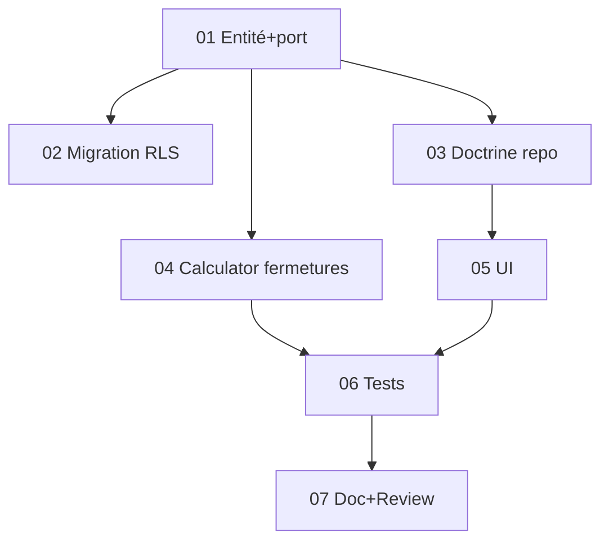

# Tâches - US-022 : Périodes de fermeture entreprise

## Informations US
- **Epic** : EPIC-001 · **Persona** : P-ADMIN · **Points** : 5 · **Sprint** : sprint-017 · **Ordre** : #1
- **Traçabilité** : EF-REF-9 · réutilise `WorkingDaysCalculator` (S16)

## Résumé
**En tant qu'** administrateur, **je veux** déclarer des plages de fermeture, **afin que** ces jours soient exclus des jours ouvrés pour tous.

## Vue d'ensemble des tâches

| ID | Type | Tâche | Est. | Dépend | Statut |
|----|------|-------|------|--------|--------|
| T-022-01 | [DB] | Entité `Domain\Calendar\ClosurePeriod` (TenantOwned) + port `ClosurePeriodRepository` | 2h | - | 🔲 |
| T-022-02 | [DB] | Migration + policy RLS (`closure_period`) | 1.5h | 01 | 🔲 |
| T-022-03 | [INFRA] | `DoctrineClosurePeriodRepository` + binding | 1.5h | 01 | 🔲 |
| T-022-04 | [BE] | Étendre `WorkingDaysCalculator` : fermetures exclues (cache par tenant) | 2h | 01 | 🔲 |
| T-022-05 | [FE-WEB] | Controller `/parametrage/fermetures` + Twig (gating, CSRF) | 2.5h | 03 | 🔲 |
| T-022-06 | [TEST] | Unit (plage exclue) + Functional (CRUD, fin<début, 403, impact occupation) | 3h | 04,05 | 🔲 |
| T-022-07 | [DOC]+[REV] | PHPDoc + review + `make ci` | 1.5h | 06 | 🔲 |

**Total estimé** : ~14h

## Détails clés
- **T-022-01** : `ClosurePeriod` (`startDate`, `endDate` date_immutable incluses, `label`) ; garde `endDate >= startDate` ; unicité non requise. Port : `save/delete/find/findForTenant/allForTenant`.
- **T-022-04** : dans `WorkingDaysCalculator::isWorkingDay()`, ajouter le test « jour ∈ une fermeture du tenant » (après week-end/férié). Charger les fermetures une fois (cache `closureCache[tenantId]` = liste d'intervalles).
- **T-022-06** : **ajouter `ClosurePeriod::class` aux SchemaTool** des tests occupation/complétude/activité (piège récurrent).

## Graphe

## Résumé
| Couche | Tâches | Heures |
|--------|--------|--------|
| [DB] | 2 | 3.5h |
| [INFRA] | 1 | 1.5h |
| [BE] | 1 | 2h |
| [FE-WEB] | 1 | 2.5h |
| [TEST] | 1 | 3h |
| [DOC]/[REV] | 1 | 1.5h |
| **TOTAL** | **7** | **~14h** |
