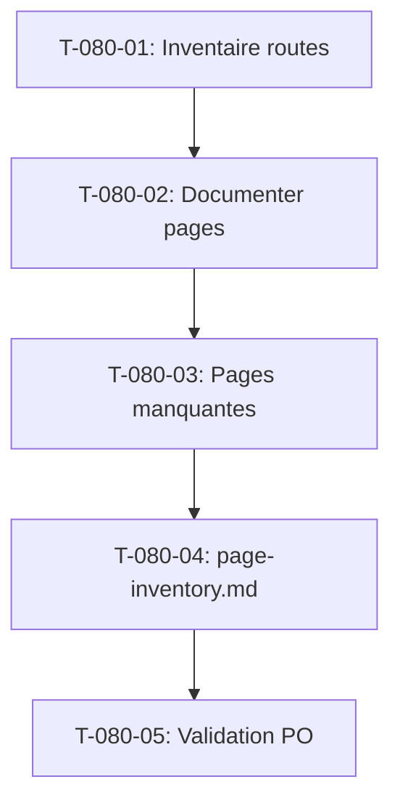

# Tâches - US-080 : Référentiel exhaustif des pages cibles

## Informations US
- **Epic** : EPIC-013 (Recensement & conception UX)
- **Persona** : Tous (concepteur / PO)
- **Story Points** : 5
- **Sprint** : sprint-019-conception-ux

## Résumé de la US
**En tant que** concepteur produit,
**Je veux** recenser toutes les pages cibles (existantes + à venir) par module,
**Afin de** figer *quelles* pages construire, *pour qui*, *avec quelles informations*.

> **Nature** : sprint de conception — livrables **documentaires** (pas de code produit).
> Types adaptés : `[DOC]` (rédaction/analyse), `[REV]` (validation PO). Pas de `[DB]/[BE]/[FE]`.

## Vue d'ensemble des tâches

| ID | Type | Tâche | Estimation | Dépend de | Statut |
|----|------|-------|------------|-----------|--------|
| T-080-01 | [DOC] | Extraire l'inventaire des routes/écrans existants (`debug:router` + templates) | 2h | - | 🔲 |
| T-080-02 | [DOC] | Documenter chaque page existante : objectif, persona(s), infos affichées, actions, données sources | 4h | T-080-01 | 🔲 |
| T-080-03 | [DOC] | Identifier les pages cibles manquantes (à créer) par module | 3h | T-080-02 | 🔲 |
| T-080-04 | [DOC] | Consolider `architecture/page-inventory.md` (autorité, ventilé module/persona) | 2h | T-080-03 | 🔲 |
| T-080-05 | [REV] | Validation PO : couverture 100 % des ~30 écrans existants | 1h | T-080-04 | 🔲 |

**Total estimé** : 12h

---

## Détail des tâches

### T-080-01 : Extraire l'inventaire des routes/écrans existants
- **Type** : [DOC] · **Estimation** : 2h · **Dépend de** : -

**Description** : lister exhaustivement les écrans à partir de `php bin/console debug:router` (routes web) et des `templates/**/*.html.twig`.

**Livrable** : liste brute (route, template, méthode) — base de travail.

**Critères de validation** :
- [ ] Toutes les routes web (hors API/technique) listées
- [ ] Écrans sans route directe (modales, volets) repérés

**Commandes** :
```bash
make console c="debug:router"
```

---

### T-080-02 : Documenter chaque page existante
- **Type** : [DOC] · **Estimation** : 4h · **Dépend de** : T-080-01

**Livrable** : pour chaque page — objectif, persona(s) primaire(s), informations affichées, actions possibles, données sources (entités/services).

**Critères** :
- [ ] Une ligne par page ; colonnes complètes
- [ ] Persona primaire déterminé pour chaque page (cf. `personas.md`)

---

### T-080-03 : Identifier les pages cibles manquantes
- **Type** : [DOC] · **Estimation** : 3h · **Dépend de** : T-080-02

**Livrable** : pages à créer par module (temps, projets, staffing, finance, CRM, RH…), avec justification (besoin persona non couvert).

**Critères** :
- [ ] Manques rattachés à un EPIC module cible
- [ ] Distinction claire existant / à créer

---

### T-080-04 : Consolider `page-inventory.md`
- **Type** : [DOC] · **Estimation** : 2h · **Dépend de** : T-080-03

**Fichier** : `project-management/architecture/page-inventory.md` (créer le dossier si absent).

**Critères** :
- [ ] Document faisant autorité, ventilé par module et persona
- [ ] Format tableau homogène (page, route, statut existant/à créer, persona, infos, actions, données)

---

### T-080-05 : Validation PO
- **Type** : [REV] · **Estimation** : 1h · **Dépend de** : T-080-04

**Critères** :
- [ ] PO confirme la couverture 100 % des écrans existants
- [ ] Feu vert pour US-081 / US-083 (US-080 est leur pré-condition stricte)

---

## Graphe de dépendances



## Résumé

| Type | Nb tâches | Heures |
|------|-----------|--------|
| [DOC] | 4 | 11h |
| [REV] | 1 | 1h |
| **TOTAL** | **5** | **12h** |
