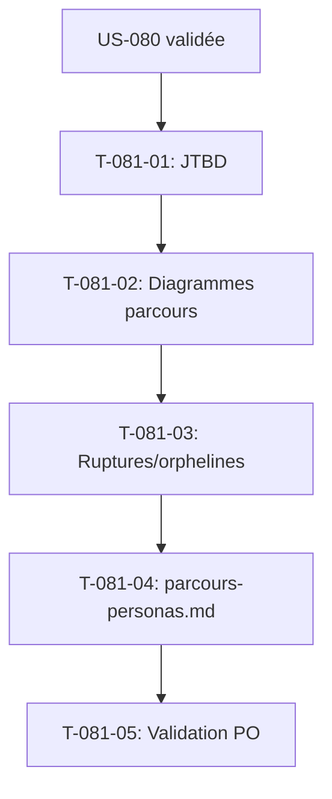

# Tâches - US-081 : Cartographie des parcours par persona (P1–P6)

## Informations US
- **Epic** : EPIC-013 (Recensement & conception UX)
- **Persona** : P1–P6 (concepteur au nom des personas)
- **Story Points** : 5
- **Sprint** : sprint-019-conception-ux

## Résumé de la US
**En tant que** concepteur produit,
**Je veux** tracer les parcours clés (JTBD → séquence d'écrans) pour chaque persona P1–P6,
**Afin de** révéler ruptures, manques et pages orphelines.

> **Nature** : conception — livrables **documentaires** (diagrammes Mermaid). Types `[DOC]`/`[REV]`.
> **Dépend d'US-080** : la cartographie s'appuie sur le `page-inventory.md` validé.

## Vue d'ensemble des tâches

| ID | Type | Tâche | Estimation | Dépend de | Statut |
|----|------|-------|------------|-----------|--------|
| T-081-01 | [DOC] | Identifier les JTBD principaux par persona (P1–P6) depuis `personas.md` | 3h | US-080 | 🔲 |
| T-081-02 | [DOC] | Tracer 1 diagramme de parcours Mermaid par persona (P1–P6) | 5h | T-081-01 | 🔲 |
| T-081-03 | [DOC] | Croiser avec `page-inventory.md` : ruptures & pages orphelines | 2h | T-081-02 | 🔲 |
| T-081-04 | [DOC] | Consolider `architecture/parcours-personas.md` | 1h | T-081-03 | 🔲 |
| T-081-05 | [REV] | Validation PO : ≥ 1 parcours principal par persona | 1h | T-081-04 | 🔲 |

**Total estimé** : 12h

---

## Détail des tâches

### T-081-01 : Identifier les JTBD par persona
- **Type** : [DOC] · **Estimation** : 3h · **Dépend de** : US-080

**Livrable** : liste des jobs-to-be-done principaux de chaque persona P1–P6 (cf. `personas.md`).

**Critères** :
- [ ] Au moins le JTBD principal identifié pour P1–P6
- [ ] JTBD reliés à des pages du référentiel

---

### T-081-02 : Tracer les diagrammes de parcours
- **Type** : [DOC] · **Estimation** : 5h · **Dépend de** : T-081-01

**Livrable** : 1 diagramme Mermaid (flowchart) par persona, du JTBD à la séquence d'écrans.

**Critères** :
- [ ] 6 diagrammes (P1–P6), écrans nommés d'après `page-inventory.md`
- [ ] P1 (80 % des utilisateurs) traité en priorité et en détail

---

### T-081-03 : Ruptures & pages orphelines
- **Type** : [DOC] · **Estimation** : 2h · **Dépend de** : T-081-02

**Critères** :
- [ ] Ruptures de parcours (étapes sans écran) listées
- [ ] Pages orphelines (jamais atteintes par un parcours) signalées

---

### T-081-04 : Consolider `parcours-personas.md`
- **Type** : [DOC] · **Estimation** : 1h · **Dépend de** : T-081-03

**Fichier** : `project-management/architecture/parcours-personas.md`.

---

### T-081-05 : Validation PO
- **Type** : [REV] · **Estimation** : 1h · **Dépend de** : T-081-04

**Critères** :
- [ ] PO valide ≥ 1 parcours principal par persona

---

## Graphe de dépendances

## Résumé

| Type | Nb tâches | Heures |
|------|-----------|--------|
| [DOC] | 4 | 11h |
| [REV] | 1 | 1h |
| **TOTAL** | **5** | **12h** |
