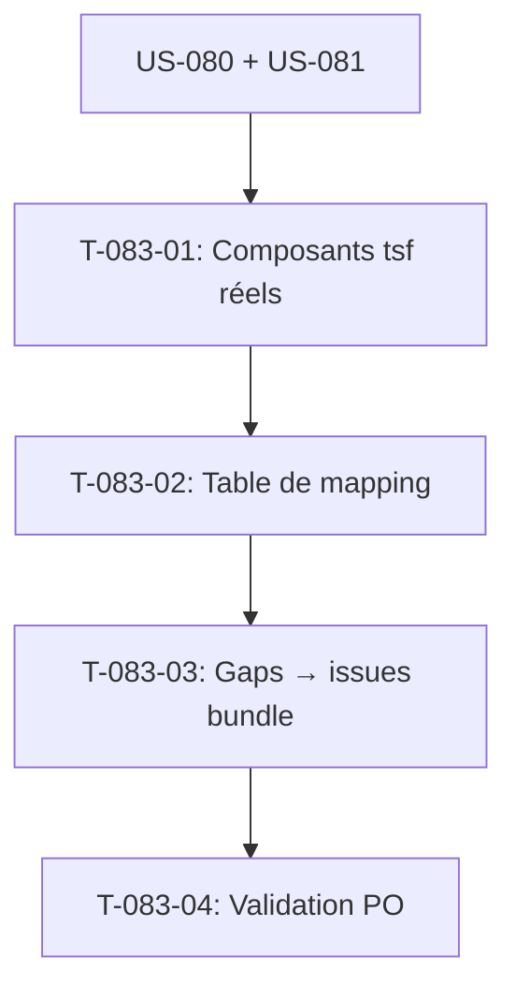

# Tâches - US-083 : Mapping pages ↔ composants tailsfadmin (+ gaps)

## Informations US
- **Epic** : EPIC-013 (Recensement & conception UX)
- **Persona** : Tous (concepteur / intégrateur)
- **Story Points** : 3
- **Sprint** : sprint-019-conception-ux

## Résumé de la US
**En tant que** concepteur/intégrateur,
**Je veux** associer chaque page/section aux layouts et composants `<twig:tsf:…>` du bundle,
**Afin de** garantir que chaque écran est « une greffe sur un terrain stable » et d'identifier les composants manquants.

> **Nature** : conception — livrables **documentaires**. Types `[DOC]`/`[REV]`.
> **Dépend d'US-080 + US-081** (référentiel + parcours). Ancre chaque page sur des composants **réels** du socle.

## Vue d'ensemble des tâches

| ID | Type | Tâche | Estimation | Dépend de | Statut |
|----|------|-------|------------|-----------|--------|
| T-083-01 | [DOC] | Recenser les composants `tsf:*` réels du bundle (à jour) | 2h | US-081 | 🔲 |
| T-083-02 | [DOC] | Table de mapping page → layout (admin/auth) + composants `tsf:*` | 4h | T-083-01 | 🔲 |
| T-083-03 | [DOC] | Lister les *gaps* (composants manquants) → demandes d'évolution bundle | 2h | T-083-02 | 🔲 |
| T-083-04 | [REV] | Validation PO : chaque page mappée ou gap explicite | 1h | T-083-03 | 🔲 |

**Total estimé** : 9h

---

## Détail des tâches

### T-083-01 : Recenser les composants `tsf:*` réels
- **Type** : [DOC] · **Estimation** : 2h · **Dépend de** : US-081

**Description** : relire `vendor/tailsfadmin/tailsfadmin-bundle/templates/components/` pour lister les composants réellement disponibles (Ui/Layout/Form/Chart/Calendar) à la version en place. **Ne pas se fier à la mémoire** — un composant peut avoir été renommé/retiré.

**Critères** :
- [ ] Inventaire des `tsf:*` avec leurs props principales
- [ ] Version du bundle notée

---

### T-083-02 : Table de mapping page → composants
- **Type** : [DOC] · **Estimation** : 4h · **Dépend de** : T-083-01

**Fichier** : `project-management/architecture/page-component-mapping.md`.

**Critères** :
- [ ] Chaque page du référentiel → layout (`admin`/`auth`) + jeu de composants `tsf:*`
- [ ] Sections récurrentes (KPI, tableaux, formulaires, onglets, graphes) mutualisées

---

### T-083-03 : Lister les *gaps*
- **Type** : [DOC] · **Estimation** : 2h · **Dépend de** : T-083-02

**Critères** :
- [ ] Composants manquants formalisés comme demandes d'évolution du bundle (issues tailsfadmin)
- [ ] Chaque gap justifié par ≥ 1 page cible

---

### T-083-04 : Validation PO
- **Type** : [REV] · **Estimation** : 1h · **Dépend de** : T-083-03

**Critères** :
- [ ] Chaque page a un mapping OU un gap explicite (aucune page « orpheline de composant »)

---

## Graphe de dépendances

## Résumé

| Type | Nb tâches | Heures |
|------|-----------|--------|
| [DOC] | 3 | 8h |
| [REV] | 1 | 1h |
| **TOTAL** | **4** | **9h** |
