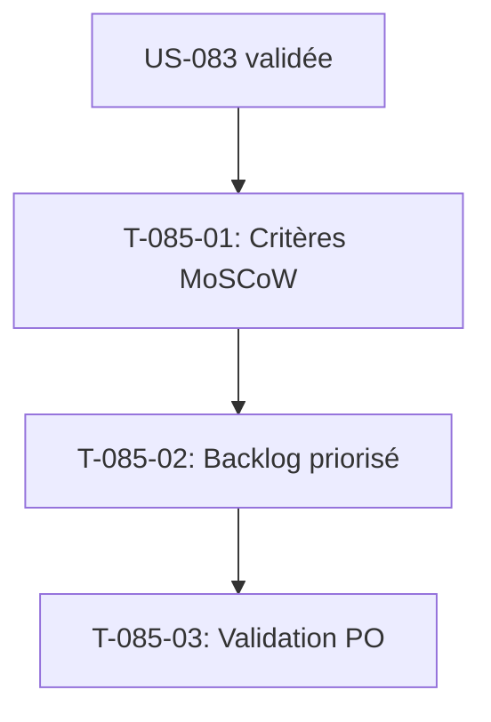

# Tâches - US-085 : Backlog de refonte/reskin priorisé (MoSCoW)

## Informations US
- **Epic** : EPIC-013 (Recensement & conception UX)
- **Persona** : Tous (PO / Product)
- **Story Points** : 3
- **Sprint** : sprint-019-conception-ux

## Résumé de la US
**En tant que** Product Owner,
**Je veux** déduire du recensement + mapping un backlog priorisé (MoSCoW) des écrans à (re)concevoir,
**Afin de** transformer un backlog implicite en backlog explicite, priorisé et traçable, ventilé vers les EPICs modules.

> **Nature** : conception — livrable **documentaire** de synthèse. Types `[DOC]`/`[REV]`.
> **Dépend d'US-083** (mapping) — donc indirectement d'US-080/081.

## Vue d'ensemble des tâches

| ID | Type | Tâche | Estimation | Dépend de | Statut |
|----|------|-------|------------|-----------|--------|
| T-085-01 | [DOC] | Définir les critères de priorisation (valeur, fréquence d'usage, effort de reskin) | 1h | US-083 | 🔲 |
| T-085-02 | [DOC] | Établir le backlog reskin priorisé MoSCoW, ventilé par EPIC module | 3h | T-085-01 | 🔲 |
| T-085-03 | [REV] | Validation PO : priorisation et ventilation | 1h | T-085-02 | 🔲 |

**Total estimé** : 5h

---

## Détail des tâches

### T-085-01 : Critères de priorisation
- **Type** : [DOC] · **Estimation** : 1h · **Dépend de** : US-083

**Critères** :
- [ ] Critères explicites : valeur métier, fréquence d'usage (persona), effort de reskin
- [ ] Barème MoSCoW (Must/Should/Could/Won't) défini

---

### T-085-02 : Backlog reskin priorisé
- **Type** : [DOC] · **Estimation** : 3h · **Dépend de** : T-085-01

**Fichier** : `project-management/architecture/backlog-reskin-priorise.md`.

**Critères** :
- [ ] Une entrée par écran à (re)concevoir, classée MoSCoW
- [ ] Chaque entrée rattachée à un EPIC module cible (temps, projets, staffing, finance, CRM, RH…)
- [ ] Écrans à fort enjeu d'adoption (saisie P1, complétude, valorisation, pilotage) priorisés

---

### T-085-03 : Validation PO
- **Type** : [REV] · **Estimation** : 1h · **Dépend de** : T-085-02

**Critères** :
- [ ] PO valide la priorisation et la ventilation par EPIC
- [ ] Backlog prêt à alimenter les sprints de refonte (entrée des EPICs modules)

---

## Graphe de dépendances

## Résumé

| Type | Nb tâches | Heures |
|------|-----------|--------|
| [DOC] | 2 | 4h |
| [REV] | 1 | 1h |
| **TOTAL** | **3** | **5h** |
