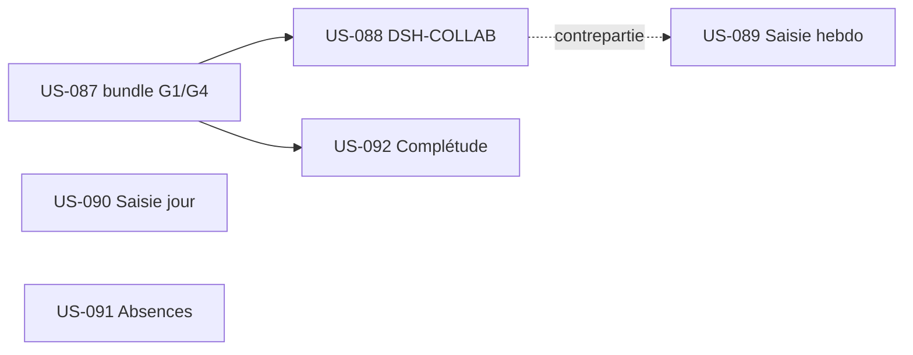

# Sprint 21 : Reskin du parcours de saisie collaborateur (EPIC-003)

## Informations

| Attribut | Valeur |
|----------|--------|
| Numéro | 21 |
| Début | 2026-09-28 |
| Fin | 2026-10-09 |
| Durée | 10 jours ouvrés |
| Capacité engagée | ~15 pts + lot bundle |
| EPIC | EPIC-003 (Temps & activité) — front |
| Prérequis | Maquettes HF **validées PO 100 %** (S20, `design-canvas/lot2-saisie/`) + audit `audit-ux-existant.md` |

## Sprint Goal

> **« Porter le parcours de saisie collaborateur (persona P1) sur le socle tailsfadmin conformément aux
> maquettes validées — après avoir doté le bundle des composants manquants G1 `StatCard` et G4 `PageHeader` —
> pour livrer un incrément front adopté et accessible (WCAG 2.2 AA). »**

Premier sprint de **dev reskin** issu d'EPIC-013 : la conception (audit + maquettes) est faite et validée ;
ce sprint la **met en œuvre**. Séquence : **lot bundle d'abord**, puis portage des 5 écrans.

## Definition of Done (rappel projet)

- [ ] Code review approuvée
- [ ] Tests (PHPUnit/Pest) verts ; couverture maintenue (gate CI ≥ 80 %)
- [ ] PHPStan max 0 erreur · Deptrac OK
- [ ] **WCAG 2.2 AA** vérifié par écran (contraste, cibles 44px, focus, statut texte+icône+couleur)
- [ ] Écran **conforme à la maquette validée** (`lot2-saisie/VALIDATION.md`) + recommandations d'audit bloquantes/majeures appliquées
- [ ] Pas de dette technique ajoutée ; déployable

## Sprint Backlog

| Priorité | US | Titre | Points | Gaps | Statut |
|----------|-----|-------|--------|------|--------|
| 🔴 Must | US-087 | Bundle : composants `Ui:StatCard` (G1) + `Layout:PageHeader` (G4) | 3 | — | 🟢 Ready |
| 🔴 Must | US-088 | DSH-COLLAB — Dashboard collaborateur (build) | 5 | G1, G4 | 🟢 Ready |
| 🔴 Must | US-089 | PG-TMP-01 — Reskin saisie hebdomadaire | 3 | — | 🟢 Ready |
| 🔴 Must | US-090 | PG-TMP-02/03 — Reskin saisie du jour (mobile) | 2 | — | 🟢 Ready |
| 🔴 Must | US-091 | PG-ABS-01 — Reskin Mes absences | 2 | — | 🟢 Ready |
| 🔴 Must | US-092 | PG-CPL-01 — Reskin Complétude | 3 | G1 | 🟢 Ready |

**Total engagé : 18 pts** (US-087 bundle 3 + 5 écrans 15). Dans la fourchette de vélocité récente (13–21).

## Séquencement (dépendances)

- **US-087 en tête** : débloque DSH-COLLAB (G1+G4) et Complétude (G1). Dév dans le **bundle externe**
  `github.com/thibmonier/tailsfadmin` → release + **bump de version** dans hotTwos (ADR-0023).
- US-089/090/091 (reskin pur) sont **indépendants** et peuvent avancer en parallèle du bundle.

## Décisions de cadrage (PO, 2026-09-12)

- **Périmètre** : EPIC-003 Must complet (bundle + 5 écrans).
- **G1/G4 dans le bundle externe** tailsfadmin (pas dans l'app), puis bump de version — cohérent ADR-0023.
- Source visuelle = **maquettes `lot2-saisie/`** ; corrections d'audit intégrées (F-S5-4, F-S5-5, totaux serveur, états d'erreur, solde contextualisé, calendrier conflits).

## Risques

| Risque | Prob. | Impact | Mitigation |
|--------|-------|--------|------------|
| Travail bundle cross-repo (release/bump) plus long que prévu | Moyenne | Moyen | US-087 en tête ; reskin pur (089/090/091) avance en parallèle sans attendre |
| Régression fonctionnelle au portage (les 4 écrans existent) | Moyenne | Moyen | Tests existants doivent rester verts ; reskin = présentation, pas de changement de logique |
| Accessibilité perdue au portage | Faible | Moyen | Checklist WCAG AA par écran (action rétro S20) ; vérif contraste dès l'authoring |
| Dérive « build » DSH-COLLAB (écran neuf) | Moyenne | Moyen | S'en tenir à la maquette validée ; pas d'ajout hors périmètre |

## Cérémonies

| Cérémonie | Quand |
|-----------|-------|
| Sprint Planning | J1 (2026-09-28) |
| Daily | Quotidien (`daily-notes/`) |
| Affinage | mi-sprint (cadrer S22 : EPIC-003 Should — validation temps, relances) |
| Sprint Review | J10 (2026-10-09) |
| Rétrospective | J10 (2026-10-09) |

## Suite (S22 pressenti)
EPIC-003 Should (PG-VLD-01 validation des temps, PG-REL-01 relances) et/ou démarrage reskin EPIC-002
(fiche projet, liste projets) selon arbitrage PO.
