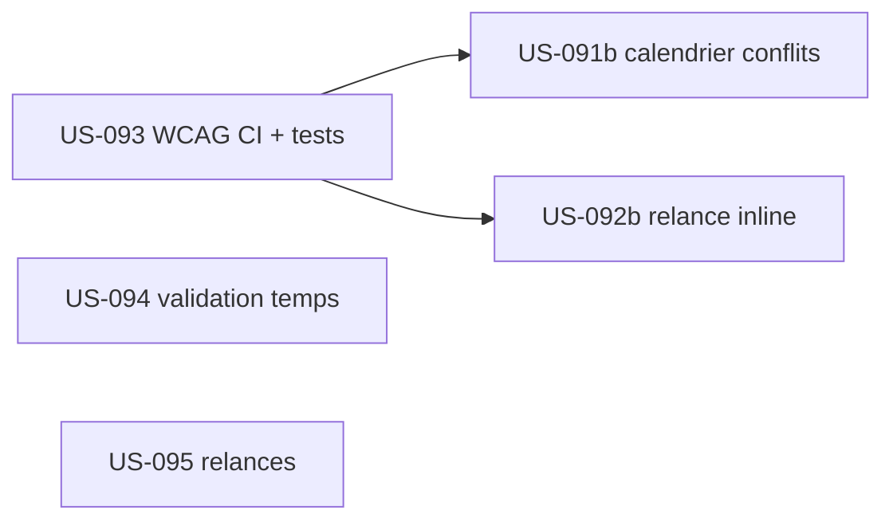

# Sprint 22 : Finition & durcissement du parcours de saisie (EPIC-003)

## Informations

| Attribut | Valeur |
|----------|--------|
| Numéro | 22 |
| Début | 2026-10-12 |
| Fin | 2026-10-23 |
| Durée | 10 jours ouvrés |
| Capacité engagée | ~12 pts (vélocité récente S19–21 : 13–16) |
| EPIC | EPIC-003 (Temps & activité) — finition front + qualité |
| Thème arbitré (PO) | Solder & durcir EPIC-003 (dette S21 + Should) — décision 2026-09-12 |

## Sprint Goal

> **« Solder l'engagement du parcours de saisie : livrer le calendrier de conflits d'absences et la
> relance inline de complétude, attester l'accessibilité WCAG 2.2 AA en CI, et reskinner la validation
> des temps et les relances — refermer proprement EPIC-003 avant d'ouvrir le reskin EPIC-002. »**

Ce sprint applique une action clé de la rétrospective S21 : **finir ce qui est engagé avant d'ouvrir un
nouveau front**. Il solde la dette S21 (dont un *Must* non livré : US-091 ABS-03) et instrumente
l'accessibilité, jusqu'ici déclarée mais non vérifiée.

## Definition of Done (rappel projet)

- [ ] Code review approuvée · PHPStan max 0 · Deptrac OK · **php-cs-fixer OK** (lancer `make ci` avant push)
- [ ] Tests (PHPUnit/Pest) verts ; couverture maintenue (gate CI ≥ 80 %)
- [ ] **WCAG 2.2 AA attesté** (job axe/pa11y en CI à partir d'US-093) — plus seulement déclaré
- [ ] Écrans conformes aux maquettes validées S20 (`design-canvas/lot2-saisie/`) + recos audit US-082
- [ ] Pas de dette ajoutée ; déployable

## Sprint Backlog

| Priorité | US | Titre | Points | Origine | Statut |
|----------|-----|-------|--------|---------|--------|
| 🔴 Must | US-091b | Absences — calendrier de conflits (ABS-03) + solde projeté dynamique (CA-2) | 3 | dette S21 (Must non livré) | 🟢 Ready |
| 🔴 Must | US-093 | Qualité — WCAG axe/pa11y en CI + tests d'états saisie hebdo (US-089) | 3 | dette S21 (transversale) | 🟢 Ready |
| 🟡 Should | US-092b | Complétude — relance inline (CPL-04) + filtre/recherche (CPL-05) | 2 | dette S21 | 🟢 Ready |
| 🟡 Should | US-094 | PG-VLD-01 — reskin validation des temps | 2 | EPIC-003 Should (backlog reskin) | 🟢 Ready |
| 🟡 Should | US-095 | PG-REL-01 — reskin relances | 2 | EPIC-003 Should (backlog reskin) | 🟢 Ready |

**Total engagé : 12 points** (Must 6 + Should 6). Marge sous la vélocité pour absorber la dette de qualité.

## Séquencement

- **US-093 en tête** : le job WCAG en CI protège les écrans finis ce sprint dès leur merge ; les tests d'états soldent la dette US-089.
- US-091b (Must) et US-092b débloquent la clôture propre des écrans absences/complétude.
- US-094/095 (reskin pur) indépendants, en parallèle.

## Dépendances

| US | Dépend de | Statut |
|----|-----------|--------|
| US-091b | `WorkingDaysCalculator` (fériés), `ClosurePeriod`, `AbsenceRequestRepository` (conflits) | ✅ existants (EPIC-001) |
| US-092b | endpoint de relance `reminders_update` (POST /relances) | ✅ existant (US-056) |
| US-093 | binaire pa11y/axe-core en CI (sans Node.js — cf. ADR-0019 tailwind) | ⚠️ à valider (outillage CI) |
| US-094/095 | composants bundle tailsfadmin v1.6.0 | ✅ (US-087) |

## Risques

| Risque | Prob. | Impact | Mitigation |
|--------|-------|--------|------------|
| Outillage a11y en CI sans Node (pa11y/axe requièrent Node) | Moyenne | Moyen | Évaluer un runner conteneurisé dédié a11y ; sinon fallback `axe` via un conteneur CI séparé — US-093 tranche l'approche en préambule |
| US-091b calendrier = logique conflits (fériés/fermetures/absences) plus riche qu'un reskin | Moyenne | Moyen | Réutiliser `WorkingDaysCalculator` + repos existants ; se limiter au parcours P1 |
| Dispersion (5 US, 2 dettes + 2 reskins + qualité) | Faible | Moyen | US-093 & US-091b (Must) d'abord ; Should en repli |

## Cérémonies

| Cérémonie | Quand |
|-----------|-------|
| Planning | J1 (2026-10-12) |
| Daily | quotidien (`daily-notes/`) |
| Affinage | mi-sprint — cadrer S23 (démarrage reskin **EPIC-002** : liste/fiche/dashboard projets) |
| Review | J10 (2026-10-23) |
| Rétrospective | J10 (2026-10-23) |

## Suite (S23 pressenti)
Démarrage du **reskin EPIC-002** (PG-PRJ-01 liste, PG-PRJ-02 fiche, DSH-PRJ dashboard projets) — gaps G1/G3/G4/G5 ; EPIC-003 front alors soldé.
