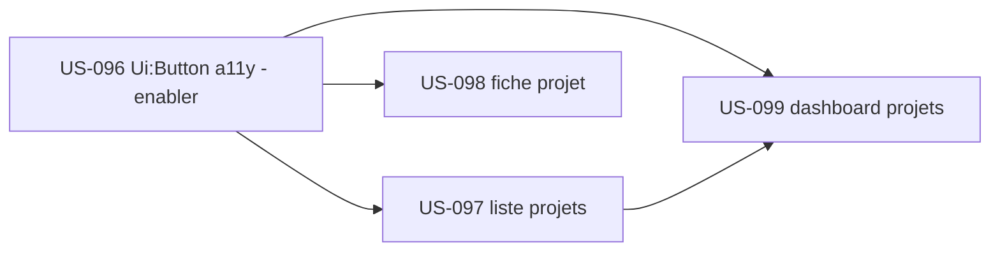

# Sprint 23 : Ouverture du reskin EPIC-002 (Projets) + enabler a11y

## Informations

| Attribut | Valeur |
|----------|--------|
| Numéro | 23 |
| Début | 2026-10-26 |
| Fin | 2026-11-06 |
| Durée | 10 jours ouvrés |
| Capacité engagée | 13 pts (vélocité récente S19–22 : 12–16) |
| EPIC | EPIC-002 (Projets & delivery) — reskin front + enabler socle |
| Thème arbitré (PO) | Ouvrir le reskin EPIC-002 par un **incrément fini** (action rétro S22), en commençant par le composant bouton accessible — décision 2026-10-23 |

## Sprint Goal

> **« Ouvrir le reskin EPIC-002 par un incrément fini : livrer un composant bouton accessible du socle,
> puis porter la liste et la fiche projet sur tailsfadmin et construire le dashboard projets — offrir à
> P2 un parcours de pilotage cohérent, accessible et prêt à s'étendre. »**

Ce sprint applique l'action clé de la rétrospective S22 : **démarrer un nouveau front par un incrément fini**
(≤ 3 écrans ouverts) et **traiter la dette a11y de façon structurelle** (composant bouton du bundle plutôt
qu'au cas par cas). L'enabler `Ui:Button` (US-096) solde la dette de focus transverse (WCAG 2.4.7) relevée en S22
et sert de socle aux écrans reskinnés.

## Definition of Done (rappel projet)

- [ ] Code review approuvée · PHPStan max 0 · Deptrac OK · **php-cs-fixer OK** (lancer `make ci` avant push)
- [ ] Tests (PHPUnit/Pest) verts ; couverture maintenue (gate CI ≥ 80 %)
- [ ] **WCAG 2.2 AA attesté** (job axe/pa11y en CI — US-093), dont **2.4.7 focus visible** sur tous les boutons
- [ ] Composants/tokens tailsfadmin uniquement ; hooks Stimulus & logique préservés (reskins)
- [ ] Pas de dette ajoutée ; déployable

## Sprint Backlog

| Priorité | US | Titre | Points | Origine | Statut |
|----------|-----|-------|--------|---------|--------|
| 🔴 Must | US-096 | Composant `Ui:Button` accessible (focus visible) — socle | 3 | rétro S22 ACTION-1 (dette a11y) | 🟢 Ready |
| 🔴 Must | US-097 | PG-PRJ-01 — reskin liste des projets | 2 | backlog reskin (EPIC-002, G3) | 🟢 Ready |
| 🔴 Must | US-098 | PG-PRJ-02 — reskin fiche projet (onglets + cycle de vie) | 3 | backlog reskin (EPIC-002, G4/G5) | 🟢 Ready |
| 🟡 Should | US-099 | DSH-PRJ — dashboard projets (build) | 5 | backlog reskin (EPIC-002, G1/G4) | 🟢 Ready |

**Total engagé : 13 points** (Must 8 + Should 5). Sous la vélocité haute pour absorber le travail bundle (US-096) et les chantiers OPS de la rétro.

## Chantiers techniques rétro S22 (hors points, intégrés au sprint)

- **ACTION-3 (J1)** — Ajouter `php-cs-fixer --dry-run` au hook `.githooks/pre-commit` (miroir exact de la CI ; report ACTION-4 S21 non faite).
- **ACTION-2 (J5)** — Stabiliser les jobs CodeQL `Analyze` (disque runner / cache `codeql-overlay-status-*`) **ou** les rendre explicitement non bloquants + documenter (fin de l'`UNSTABLE` récurrent).

## Séquencement

- **US-096 en tête** (pattern « dev-dans-le-bundle », cf. US-087) : release bundle + bump app, puis adoption sur les reskins et les nouveaux boutons.
- US-097 / US-098 (Must) : cœur de l'incrément fini EPIC-002 (liste + fiche).
- US-099 (Should, build 5 pts) : dashboard projets, en repli si la capacité se tend.

## Dépendances

| US | Dépend de | Statut |
|----|-----------|--------|
| US-096 | bundle tailsfadmin (release + bump Composer) — pattern US-087 | ✅ pattern connu |
| US-097 | US-096 (bouton) + tokens tailsfadmin | ⏳ US-096 en tête |
| US-098 | US-096 + `PageHeader` (G4, US-087) + `Tabs` (déjà adopté) ; G5 Timeline/Stepper à réaliser (custom) | ⚠️ G5 non au bundle |
| US-099 | `StatCard` (G1) + `PageHeader` (G4) (US-087) + services dérive/marge EPIC-002 | ✅ existants |

## Risques

| Risque | Prob. | Impact | Mitigation |
|--------|-------|--------|------------|
| Travail cross-repo bundle (US-096) : séquençage release→bump→adoption | Moyenne | Moyen | Reproduire le séquençage maîtrisé de S21 (bundle avant bump avant US consommatrices) |
| G5 (Timeline/Stepper cycle de vie) non au bundle → effort custom sur la fiche | Moyenne | Moyen | Repère de cycle de vie custom minimal (accessible, `aria-current`) ; composant bundle en itération ultérieure |
| DSH-PRJ (build 5 pts) plus lourd qu'un reskin | Moyenne | Moyen | Should (repli) ; agrégation des services existants, pas de nouveau calcul ni de librairie de graphes |

## Références de conception (dashboards)
- Écrans **hotones (legacy)** + visuels `project-management/architecture/design-canvas/tailadmin-ref/` (`cards-kpi`, `cards-multistats`, `cards-revenue`, `monthly-target`, `graph-sales`) — inspiration pour la hiérarchie KPI / alertes de dérive du DSH-PRJ (US-099).

## Cérémonies

| Cérémonie | Quand |
|-----------|-------|
| Planning | J1 (2026-10-26) — validation backlog + chantiers rétro |
| Daily | quotidien (`daily-notes/`) |
| Affinage | mi-sprint — cadrer S24 (suite EPIC-002 : clients PG-CLI-01 ; poursuite reskin) |
| Review | J10 (2026-11-06) |
| Rétrospective | J10 (2026-11-06) |

## Suite (S24 pressenti)
Poursuite du reskin EPIC-002 (PG-CLI-01 liste clients) et amorce EPIC-005 finance (valorisation / finance) selon `backlog-reskin-priorise.md`.
