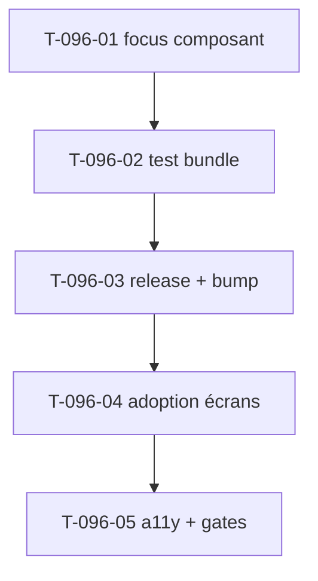

# Tâches — US-096 : Composant Ui:Button accessible (focus visible)

## Informations US
- **EPIC** : EPIC-003 / transverse (enabler socle) · **Persona** : tous (clavier/lecteur d'écran) + P2/P3 · **Points** : 3 · **Sprint** : 23
- **Origine** : rétro S22 ACTION-1 (dette a11y focus, WCAG 2.4.7). Cross-repo : composant dans le bundle `tailsfadmin` (`/Users/tmonier/Projects/tailsfadmin`).

## Constat
`Ui/Button.html.twig` existe (6 variantes, tailles, icônes, loading, disabled) **mais `baseClasses`/variants n'ont aucun `focus-visible`** → Tailwind v4 Preflight supprime l'outline → focus invisible au clavier.

## Vue d'ensemble des tâches

| ID | Type | Tâche | Estimation | Dépend de | Statut |
|----|------|-------|------------|-----------|--------|
| T-096-01 | [FE-WEB] | Ajouter `focus-visible:outline-none focus-visible:ring-2 focus-visible:ring-brand-500/40` au `baseClasses` du composant (ring adapté aux variantes claires) | 1h | - | 🔲 |
| T-096-02 | [TEST] | Test de rendu bundle (focus présent + variantes) | 1h | T-096-01 | 🔲 |
| T-096-03 | [OPS] | Release bundle v1.6.1 (tag) + bump hotTwos `^1.6.1` + `composer update` + `make cache-dev` | 1h | T-096-02 | 🔲 |
| T-096-04 | [FE-WEB] | Adopter `tsf:Ui:Button` sur les boutons primaires des écrans reskinnés (absence, complétude, validation, relances) — hooks Stimulus préservés | 2h | T-096-03 | 🔲 |
| T-096-05 | [REV] | Suites existantes vertes + job a11y (0 violation 2.4.7) + gates | 1h | T-096-04 | 🔲 |

**Total : 6h**

## Détails clés
- **T-096-01** : le focus ring doit rester visible sur variantes claires (`secondary`/`ghost`/`link`) — `focus-visible:ring-brand-500/40` + éventuel `focus-visible:ring-offset` si nécessaire (vérifier contraste). Ne pas casser `disabled:opacity-50`.
- **T-096-04** : remplacer les `<button class="bg-brand-500 …">` par `<twig:tsf:Ui:Button>` en conservant `type`, `data-action`, `data-*-target`. Vérifier que le composant relaie les attributs Stimulus (sinon, fallback : ajouter le focus au niveau app sur les boutons existants et tracer la dette).

## Dépendances

## DoD
- [ ] Composant avec focus visible + variantes ; release bundle + bump app
- [ ] Adopté sur les boutons primaires reskinnés (hooks préservés, tests verts)
- [ ] WCAG 2.4.7 attesté (job a11y) ; CI verte ; PR mergée
