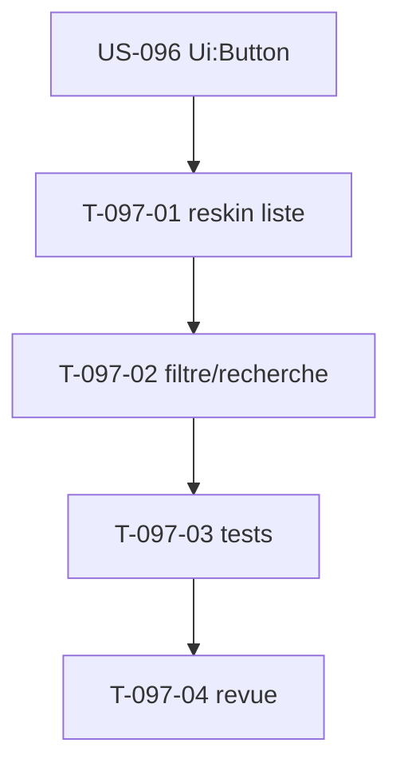

# Tâches — US-097 : PG-PRJ-01 reskin liste des projets

## Informations US
- **EPIC** : EPIC-002 · **Persona** : P2 (chef de projet) · **Points** : 2 · **Sprint** : 23
- **Écran** : `templates/project/index.html.twig` (82 lignes, ~12 anciens tokens ; route `project_index` GET `/projets`, `ProjectPageController::index` → `projects` + `canCreate`).

## Vue d'ensemble des tâches

| ID | Type | Tâche | Estimation | Dépend de | Statut |
|----|------|-------|------------|-----------|--------|
| T-097-01 | [FE-WEB] | Reskin `index.html.twig` sur tokens tailsfadmin (table/carte, badges statut texte+icône+couleur, `tsf:Ui:Button` « Nouveau projet ») | 2h | US-096 | 🔲 |
| T-097-02 | [FE-WEB] | Barre filtre (statut) + recherche (nom/code) — Stimulus `projects_controller`, filtrage client (pattern CPL-05) | 2h | T-097-01 | 🔲 |
| T-097-03 | [TEST] | Fonctionnels : rendu reskin (badges, bouton), état vide, présence des contrôles filtre/recherche | 1.5h | T-097-02 | 🔲 |
| T-097-04 | [REV] | Revue + gates (`make cs`/`analyse`, lint Twig, a11y) | 0.5h | T-097-03 | 🔲 |

**Total : 6h**

## Détails clés
- Réutiliser le pattern de la complétude (US-092b) : lignes `data-…-target="row"` + `data-name`/`data-status`, filtre client sans rechargement, labels `sr-only`.
- Statuts projet : badges texte+icône+couleur (jamais la couleur seule). Vérifier les classes dans `var/tailwind/app.built.css`.
- Préserver route/logique ; `canCreate` gouverne l'affichage du bouton.

## Dépendances

## DoD
- [ ] Liste reskinnée (badges, `tsf:Ui:Button`) ; logique inchangée (tests verts)
- [ ] Filtre/recherche + état vide ; WCAG AA (US-093) ; CI verte ; PR mergée
