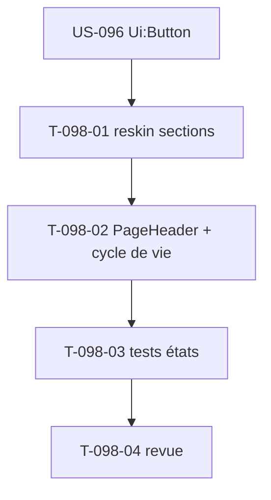

# Tâches — US-098 : PG-PRJ-02 reskin fiche projet (onglets + cycle de vie)

## Informations US
- **EPIC** : EPIC-002 · **Persona** : P2 (chef de projet, pilotage OBJ-2) · **Points** : 3 · **Sprint** : 23
- **Écran** : `templates/project/show.html.twig` (**846 lignes, ~158 anciens tokens**, déjà sur `Tabs` ; route `project_show` GET `/projets/{id}` → `project`/`canViewFinancials`/`amendments`/budget).

## Vue d'ensemble des tâches

| ID | Type | Tâche | Estimation | Dépend de | Statut |
|----|------|-------|------------|-----------|--------|
| T-098-01 | [FE-WEB] | Reskin `show.html.twig` **par sections** (en-tête → onglets → cartes/tableaux) sur tokens tailsfadmin ; migrer les ~158 anciens tokens ; vérifier chaque classe dans `app.built.css` | 4h | US-096 | 🔲 |
| T-098-02 | [FE-WEB] | Adopter `tsf:Layout:PageHeader` (G4) + repère **cycle de vie** (Stepper custom accessible, `aria-current`) | 2h | T-098-01 | 🔲 |
| T-098-03 | [TEST] | Fonctionnels : rendu (onglets, PageHeader), `aria-current` étape, états (projet clôturé lecture seule, onglet vide) ; suites pilotage existantes vertes | 2h | T-098-02 | 🔲 |
| T-098-04 | [REV] | Revue adversariale + gates | 0.5h | T-098-03 | 🔲 |

**Total : 8.5h**

## Détails clés
- **Reskin volumineux (846 lignes)** : procéder section par section, ne pas casser les hooks Stimulus, les onglets (`Tabs`), les formulaires (statut, avenants, client, facture, budget-profil) et le gating `canViewFinancials`.
- G5 (Timeline/Stepper) **non au bundle** → repère de cycle de vie **custom minimal** (Client→Projet→Facture), étape courante `aria-current`, pas la couleur seule.
- Boutons via `tsf:Ui:Button` (US-096). Préserver la logique de pilotage (US-033/035/036/072) — tests existants verts.

## Dépendances

## DoD
- [ ] Fiche reskinnée (Tabs + PageHeader G4 + cycle de vie G5) ; logique pilotage inchangée (tests verts)
- [ ] Étape accessible (`aria-current`) ; états couverts ; WCAG AA (US-093) ; CI verte ; PR mergée
