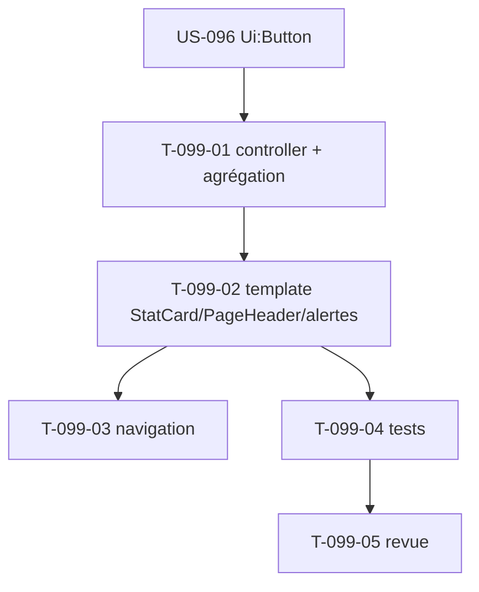

# Tâches — US-099 : DSH-PRJ dashboard projets (build)

## Informations US
- **EPIC** : EPIC-002 · **Persona** : P2 (chef de projet, entrée pilotage) · **Points** : 5 (Should) · **Sprint** : 23
- **Type** : Build (écran nouveau) natif sur le socle. Réf. conception : écrans **hotones (legacy)** + `design-canvas/tailadmin-ref/` (cards-kpi, cards-revenue, monthly-target, graph-sales). Modèle : US-088 (DSH-COLLAB).

## Vue d'ensemble des tâches

| ID | Type | Tâche | Estimation | Dépend de | Statut |
|----|------|-------|------------|-----------|--------|
| T-099-01 | [BE] | Contrôleur + route (`/projets/tableau-de-bord`) agrégeant les read-services dérive/marge EPIC-002 existants (pas de nouveau calcul) + gating (VIEW_PROJECT / périmètre) | 3h | US-096 | 🔲 |
| T-099-02 | [FE-WEB] | Template `project/dashboard.html.twig` : `tsf:Layout:PageHeader` (G4) + `tsf:Ui:StatCard` (G1) + table d'alertes de dérive (lien fiche) | 3h | T-099-01 | 🔲 |
| T-099-03 | [FE-WEB] | Entrée de navigation vers le dashboard projets | 0.5h | T-099-02 | 🔲 |
| T-099-04 | [TEST] | Fonctionnels : KPI + liste d'alertes (CA-1), état vide (CA-2), habilitation (CA-3) | 2.5h | T-099-02 | 🔲 |
| T-099-05 | [REV] | Revue adversariale + gates | 0.5h | T-099-04 | 🔲 |

**Total : 9.5h**

## Détails clés
- **Aucun nouveau calcul métier** : agréger les services existants (marge/dérive charge — US-036/072). Cohérence DSH-COLLAB : StatCards + table, **pas de librairie de graphes** côté client (itération ultérieure).
- Schéma de test : trait `ProvisionsFullSchema` (dépendances projets/pilotage). Habilitation via voters existants.
- StatCards labellisées, table accessible, focus (via `tsf:Ui:Button`/liens), contraste.

## Dépendances

## DoD
- [ ] Dashboard construit (StatCard G1 + PageHeader G4 + alertes dérive) ; agrégation de l'existant
- [ ] États (vide, sans habilitation) ; tests verts ; WCAG AA (US-093) ; CI verte ; PR mergée
