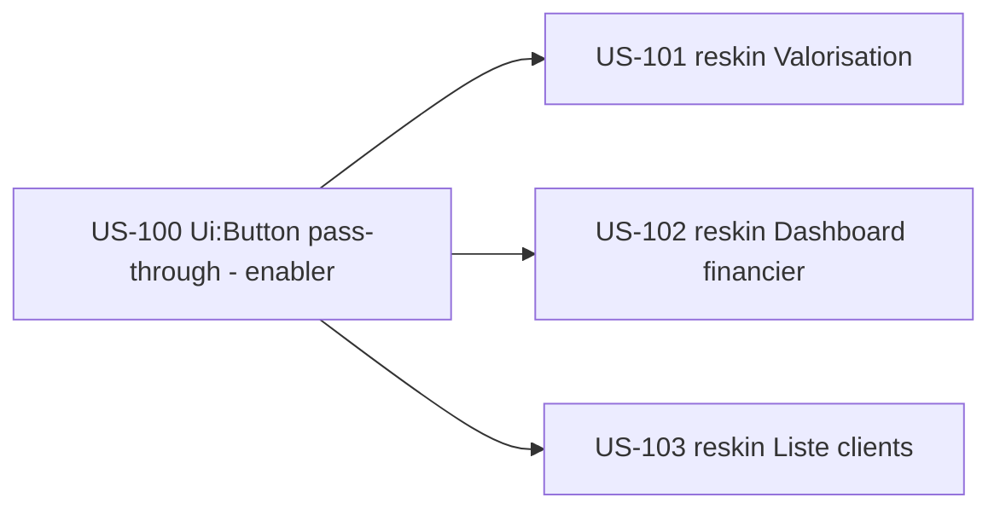

# Sprint 24 : Amorce EPIC-005 (finance) + suite EPIC-002 (clients) + enabler bouton adoptable

## Informations

| Attribut | Valeur |
|----------|--------|
| Numéro | 24 |
| Début | 2026-11-09 |
| Fin | 2026-11-20 |
| Durée | 10 jours ouvrés |
| Capacité engagée | 11 pts (vélocité livrée S20–23 : 12–15, moyenne ≈ 13) |
| EPIC | EPIC-005 (Finance & rentabilité) — amorce · EPIC-002 (Projets/Clients) — suite · enabler socle |
| Thème arbitré (PO) | **Amorce finance + enabler** — porter valorisation & pilotage financier sur le socle, poursuivre EPIC-002 par les clients, rendre le bouton pleinement adoptable — décision rétro/planning 2026-11-06 |

## Sprint Goal

> **« Étendre le socle reskin à la valorisation et au pilotage financier (amorce EPIC-005),
> poursuivre EPIC-002 par les clients, et rendre le composant bouton pleinement adoptable
> (pass-through d'attributs) — offrir aux personas direction/production un parcours financier
> cohérent, accessible et prêt à s'étendre. »**

Ce sprint reconduit les deux réflexes gagnants des sprints S22–S23 (deux clôtures consécutives à 100 % DoD) :
**avancer par incrément fini** (≤ 3 écrans ouverts, garde-fou ACTION-3) et **traiter la dette à la racine**
(le composant du bundle plutôt que l'écran). L'enabler `Ui:Button` (US-100) lève le thème n°1 de la rétro S23 :
le pass-through d'attributs Stimulus rend le composant réellement adoptable et achève la convergence a11y
(WCAG 2.4.7) sur les boutons câblés.

## Definition of Done (rappel projet)

- [ ] Code review approuvée · PHPStan max 0 · Deptrac OK · **php-cs-fixer OK** (lancer `make ci` avant push)
- [ ] Tests (PHPUnit/Pest) verts ; couverture maintenue (gate CI ≥ 80 %)
- [ ] **WCAG 2.2 AA attesté** (job axe/pa11y en CI — US-093), dont **2.4.7 focus visible** sur tous les boutons
- [ ] Composants/tokens tailsfadmin uniquement ; hooks Stimulus & logique métier préservés (reskins)
- [ ] Pas de dette ajoutée ; déployable

## Sprint Backlog

| Priorité | US | Titre | Points | Origine | Statut |
|----------|-----|-------|--------|---------|--------|
| 🔴 Must | US-100 | Enabler `Ui:Button` — pass-through d'attributs Stimulus + migration des boutons câblés | 3 | rétro S23 ACTION-1 (thème n°1) | 🟢 Ready |
| 🔴 Must | US-101 | PG-VAL-01 — reskin Valorisation | 3 | backlog reskin (EPIC-005, G1) | 🟢 Ready |
| 🔴 Must | US-102 | PG-FIN-01 — reskin Tableau de bord financier | 3 | backlog reskin (EPIC-005, G1) | 🟢 Ready |
| 🟡 Should | US-103 | PG-CLI-01 — reskin Liste des clients | 2 | backlog reskin (EPIC-002/006, G3) | 🟢 Ready |

**Total engagé : 11 points** (Must 9 + Should 2). Sous la vélocité (~13) pour absorber le travail cross-repo bundle (US-100) et l'affinage ACTION-4 (arbitrage solde absences).

## Écrans cibles (reskins)

| US | Écran | Template | Contrôleur / route |
|----|-------|----------|--------------------|
| US-101 | Valorisation | `templates/valuation/index.html.twig` | `ValuationDashboardController` — `/valorisation` |
| US-102 | Tableau de bord financier | `templates/finance/index.html.twig` | `FinanceDashboardController` — `/finance` |
| US-103 | Liste des clients | `templates/client/index.html.twig` | `ClientController` |

## Chantiers / actions rétro S23 (hors points, intégrés au sprint)

- **ACTION-2 (J1, Must, immédiat)** — « **Branche d'abord** » : créer `feature/us-XXX-…` avant toute édition ; vérifier `git branch --show-current` avant le 1er commit d'une US. *Critère : 0 commit sur `main` en local.*
- **ACTION-4 (affinage mi-sprint, Could)** — Arbitrage PO **base de décompte du solde d'absences** (US-091b) : harmoniser en jours ouvrés partout **ou** documenter l'écart (ADR/note). *Reporté depuis S22 (ACTION-5).*
- **Suivi CodeQL** — Reconfirmer la stabilité du job `Analyze` (default-setup) sur quelques exécutions ; sinon basculer en advanced-setup avec `continue-on-error` documenté.

## Séquencement

- **US-100 en tête** (pattern « dev-dans-le-bundle », cf. US-087/096) : release mineure du bundle (`{{ attributes }}` sur `Ui:Button`) + bump Composer, puis migration des boutons câblés (absence, complétude, validation, relances) et adoption sur les écrans du sprint.
- **US-101 / US-102** (Must) : cœur de l'amorce EPIC-005 (valorisation + pilotage financier).
- **US-103** (Should) : suite EPIC-002 (liste clients, pattern filtre/recherche d'US-097) ; en repli si la capacité se tend.

## Dépendances

| US | Dépend de | Statut |
|----|-----------|--------|
| US-100 | bundle tailsfadmin (release mineure + bump Composer) — pattern US-087/096 | ✅ pattern connu |
| US-101 | US-100 (bouton adoptable) + tokens + `StatCard` (G1) + `ProgressBar` (déjà adoptée) | ✅ existants |
| US-102 | US-100 + `StatCard` (G1) + `PageHeader` (G4) + services finance (US-071/072/073) | ✅ existants |
| US-103 | US-100 + tokens + filtre/recherche Stimulus (G3, pattern US-097) | ✅ pattern US-097 |

## Risques

| Risque | Prob. | Impact | Mitigation |
|--------|-------|--------|------------|
| Cross-repo bundle US-100 (pass-through d'attributs : release → bump → adoption) | Moyenne | Moyen | Reproduire le séquençage maîtrisé S21/S23 ; vérifier qu'un `<twig:tsf:Ui:Button data-action=…>` rend l'attribut **avant** migration |
| La migration des boutons câblés casse un hook Stimulus | Moyenne | Moyen | Tests fonctionnels des écrans concernés (absence/complétude/validation/relances) verts avant/après ; migration écran par écran |
| Densité de tokens sur PG-VAL-01/PG-FIN-01 (gros templates, migration `sed`) | Moyenne | Moyen | Passe de vérification des variantes `hover:`/`dark:` post-`sed` (Moins-de rétro S23) ; vérifier chaque classe dans `app.built.css` |
| Amorce de 2 EPICs (005 + 002) → dispersion | Faible | Moyen | ≤ 3 écrans (garde-fou ACTION-3) ; l'enabler transverse mutualise l'effort |

## Références de conception (dashboards finance/valorisation)

- Écrans **hotones (legacy)** + visuels `project-management/architecture/design-canvas/tailadmin-ref/` (`cards-kpi`, `cards-revenue`, `cards-multistats`, `graph-sales`, `monthly-target`) — inspiration pour la hiérarchie KPI / marge / dérive de PG-FIN-01 et PG-VAL-01.
- `backlog-reskin-priorise.md` (US-085) — source de vérité de la priorisation reskin.

## Cérémonies

| Cérémonie | Quand |
|-----------|-------|
| Planning | J1 (2026-11-09) — validation backlog + rappel ACTION-2 (branche d'abord) |
| Daily | quotidien (`daily-notes/`) |
| Affinage | mi-sprint — ACTION-4 (arbitrage solde absences) + cadrer S25 (suite EPIC-005 : PG-PRC-01 profils & taux, configs finance ; ou dashboard clients) |
| Review | J10 (2026-11-20) |
| Rétrospective | J10 (2026-11-20) |

## Suite (S25 pressenti)

Poursuite d'EPIC-005 (PG-PRC-01 profils & taux, PG-FIN-02…05 configs finance : dérive, devises, FEC, périodes) et/ou EPIC-002 (dashboard clients), selon `backlog-reskin-priorise.md`.
