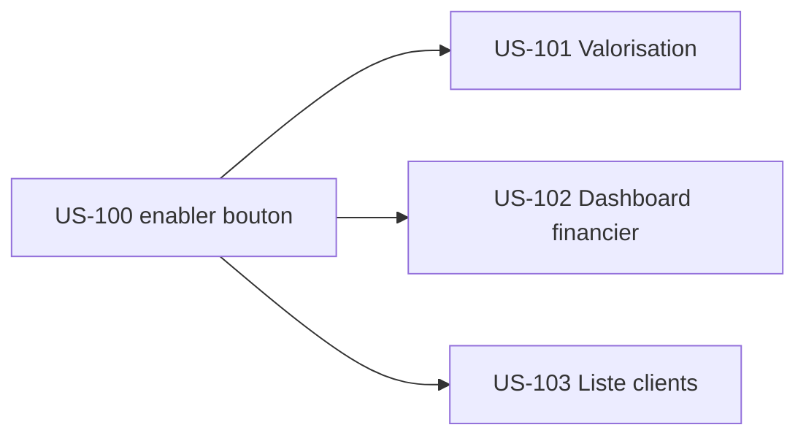

# Tâches — Sprint 24 (Amorce EPIC-005 finance + suite EPIC-002 clients + enabler bouton)

## Vue d'ensemble

| US | Titre | Points | Tâches | Heures | Statut |
|----|-------|--------|--------|--------|--------|
| US-100 | Enabler `Ui:Button` — pass-through + migration boutons câblés | 3 | 6 | ~9,5h | 🔲 Ready |
| US-101 | PG-VAL-01 — reskin Valorisation | 3 | 5 | ~9h | 🔲 Ready |
| US-102 | PG-FIN-01 — reskin Tableau de bord financier | 3 | 5 | ~8,5h | 🔲 Ready |
| US-103 | PG-CLI-01 — reskin Liste des clients | 2 | 4 | ~6,5h | 🔲 Ready |
| — | Tâches techniques transverses (rétro S23) | — | 3 | ~3h | 🔲 |

**Total** : **23 tâches** | **~36,5h** | 11 points engagés

## Répartition par type

| Type | Tâches | Heures | % |
|------|--------|--------|---|
| [FE-WEB] | 9 | 18h | ~49 % |
| [TEST] | 4 | 7,5h | ~21 % |
| [OPS] | 4 | 5h | ~14 % |
| [REV] | 4 | 4h | ~11 % |
| [DOC] | 2 | 1,5h | ~4 % |
| **Total** | **23** | **~36,5h** | 100 % |

> **Mono-stack Symfony** : aucune tâche `[DB]`/`[FE-MOB]`/`[API]` — les reskins ne touchent ni schéma ni endpoints ; la logique métier (valorisation, finance, clients) est préservée.

## Séquencement (macro)

**US-100 en tête** (débloque la migration + l'adoption du bouton sur les reskins) → US-101/102 (Must EPIC-005) → US-103 (Should, repli).

## Fichiers
- [US-100 — Enabler Ui:Button pass-through](./US-100-tasks.md)
- [US-101 — Reskin Valorisation](./US-101-tasks.md)
- [US-102 — Reskin Dashboard financier](./US-102-tasks.md)
- [US-103 — Reskin Liste clients](./US-103-tasks.md)
- [Tâches techniques transverses](./technical-tasks.md)

## Conventions
- **ID** : T-[US]-[NN] (ex : T-100-03) ; transverses : T-TECH-NN
- **Taille** : 0,5h – 8h (idéal 2-4h)
- **Statuts** : 🔲 À faire · 🔄 En cours · 👀 Review · ✅ Done · 🚫 Bloqué
- **DoD projet** : `make ci` vert (PHPStan max, Deptrac, php-cs-fixer) · tests ≥ 80 % · a11y WCAG 2.2 AA (job axe/pa11y, 2.4.7) · tokens tailsfadmin only · **branche d'abord (ACTION-2)**

## Point d'entrée dev
`/sprint:dev US-100` (enabler en tête), puis US-101 → US-102 → US-103.
