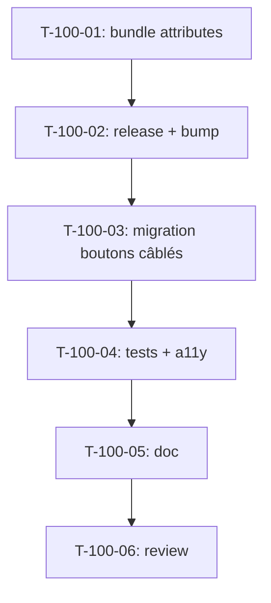

# Tâches — US-100 : Enabler `Ui:Button` — pass-through d'attributs + migration des boutons câblés

## Informations US
- **Epic** : EPIC-012 (Intégration design / socle) — enabler transverse
- **Persona** : transverse (tous) — dette a11y & adoptabilité
- **Story Points** : 3
- **Sprint** : sprint-024-amorce-finance
- **Origine** : rétrospective S23 — ACTION-1 (thème n°1) ; dette « pass-through » suivie (Sprint Review S23)
- **Priorité** : 🔴 Must

## Résumé de la US
**En tant que** développeur front (au service de tous les personas)
**Je veux** que le composant `tsf:Ui:Button` relaie les attributs HTML additionnels (`data-action`, `data-*-target`, `id`, `aria-*`)
**Afin de** migrer les boutons câblés Stimulus vers le composant et achever la convergence a11y (focus visible WCAG 2.4.7) sur tout le parcours.

## Constat technique
`vendor/tailsfadmin/tailsfadmin-bundle/templates/components/Ui/Button.html.twig` ne rend **pas** `{{ attributes }}` : un `<twig:tsf:Ui:Button data-action="…">` perd l'attribut. Les boutons câblés des écrans reskinnés ont donc reçu le focus **en direct** (S23) au lieu d'être migrés. Correction = ajouter `{{ attributes }}` aux deux branches (`<a>` et `<button>`) du composant, release mineure du bundle, bump, puis migration.

## Vue d'ensemble des tâches

| ID | Type | Tâche | Estimation | Dépend de | Statut |
|----|------|-------|------------|-----------|--------|
| T-100-01 | [OPS] | Bundle : rendre `{{ attributes }}` sur `Ui:Button` (`<a>` + `<button>`) + test composant | 2h | - | 🔲 |
| T-100-02 | [OPS] | Release bundle **v1.6.2** (tag) + bump Composer `^1.6.2` dans l'app | 1h | T-100-01 | 🔲 |
| T-100-03 | [FE-WEB] | Migrer les boutons câblés → `tsf:Ui:Button` (complétude, validation, absences, relances) | 3h | T-100-02 | 🔲 |
| T-100-04 | [TEST] | Vérifier le rendu du pass-through + suites fonctionnelles des écrans migrés + job a11y (2.4.7) | 2h | T-100-03 | 🔲 |
| T-100-05 | [DOC] | PHPDoc/usage du pass-through sur le composant + note « dette soldée » | 0.5h | T-100-04 | 🔲 |
| T-100-06 | [REV] | Code review (bundle + app) | 1h | T-100-05 | 🔲 |

**Total estimé** : ~9,5h

---

## Détail des tâches

### T-100-01 : Bundle — pass-through `{{ attributes }}`
- **Type** : [OPS] (dépôt bundle tailsfadmin, pattern « dev-dans-le-bundle » US-087/096)
- **Estimation** : 2h · **Dépend de** : -

**Description** : ajouter le rendu de `{{ attributes }}` sur les deux branches du composant (après `class="{{ baseClasses }}"`), en veillant à ce que `class` fusionne (les classes du socle priment/complètent) et que `type`/`href`/`disabled`/`aria-busy` restent maîtrisés par le composant.

**Fichiers (bundle)** :
- `templates/components/Ui/Button.html.twig` (branches `<a>` et `<button>`)
- `src/Twig/Components/Ui/Button.php` (PHPDoc du contrat de pass-through)
- test composant (rendu de `data-action`, non-écrasement de `class`)

**Critères de validation** :
- [ ] `<twig:tsf:Ui:Button data-action="x#y" data-x-target="z">` rend `data-action` et `data-x-target`
- [ ] `class` custom fusionne avec `baseClasses` (focus visible préservé)
- [ ] `disabled`/`loading`/`href`/`type` inchangés ; pas de régression sur les 6 variantes
- [ ] Test composant vert

---

### T-100-02 : Release bundle v1.6.2 + bump app
- **Type** : [OPS] · **Estimation** : 1h · **Dépend de** : T-100-01

**Critères** :
- [ ] Bundle taggé `v1.6.2` (release mineure) ; CHANGELOG bundle à jour
- [ ] `composer.json` app : `tailsfadmin/tailsfadmin-bundle: "^1.6.2"` + `composer update tailsfadmin/tailsfadmin-bundle`
- [ ] `make up` / `tailwind:build` OK (classes du socle inchangées)

**Commandes** :
```bash
composer update tailsfadmin/tailsfadmin-bundle --with-dependencies
```

---

### T-100-03 : Migration des boutons câblés → `tsf:Ui:Button`
- **Type** : [FE-WEB] · **Estimation** : 3h · **Dépend de** : T-100-02

**Cibles (boutons câblés, `data-action`/targets préservés)** :
| Template | Contrôleur Stimulus | Boutons à migrer |
|----------|--------------------|------------------|
| `templates/completeness/index.html.twig` | `completeness` | « Relancer » (`completeness#remind`), « Tout cocher » (`toggleAll`) |
| `templates/timesheet/validation.html.twig` | `validation` | « Valider » (`validation#validate`), « Rejeter » (`validation#reject`), « Tout sélectionner » (`toggleAll`) |
| `templates/absence/index.html.twig` | `absence` | bouton de soumission du formulaire (type=submit) |
| `templates/reminder/index.html.twig` | `reminders` | bouton d'action de relance (si présent) ; toggles = checkboxes (hors scope) |

**Critères** :
- [ ] Boutons rendus via `<twig:tsf:Ui:Button …>` avec `data-action`/`data-*-target` **intacts**
- [ ] Hooks Stimulus fonctionnels (filtre, relance, validation, calcul d'impact absences)
- [ ] Focus visible via le composant (plus de focus ajouté « en direct »)
- [ ] Saisie hebdo/jour (`timesheet/week|day`) : **opportuniste** si capacité, sinon reporté (hors ACTION-1)

---

### T-100-04 : Tests & attestation a11y
- **Type** : [TEST] · **Estimation** : 2h · **Dépend de** : T-100-03

**Critères** :
- [ ] Assertion de rendu : un `tsf:Ui:Button data-action=…` produit l'attribut dans le HTML
- [ ] Suites fonctionnelles vertes : complétude, validation des temps, absences, relances (hooks préservés)
- [ ] Job a11y (axe/pa11y — US-093) **sans violation 2.4.7** sur les écrans migrés
- [ ] `make ci` vert (PHPStan max, Deptrac, php-cs-fixer)

---

### T-100-05 : Documentation
- **Type** : [DOC] · **Estimation** : 0.5h · **Dépend de** : T-100-04

**Critères** :
- [ ] Contrat de pass-through documenté (PHPDoc `Button.php` + exemple d'usage câblé)
- [ ] Note « dette pass-through soldée » (référence Sprint Review S23)

---

### T-100-06 : Code review
- **Type** : [REV] · **Estimation** : 1h · **Dépend de** : T-100-05

**Checklist** : bundle + app cohérents · pas de régression variantes · attributs non dupliqués · tests verts · **branche `feature/us-100-…` (ACTION-2)**.

---

## Graphe de dépendances



## Résumé

| Type | Nb | Heures |
|------|----|--------|
| [OPS] | 2 | 3h |
| [FE-WEB] | 1 | 3h |
| [TEST] | 1 | 2h |
| [DOC] | 1 | 0.5h |
| [REV] | 1 | 1h |
| **TOTAL** | **6** | **~9,5h** |
