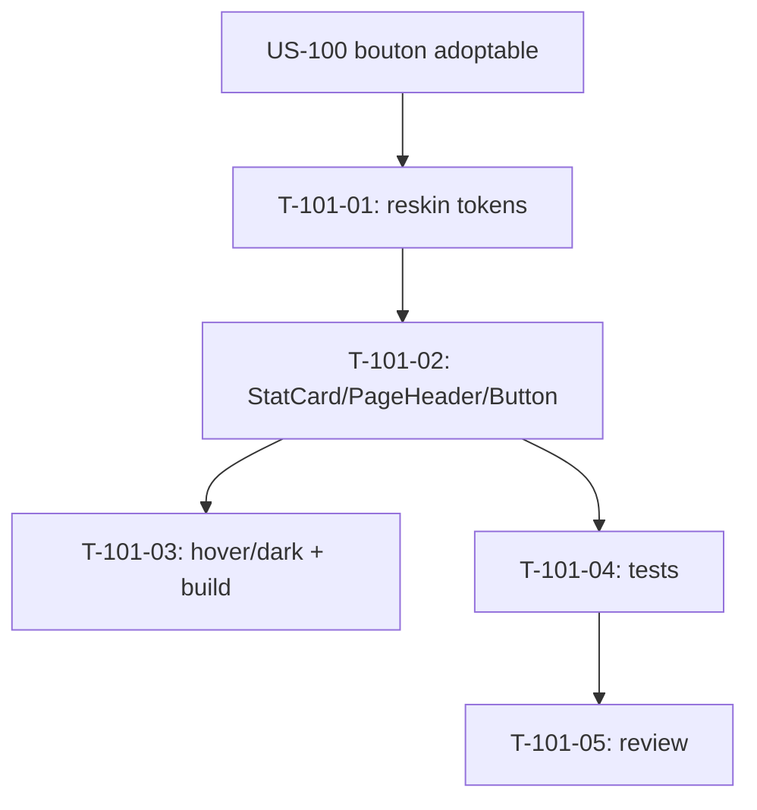

# Tâches — US-101 : PG-VAL-01 — reskin Valorisation

## Informations US
- **Epic** : EPIC-005 (Finance & rentabilité) — amorce reskin
- **Persona** : P3 (production) / P6 (direction) — valeur direction/prod
- **Story Points** : 3
- **Sprint** : sprint-024-amorce-finance
- **Origine** : `backlog-reskin-priorise.md` — EPIC-005 Must (PG-VAL-01, gap G1)
- **Priorité** : 🔴 Must

## Résumé de la US
**En tant que** membre de la direction / de la production
**Je veux** consulter la valorisation du temps validé sur le socle tailsfadmin
**Afin de** disposer d'une vue cohérente et accessible du CA reconnu / de l'occupation.

## Écran cible
- **Template** : `templates/valuation/index.html.twig` (250 lignes)
- **Contrôleur / route** : `ValuationDashboardController` — `/valorisation`
- **Nature** : reskin **template-only** (logique de valorisation inchangée — US-060/079)

## Vue d'ensemble des tâches

| ID | Type | Tâche | Estimation | Dépend de | Statut |
|----|------|-------|------------|-----------|--------|
| T-101-01 | [FE-WEB] | Reskin du template sur tokens tailsfadmin (structure, badges, tables) | 3h | US-100 | 🔲 |
| T-101-02 | [FE-WEB] | KPI en `tsf:Ui:StatCard` (G1) + `tsf:Layout:PageHeader` (G4) + liens/actions en `tsf:Ui:Button` | 2h | T-101-01 | 🔲 |
| T-101-03 | [FE-WEB] | Passe de vérification variantes `hover:`/`dark:` (post-`sed`) + classes présentes dans `app.built.css` | 1h | T-101-02 | 🔲 |
| T-101-04 | [TEST] | Suites fonctionnelles vertes + assertions reskin (StatCard, absence de badges legacy) | 2h | T-101-02 | 🔲 |
| T-101-05 | [REV] | Code review | 1h | T-101-04 | 🔲 |

**Total estimé** : ~9h

---

## Détail des tâches

### T-101-01 : Reskin du template sur tokens tailsfadmin
- **Type** : [FE-WEB] · **Estimation** : 3h · **Dépend de** : US-100

**Description** : porter `valuation/index.html.twig` sur les tokens du socle (couleurs `brand`/`gray`, ombres `shadow-theme`, `rounded`), migrer les tables/cartes et badges de statut (texte + couleur), en préservant les variables Twig et la `ProgressBar` déjà adoptée.

**Critères** :
- [ ] 100 % tokens tailsfadmin ; aucune classe legacy résiduelle
- [ ] Badges statut lisibles (texte + couleur, contraste AA)
- [ ] Données/variables et logique d'affichage inchangées

---

### T-101-02 : StatCard (G1) + PageHeader (G4) + Button
- **Type** : [FE-WEB] · **Estimation** : 2h · **Dépend de** : T-101-01

**Critères** :
- [ ] KPI de valorisation (CA reconnu, occupation…) en `tsf:Ui:StatCard`
- [ ] En-tête via `tsf:Layout:PageHeader` (titre + fil éventuel)
- [ ] Boutons/liens (recalcul, export, navigation) via `tsf:Ui:Button` (pass-through US-100 si câblés)

---

### T-101-03 : Passe hover:/dark: + vérif build
- **Type** : [FE-WEB] · **Estimation** : 1h · **Dépend de** : T-101-02

**Critères** :
- [ ] Variantes `hover:`/`dark:` correctes (leçon « Moins de » rétro S23 : `hover:X dark:Y` non cassés)
- [ ] Chaque classe utilisée présente dans `public/assets/.../app.built.css` (tenir compte de l'échappement `\:` `\/` `\.`)
- [ ] `php bin/console tailwind:build` + `cache:clear` + restart app (boucle front connue)

---

### T-101-04 : Tests
- **Type** : [TEST] · **Estimation** : 2h · **Dépend de** : T-101-02

**Suites concernées** : `tests/Functional/Web/ValuationDashboardAccessTest.php`, `tests/Functional/Web/ProjectValuationBreakdownTest.php`.

**Critères** :
- [ ] Suites vertes (accès, gating, breakdown) ; **piège récurrent** : un test atteignant `/valorisation` avec des imputations valorisées déclenche l'occupation → ajouter `AbsenceRequest::class` au schéma du test si besoin (cf. mémoire)
- [ ] Assertions reskin : présence StatCard/PageHeader, absence de badge legacy
- [ ] Couverture maintenue (gate ≥ 80 %)

---

### T-101-05 : Code review
- **Type** : [REV] · **Estimation** : 1h · **Dépend de** : T-101-04

**Checklist** : tokens only · a11y (focus/contraste) · logique intacte · `make ci` vert · **branche `feature/us-101-…` (ACTION-2)**.

---

## Graphe de dépendances

## Résumé

| Type | Nb | Heures |
|------|----|--------|
| [FE-WEB] | 3 | 6h |
| [TEST] | 1 | 2h |
| [REV] | 1 | 1h |
| **TOTAL** | **5** | **~9h** |
