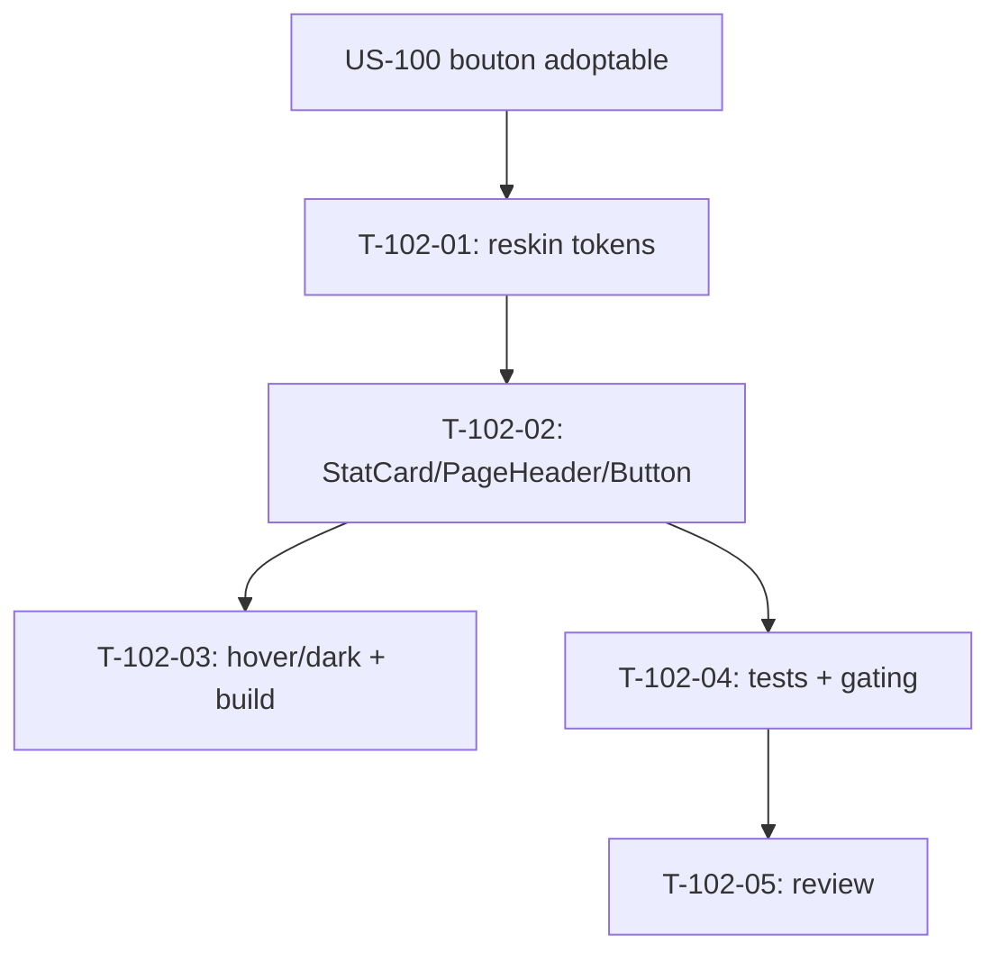

# Tâches — US-102 : PG-FIN-01 — reskin Tableau de bord financier

## Informations US
- **Epic** : EPIC-005 (Finance & rentabilité) — amorce reskin
- **Persona** : P6 (direction) / P3 — marge & dérive
- **Story Points** : 3
- **Sprint** : sprint-024-amorce-finance
- **Origine** : `backlog-reskin-priorise.md` — EPIC-005 Must (PG-FIN-01, gap G1)
- **Priorité** : 🔴 Must

## Résumé de la US
**En tant que** membre de la direction
**Je veux** consulter le tableau de bord financier consolidé sur le socle tailsfadmin
**Afin de** suivre marge et dérive avec une hiérarchie visuelle claire et accessible.

## Écran cible
- **Template** : `templates/finance/index.html.twig` (159 lignes)
- **Contrôleur / route** : `FinanceDashboardController` — `/finance`
- **Nature** : reskin **template-only** (agrégation US-071/072/073 inchangée) ; **gating habilitation finance** à préserver

## Vue d'ensemble des tâches

| ID | Type | Tâche | Estimation | Dépend de | Statut |
|----|------|-------|------------|-----------|--------|
| T-102-01 | [FE-WEB] | Reskin du template sur tokens tailsfadmin (structure, tables, badges) | 2.5h | US-100 | 🔲 |
| T-102-02 | [FE-WEB] | KPI marge/dérive en `tsf:Ui:StatCard` (G1) + `PageHeader` (G4) + liens config en `tsf:Ui:Button` | 2h | T-102-01 | 🔲 |
| T-102-03 | [FE-WEB] | Passe `hover:`/`dark:` + vérif classes dans `app.built.css` | 1h | T-102-02 | 🔲 |
| T-102-04 | [TEST] | `FinanceDashboardTest` vert + assertions reskin + gating finance (403) préservé | 2h | T-102-02 | 🔲 |
| T-102-05 | [REV] | Code review | 1h | T-102-04 | 🔲 |

**Total estimé** : ~8,5h

---

## Détail des tâches

### T-102-01 : Reskin du template sur tokens tailsfadmin
- **Type** : [FE-WEB] · **Estimation** : 2.5h · **Dépend de** : US-100

**Critères** :
- [ ] 100 % tokens tailsfadmin ; tables/cartes migrées
- [ ] Badges de dérive (couleur + texte) contraste AA
- [ ] Liens vers les configs (dérive, devises, FEC, périodes) préservés

---

### T-102-02 : StatCard (G1) + PageHeader (G4) + Button
- **Type** : [FE-WEB] · **Estimation** : 2h · **Dépend de** : T-102-01

**Critères** :
- [ ] KPI (CA, coûts, marge, projets en dérive) en `tsf:Ui:StatCard`
- [ ] En-tête via `tsf:Layout:PageHeader`
- [ ] Liens de configuration/exports en `tsf:Ui:Button`
- [ ] Référence visuelle : `design-canvas/tailadmin-ref/` (`cards-kpi`, `cards-revenue`, `monthly-target`)

---

### T-102-03 : Passe hover:/dark: + vérif build
- **Type** : [FE-WEB] · **Estimation** : 1h · **Dépend de** : T-102-02

**Critères** :
- [ ] Variantes `hover:`/`dark:` correctes ; classes présentes dans `app.built.css`
- [ ] `tailwind:build` + `cache:clear` + restart app

---

### T-102-04 : Tests
- **Type** : [TEST] · **Estimation** : 2h · **Dépend de** : T-102-02

**Suite concernée** : `tests/Functional/Web/FinanceDashboardTest.php`.

**Critères** :
- [ ] Suite verte ; **gating finance préservé** (403 sans habilitation ; visible pour compte coût-visible type Dirigeant)
- [ ] Assertions reskin (StatCard/PageHeader présents)
- [ ] Couverture maintenue (≥ 80 %)

---

### T-102-05 : Code review
- **Type** : [REV] · **Estimation** : 1h · **Dépend de** : T-102-04

**Checklist** : tokens only · gating intact · a11y · `make ci` vert · **branche `feature/us-102-…` (ACTION-2)**.

---

## Graphe de dépendances

## Résumé

| Type | Nb | Heures |
|------|----|--------|
| [FE-WEB] | 3 | 5.5h |
| [TEST] | 1 | 2h |
| [REV] | 1 | 1h |
| **TOTAL** | **5** | **~8,5h** |
