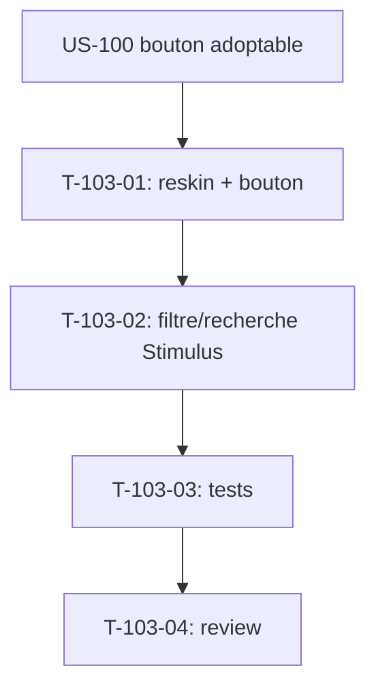

# Tâches — US-103 : PG-CLI-01 — reskin Liste des clients

## Informations US
- **Epic** : EPIC-002 (Projets & delivery) / EPIC-006 (base du cycle commercial)
- **Persona** : P2 (chef de projet) — accès clients
- **Story Points** : 2
- **Sprint** : sprint-024-amorce-finance
- **Origine** : `backlog-reskin-priorise.md` — Should (PG-CLI-01, gap G3)
- **Priorité** : 🟡 Should

## Résumé de la US
**En tant que** chef de projet
**Je veux** consulter et filtrer la liste des clients sur le socle tailsfadmin
**Afin de** retrouver rapidement un client (base du cycle projet/commercial).

## Écran cible
- **Template** : `templates/client/index.html.twig` (44 lignes — écran simple)
- **Contrôleur** : `ClientController`
- **Nature** : reskin **template-only** + filtre/recherche Stimulus (pattern US-097)

## Vue d'ensemble des tâches

| ID | Type | Tâche | Estimation | Dépend de | Statut |
|----|------|-------|------------|-----------|--------|
| T-103-01 | [FE-WEB] | Reskin du template (table/carte tokens + badges) + bouton création en `tsf:Ui:Button` (gating) | 2h | US-100 | 🔲 |
| T-103-02 | [FE-WEB] | Filtre + recherche Stimulus (G3, pattern US-097) | 2h | T-103-01 | 🔲 |
| T-103-03 | [TEST] | `ClientPageTest` : reskin + filtre/recherche + gating création | 1.5h | T-103-02 | 🔲 |
| T-103-04 | [REV] | Code review | 1h | T-103-03 | 🔲 |

**Total estimé** : ~6,5h

---

## Détail des tâches

### T-103-01 : Reskin du template
- **Type** : [FE-WEB] · **Estimation** : 2h · **Dépend de** : US-100

**Critères** :
- [ ] Table/carte sur tokens tailsfadmin ; badges éventuels (texte + couleur)
- [ ] Bouton « Nouveau client » via `tsf:Ui:Button` (focus visible), **gating** de création préservé (masqué si non habilité)
- [ ] État vide clair si aucun client

---

### T-103-02 : Filtre + recherche Stimulus
- **Type** : [FE-WEB] · **Estimation** : 2h · **Dépend de** : T-103-01

**Description** : appliquer le pattern de filtre/recherche sans rechargement d'US-097 (contrôleur Stimulus dédié), avec `data-action`/targets relayés via le composant bouton (pass-through US-100).

**Critères** :
- [ ] Recherche par nom/raison sociale sans rechargement
- [ ] Filtre (si champ pertinent : statut/actif) fonctionnel
- [ ] Pas de JS inline ; contrôleur Stimulus testé au clavier (a11y)

---

### T-103-03 : Tests
- **Type** : [TEST] · **Estimation** : 1.5h · **Dépend de** : T-103-02

**Suite concernée** : `tests/Functional/Web/ClientPageTest.php`.

**Critères** :
- [ ] Reskin attesté (tokens, bouton composant)
- [ ] Contrôles de filtre/recherche présents
- [ ] Gating création (bouton absent pour profil non habilité)
- [ ] Couverture maintenue (≥ 80 %)

---

### T-103-04 : Code review
- **Type** : [REV] · **Estimation** : 1h · **Dépend de** : T-103-03

**Checklist** : tokens only · gating intact · a11y clavier · `make ci` vert · **branche `feature/us-103-…` (ACTION-2)**.

---

## Graphe de dépendances

## Résumé

| Type | Nb | Heures |
|------|----|--------|
| [FE-WEB] | 2 | 4h |
| [TEST] | 1 | 1.5h |
| [REV] | 1 | 1h |
| **TOTAL** | **4** | **~6,5h** |
