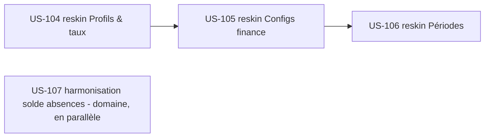

# Sprint 25 : Paramétrage EPIC-005 (profils/taux, configs finance, périodes) + harmonisation solde absences

## Informations

| Attribut | Valeur |
|----------|--------|
| Numéro | 25 |
| Début | 2026-11-23 |
| Fin | 2026-12-04 |
| Durée | 10 jours ouvrés |
| Capacité engagée | 11 pts (vélocité livrée S22–24 : 11–13, moyenne ≈ 12) |
| EPIC | EPIC-005 (Finance & rentabilité) — paramétrage · EPIC-003 (Temps) — dette solde absences |
| Thème arbitré (PO) | **Solder le paramétrage finance sur le socle + trancher le solde d'absences** — décision planning 2026-11-20 (scope : profils/taux + configs + périodes ; solde absences harmonisé en jours ouvrés) |

## Sprint Goal

> **« Solder le paramétrage EPIC-005 sur le socle tailsfadmin — profils & taux de vente,
> configurations finance (dérive, devises, FEC) et périodes de clôture — et harmoniser
> définitivement la base de décompte du solde d'absences en jours ouvrés, pour offrir aux
> personas direction/administration un paramétrage financier cohérent et un décompte d'absences
> sans ambiguïté. »**

Ce sprint reconduit la recette des trois derniers (S22–S24, trois clôtures consécutives à 100 % DoD) :
**avancer par incrément fini** (≤ 3 écrans reskin ouverts, garde-fou ACTION-3 rétro S24) et **traiter la dette à la racine**.
Il solde le front EPIC-005 (après valorisation + dashboard financier en S24) et clôt enfin la dette récurrente
du solde d'absences (US-091-CA2-solde), ouverte depuis le Sprint 21 et reportée trois sprints d'affilée.

## Definition of Done (rappel projet)

- [ ] Code review approuvée · PHPStan max 0 · Deptrac OK · **php-cs-fixer OK** (lancer `make ci` avant push)
- [ ] Tests (PHPUnit/Pest) verts ; couverture maintenue (gate CI ≥ 80 %)
- [ ] **WCAG 2.2 AA attesté** (job axe/pa11y en CI — US-093), dont **2.4.7 focus visible** sur tous les boutons
- [ ] Composants/tokens tailsfadmin uniquement ; hooks Stimulus & logique métier préservés (reskins)
- [ ] **Statut d'US basculé à `done` au merge de la PR** (ACTION-1 rétro S24)
- [ ] Pas de dette ajoutée ; déployable

## Sprint Backlog

| Priorité | US | Titre | Points | Origine | Statut |
|----------|-----|-------|--------|---------|--------|
| 🔴 Must | US-104 | PG-PRC-01 — reskin Profils & taux | 3 | backlog reskin (EPIC-005 Should) | 🟢 Ready |
| 🔴 Must | US-105 | PG-FIN-02…05 — reskin Configs finance (dérive, devises, FEC) | 3 | backlog reskin (EPIC-005 Should) | 🟢 Ready |
| 🔴 Must | US-107 | Harmonisation du solde d'absences en jours ouvrés | 3 | rétro S24 ACTION-2 (dette US-091-CA2-solde) | 🟢 Ready |
| 🟡 Should | US-106 | PG-ADM-01 — reskin Périodes | 2 | backlog reskin (EPIC-005 Should) | 🟢 Ready |

**Total engagé : 11 points** (Must 9 + Should 2). Aligné sur la vélocité (~12).

## Écrans cibles

| US | Écran | Template(s) | Route(s) |
|----|-------|-------------|----------|
| US-104 | Profils & taux | `templates/pricing/index.html.twig` | `/profils`, `/profils/taux-vente`, `/profils/affectations` |
| US-105 | Configs finance | `templates/finance/{margin-drift-config,charge-drift-config,currency-config,fec-config}.html.twig` | `/finance/config-derive`, `/finance/config-derive-charge`, `/finance/config-devises…`, `/finance/config-fec` |
| US-106 | Périodes | `templates/period/index.html.twig` | `/administration/periodes`, `/administration/periodes/cloturer` |
| US-107 | (aucun écran nouveau — domaine) | `Domain`/`Application` absences + `/api/absences/impact` | — |

## Chantiers / actions rétro S24 (intégrés au sprint)

- **ACTION-1 (au fil de l'eau)** — **Statut → `done` au merge** de chaque PR d'US, sans attendre la clôture. *Critère : 0 US mergée encore `ready` en fin de sprint.*
- **ACTION-3 (garde-fou)** — Incrément fini ≤ 3 écrans reskin (US-104/105/106) ; US-107 est du domaine, hors compte d'écrans.
- **ACTION-4 (J2, Could)** — Nettoyer le bruit du working tree (`.idea/`, `RESUME-*`, churn `tailadmin-ref/`) via `.gitignore`. *Critère : `git status` propre hors travail en cours.*

## Séquencement

- **US-104 / US-105** (Must) : cœur du paramétrage EPIC-005, réutilisent `StatCard`/`PageHeader`/`Ui:Button` ; services `Pricing` (US-015/078) et finance (US-072/074/018) **inchangés** — reskin présentation seule.
- **US-107** (Must, domaine) : indépendante des reskins, peut avancer en parallèle ; harmonise le compteur persisté sur la source jours ouvrés (`/api/absences/impact`, US-091b).
- **US-106** (Should) : périodes, en repli si la capacité se tend.

## Dépendances

| US | Dépend de | Statut |
|----|-----------|--------|
| US-104 | tokens + `StatCard` (G1) + `PageHeader` (G4) + `Ui:Button` (pass-through v1.6.2) | ✅ existants |
| US-105 | `PageHeader` (G4) + `Ui:Button` + gating finance (habilitation) | ✅ existants |
| US-106 | `PageHeader` (G4) + `Ui:Button` + confirmation de clôture | ✅ existants |
| US-107 | `WorkingDaysCalculator` + endpoint impact (US-091b) | ✅ existants |

## Risques

| Risque | Prob. | Impact | Mitigation |
|--------|-------|--------|------------|
| US-105 = 4 templates config → dispersion sous une seule US | Moyenne | Moyen | Patron commun (PageHeader + formulaire tokenisé) appliqué aux 4 ; passe de vérif `hover:`/`dark:` post-migration ; suites de config (403 gating) vertes |
| US-107 touche le domaine (décompte) → régression sur soldes existants | Moyenne | Élevé | TDD : test de non-régression sur le solde avant refactor ; source unique de décompte ; vérifier `/api/absences/impact` et le compteur persisté convergent |
| Formulaires de config (POST + CSRF) cassés par le reskin | Moyenne | Moyen | Ne pas déplacer les tokens CSRF avant un `.first()` ; suites fonctionnelles de config avant/après |
| Paramétrage finance gaté → tests fonctionnels doivent injecter l'habilitation | Faible | Moyen | Réutiliser le pattern de gating des tests finance existants (US-102) |

## Références de conception

- `backlog-reskin-priorise.md` (US-085) — source de vérité de la priorisation reskin (EPIC-005 Should : PG-PRC-01, PG-FIN-02…05, PG-ADM-01).
- Écrans finance déjà reskinnés S24 (`/finance`, `/valorisation`) — cohérence de patron (PageHeader + StatCard + formulaires tokenisés).

## Cérémonies

| Cérémonie | Quand |
|-----------|-------|
| Planning | J1 (2026-11-23) — validation backlog + rappel ACTION-1 (statut au merge) |
| Daily | quotidien (`daily-notes/`) |
| Affinage | mi-sprint — cadrer S26 (fin EPIC-005 : dashboard facturation si externalisation ; ou ouverture EPIC-006 CRM / EPIC-007 pilotage) |
| Review | J10 (2026-12-04) |
| Rétrospective | J10 (2026-12-04) |

## Suite (S26 pressenti)

EPIC-005 sera soldé côté paramétrage. Pistes S26 : dashboard direction (DSH-AGENCE, EPIC-007, dépend de drill-down CRM), ou ouverture EPIC-006 (CRM/devis — build natif sur socle), selon `backlog-reskin-priorise.md` et l'arbitrage PO.
