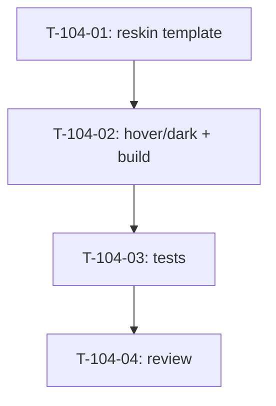

# Tâches — US-104 : PG-PRC-01 — reskin Profils & taux

## Informations US
- **Epic** : EPIC-005 (Finance & rentabilité) — paramétrage de la valorisation
- **Persona** : P6 (dirigeant) / administration — paramétrage taux de vente & profils
- **Story Points** : 3
- **Sprint** : sprint-025-parametrage-finance
- **Origine** : `backlog-reskin-priorise.md` — EPIC-005 Should (PG-PRC-01)
- **Priorité** : 🔴 Must

## Résumé de la US
**En tant que** dirigeant / administrateur
**Je veux** consulter et paramétrer les profils et leurs taux de vente sur le socle tailsfadmin
**Afin de** piloter la valorisation avec un écran cohérent et lisible.

## Écran cible
- **Template** : `templates/pricing/index.html.twig`
- **Routes** : `/profils`, `/profils/taux-vente`, `/profils/affectations`
- **Nature** : reskin **template-only** ; services `Pricing` (US-015 `SellingRateResolver`, US-078) **inchangés**

## Vue d'ensemble des tâches

| ID | Type | Tâche | Estimation | Dépend de | Statut |
|----|------|-------|------------|-----------|--------|
| T-104-01 | [FE-WEB] | Reskin du template (tokens + StatCard G1 + PageHeader G4 + `tsf:Ui:Button`) | 3h | — | 🔲 |
| T-104-02 | [FE-WEB] | Passe `hover:`/`dark:` + vérif présence classes dans `app.built.css` | 1h | T-104-01 | 🔲 |
| T-104-03 | [TEST] | Suite `pricing` (accès + taux + affectations + gating) + assertions reskin | 2h | T-104-02 | 🔲 |
| T-104-04 | [REV] | Code review | 1h | T-104-03 | 🔲 |

**Total estimé** : ~7h

---

## Détail des tâches

### T-104-01 : Reskin du template
- **Type** : [FE-WEB] · **Estimation** : 3h

**Critères** :
- [ ] PageHeader (G4) + tableaux/cartes des profils et taux sur tokens tailsfadmin (thème clair/sombre)
- [ ] Éventuelles StatCards (G1) de synthèse si pertinent (nb profils, taux moyen)
- [ ] Boutons d'action (ajout/édition taux, affectation) via `tsf:Ui:Button` (focus visible 2.4.7) ; **gating** préservé
- [ ] Formulaires : jetons CSRF non déplacés avant un `.first()` ; POST conservés à l'identique

### T-104-02 : Passe hover:/dark: + build
- **Type** : [FE-WEB] · **Estimation** : 1h

**Critères** :
- [ ] Aucun `hover:X dark:Y` cassé (leçon rétro S23) ; variantes vérifiées
- [ ] Chaque classe utilisée présente dans `app.built.css` (échappement `\:` `\/` `\.`)

### T-104-03 : Tests
- **Type** : [TEST] · **Estimation** : 2h

**Critères** :
- [ ] Reskin attesté (PageHeader, bouton composant)
- [ ] Accès + affichage profils/taux + affectations OK ; **gating** (403/masquage) pour profil non habilité
- [ ] Couverture maintenue (≥ 80 %)

### T-104-04 : Code review
- **Type** : [REV] · **Estimation** : 1h

**Checklist** : tokens only · services Pricing intacts · gating · a11y clavier · `make ci` vert · **branche `feature/us-104-…`** · **statut → `done` au merge (ACTION-1)**.

---

## Graphe de dépendances

## Résumé

| Type | Nb | Heures |
|------|----|--------|
| [FE-WEB] | 2 | 4h |
| [TEST] | 1 | 2h |
| [REV] | 1 | 1h |
| **TOTAL** | **4** | **~7h** |
