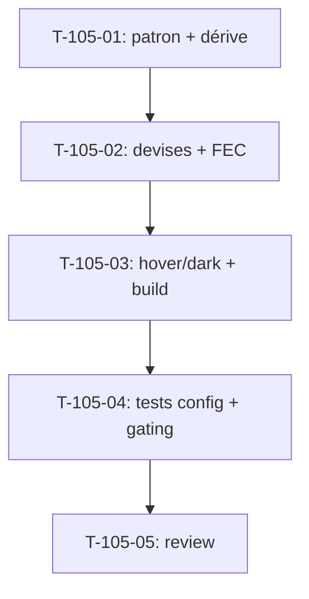

# Tâches — US-105 : PG-FIN-02…05 — reskin Configs finance (dérive, devises, FEC)

## Informations US
- **Epic** : EPIC-005 (Finance & rentabilité) — cohérence du paramétrage finance
- **Persona** : P6 (dirigeant) / administration finance
- **Story Points** : 3
- **Sprint** : sprint-025-parametrage-finance
- **Origine** : `backlog-reskin-priorise.md` — EPIC-005 Should (PG-FIN-02…05)
- **Priorité** : 🔴 Must

## Résumé de la US
**En tant que** administrateur finance
**Je veux** paramétrer les seuils de dérive, les devises et l'export FEC sur le socle tailsfadmin
**Afin de** disposer d'écrans de configuration finance cohérents et accessibles.

## Écrans cibles (4 templates)
- `templates/finance/margin-drift-config.html.twig` — seuil dérive marge (`/finance/config-derive`)
- `templates/finance/charge-drift-config.html.twig` — seuil dérive charge (`/finance/config-derive-charge`)
- `templates/finance/currency-config.html.twig` — devises (`/finance/config-devises`, `.../reference`, `.../taux`)
- `templates/finance/fec-config.html.twig` — mapping FEC (`/finance/config-fec`)
- **Nature** : reskin **template-only** ; services finance (US-018 seuil dérive, US-016 devises, US-074 FEC) **inchangés** ; **gating finance (403)** préservé

## Vue d'ensemble des tâches

| ID | Type | Tâche | Estimation | Dépend de | Statut |
|----|------|-------|------------|-----------|--------|
| T-105-01 | [FE-WEB] | Patron commun config (PageHeader + form tokenisé) + reskin dérive marge & charge | 2.5h | — | 🔲 |
| T-105-02 | [FE-WEB] | Reskin config devises + config FEC | 2h | T-105-01 | 🔲 |
| T-105-03 | [FE-WEB] | Passe `hover:`/`dark:` + vérif build | 1h | T-105-02 | 🔲 |
| T-105-04 | [TEST] | Suites config (gating 403 + POST/CSRF) + assertions reskin | 2h | T-105-03 | 🔲 |
| T-105-05 | [REV] | Code review | 1h | T-105-04 | 🔲 |

**Total estimé** : ~8.5h

---

## Détail des tâches

### T-105-01 : Patron commun + dérive marge & charge
- **Type** : [FE-WEB] · **Estimation** : 2.5h

**Description** : définir un patron de page de config (PageHeader G4 + carte formulaire tokenisée + `tsf:Ui:Button`) et l'appliquer aux deux écrans de seuil de dérive (marge, charge).

**Critères** :
- [ ] Patron réutilisable appliqué aux 2 écrans dérive
- [ ] Champs de seuil + libellés sur tokens ; bouton d'enregistrement via composant (focus visible)
- [ ] CSRF/POST conservés à l'identique

### T-105-02 : Devises + FEC
- **Type** : [FE-WEB] · **Estimation** : 2h

**Critères** :
- [ ] Config devises (référence + taux) reskinnée sur le patron
- [ ] Config FEC (mapping de comptes) reskinnée ; tableaux de mapping lisibles (tabular-nums)
- [ ] Actions (ajout/édition) via `tsf:Ui:Button`

### T-105-03 : Passe hover:/dark: + build
- **Type** : [FE-WEB] · **Estimation** : 1h

**Critères** :
- [ ] Variantes `hover:`/`dark:` vérifiées sur les 4 écrans ; classes présentes dans `app.built.css`

### T-105-04 : Tests
- **Type** : [TEST] · **Estimation** : 2h

**Critères** :
- [ ] **Gating finance (403)** attesté pour profil non habilité sur les 4 écrans
- [ ] POST de configuration (dérive, devise, FEC) fonctionnels après reskin (CSRF OK)
- [ ] Assertions reskin (PageHeader, bouton composant) ; couverture ≥ 80 %

### T-105-05 : Code review
- **Type** : [REV] · **Estimation** : 1h

**Checklist** : tokens only · services finance intacts · gating 403 · a11y · `make ci` vert · **branche `feature/us-105-…`** · **statut → `done` au merge**.

---

## Graphe de dépendances

## Résumé

| Type | Nb | Heures |
|------|----|--------|
| [FE-WEB] | 3 | 5.5h |
| [TEST] | 1 | 2h |
| [REV] | 1 | 1h |
| **TOTAL** | **5** | **~8.5h** |
