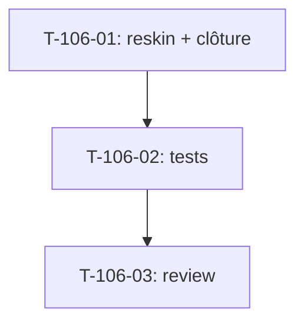

# Tâches — US-106 : PG-ADM-01 — reskin Périodes

## Informations US
- **Epic** : EPIC-005 (Finance & rentabilité) — clôture des périodes
- **Persona** : P6 (dirigeant) / administration finance
- **Story Points** : 2
- **Sprint** : sprint-025-parametrage-finance
- **Origine** : `backlog-reskin-priorise.md` — EPIC-005 Should (PG-ADM-01)
- **Priorité** : 🟡 Should

## Résumé de la US
**En tant que** administrateur finance
**Je veux** consulter et clôturer les périodes sur le socle tailsfadmin
**Afin de** figer les marges avec un écran clair et une action de clôture sûre.

## Écran cible
- **Template** : `templates/period/index.html.twig`
- **Routes** : `/administration/periodes`, `/administration/periodes/cloturer`
- **Nature** : reskin **template-only** ; logique de clôture (figement des marges) **inchangée** ; confirmation préservée

## Vue d'ensemble des tâches

| ID | Type | Tâche | Estimation | Dépend de | Statut |
|----|------|-------|------------|-----------|--------|
| T-106-01 | [FE-WEB] | Reskin `period/index` + action clôture en `tsf:Ui:Button` (confirmation préservée) | 2h | — | 🔲 |
| T-106-02 | [TEST] | Suite `period` (liste + clôture + gating) + assertions reskin | 1.5h | T-106-01 | 🔲 |
| T-106-03 | [REV] | Code review | 1h | T-106-02 | 🔲 |

**Total estimé** : ~4.5h

---

## Détail des tâches

### T-106-01 : Reskin du template
- **Type** : [FE-WEB] · **Estimation** : 2h

**Critères** :
- [ ] PageHeader (G4) + table des périodes sur tokens (statut ouvert/clôturé texte + couleur)
- [ ] Action **Clôturer** via `tsf:Ui:Button` (variant danger/primary), **confirmation** conservée (pas de dialog bloquant introduit)
- [ ] État vide clair si aucune période

### T-106-02 : Tests
- **Type** : [TEST] · **Estimation** : 1.5h

**Critères** :
- [ ] Liste + clôture d'une période fonctionnelles après reskin
- [ ] **Gating** pour profil non habilité
- [ ] Assertions reskin ; couverture ≥ 80 %

### T-106-03 : Code review
- **Type** : [REV] · **Estimation** : 1h

**Checklist** : tokens only · logique de clôture intacte · confirmation préservée · a11y · `make ci` vert · **branche `feature/us-106-…`** · **statut → `done` au merge**.

---

## Graphe de dépendances

## Résumé

| Type | Nb | Heures |
|------|----|--------|
| [FE-WEB] | 1 | 2h |
| [TEST] | 1 | 1.5h |
| [REV] | 1 | 1h |
| **TOTAL** | **3** | **~4.5h** |
