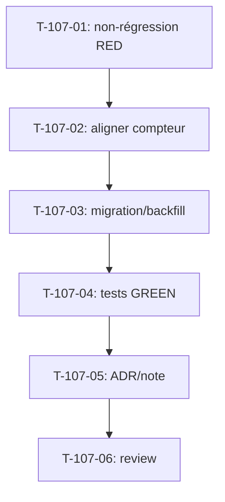

# Tâches — US-107 : Harmonisation du solde d'absences en jours ouvrés

## Informations US
- **Epic** : EPIC-003 (Temps & absences) — dette
- **Persona** : P1 (collaborateur) — lisibilité du solde ; P2/P6 — cohérence des décomptes
- **Story Points** : 3
- **Sprint** : sprint-025-parametrage-finance
- **Origine** : rétrospective S24 — ACTION-2 (dette `US-091-CA2-solde`, récurrente S22→S24) ; décision PO 2026-11-20 : **harmoniser en jours ouvrés**
- **Priorité** : 🔴 Must

## Contexte
Le **solde d'impact** projeté (US-091b, endpoint `/api/absences/impact`) est calculé en **jours ouvrés**
(via `WorkingDaysCalculator`), tandis que le **compteur persisté** du solde est décompté en **span calendaire**.
Deux bases coexistent → ambiguïté d'affichage relevée en S21 (CA-2) et non tranchée depuis. Décision : **une seule
source de décompte, en jours ouvrés.**

## Résumé de la US
**En tant que** collaborateur
**Je veux** un solde d'absences décompté en jours ouvrés, cohérent partout
**Afin de** comprendre sans ambiguïté combien de jours il me reste.

## Nature
- **Domaine / Application** (pas d'écran nouveau) ; TDD obligatoire (touche le décompte).
- **Non-régression** : les soldes existants doivent rester justes (ou être backfillés).

## Vue d'ensemble des tâches

| ID | Type | Tâche | Estimation | Dépend de | Statut |
|----|------|-------|------------|-----------|--------|
| T-107-01 | [TEST] | Test de non-régression du solde (RED) — comportement actuel + cas divergent (jour férié/week-end) | 1.5h | — | 🔲 |
| T-107-02 | [BE] | Aligner le compteur persisté sur les jours ouvrés (source unique `WorkingDaysCalculator`) | 3h | T-107-01 | 🔲 |
| T-107-03 | [DB] | Migration/backfill des soldes existants (si persistés en calendaire) | 1.5h | T-107-02 | 🔲 |
| T-107-04 | [TEST] | Tests domaine + fonctionnels : solde affiché == impact jours ouvrés (GREEN) | 2h | T-107-03 | 🔲 |
| T-107-05 | [DOC] | Note/ADR : source unique de décompte du solde | 0.5h | T-107-04 | 🔲 |
| T-107-06 | [REV] | Code review | 1h | T-107-05 | 🔲 |

**Total estimé** : ~9.5h

---

## Détail des tâches

### T-107-01 : Test de non-régression (RED)
- **Type** : [TEST] · **Estimation** : 1.5h

**Description** : capturer le comportement actuel du solde et **isoler un cas où calendaire ≠ jours ouvrés** (période incluant week-end/férié) qui doit changer après harmonisation.

**Critères** :
- [ ] Test échouant qui documente l'écart (solde calendaire vs impact jours ouvrés)
- [ ] Cas nominal (période sans week-end/férié) inchangé

### T-107-02 : Aligner le compteur persisté
- **Type** : [BE] · **Estimation** : 3h

**Critères** :
- [ ] Le décompte du solde s'appuie sur la **même** source que `/api/absences/impact` (jours ouvrés, `WorkingDaysCalculator`)
- [ ] Suppression de la double base de calcul (DRY) ; pas de logique de décompte dupliquée
- [ ] Respect des règles du domaine (calendriers/régimes par utilisateur, fériés, fermetures — US-021)

### T-107-03 : Migration / backfill
- **Type** : [DB] · **Estimation** : 1.5h

**Critères** :
- [ ] Si le solde est persisté : migration + backfill recalculant les soldes existants en jours ouvrés
- [ ] Idempotente ; RLS/tenant respecté ; réversible documentée
- [ ] Si le solde est purement dérivé (non persisté) : tâche close sans migration (le noter)

### T-107-04 : Tests (GREEN)
- **Type** : [TEST] · **Estimation** : 2h

**Critères** :
- [ ] Le test T-107-01 passe désormais (solde == impact jours ouvrés)
- [ ] Tests domaine du décompte (week-end, férié, fermeture, temps partiel/régime)
- [ ] Couverture maintenue (≥ 80 %)

### T-107-05 : Note/ADR
- **Type** : [DOC] · **Estimation** : 0.5h

**Critères** :
- [ ] ADR/note actant **jours ouvrés = source unique** de décompte du solde d'absences ; clôt la dette `US-091-CA2-solde`

### T-107-06 : Code review
- **Type** : [REV] · **Estimation** : 1h

**Checklist** : source unique (pas de double décompte) · non-régression verte · migration sûre · `make ci` vert · **branche `feature/us-107-…`** · **statut → `done` au merge**.

---

## Graphe de dépendances

## Résumé

| Type | Nb | Heures |
|------|----|--------|
| [TEST] | 2 | 3.5h |
| [BE] | 1 | 3h |
| [DB] | 1 | 1.5h |
| [DOC] | 1 | 0.5h |
| [REV] | 1 | 1h |
| **TOTAL** | **6** | **~9.5h** |
