# Spécification Technique — HotOnes

## Informations du document

| Champ | Valeur |
|-------|--------|
| **Projet** | HotOnes — ERP SaaS de gestion d'agence digitale / ESN |
| **Version** | 0.1 (draft) |
| **Date** | 2026-08-31 |
| **Auteur** | Tech Lead / AMOA |
| **PRD associé** | [prd.md](./prd.md) |
| **Statut** | Draft |
| **Périmètre** | Lot 1 (EPIC-000 à EPIC-003) — socle transverse posé pour les lots suivants |

> **Note de lecture.** La stack est arrêtée dans le CDC (16 ADR, chapitre 12). Cette spécification l'instancie pour le lot 1 et instruits les points ouverts (`ARB-25`, provisions). Elle ne remet pas en cause les décisions du sponsor.

---

## 1. Vue d'ensemble

### 1.1 Objet

Cette spécification décrit les décisions techniques d'implémentation du lot 1 de HotOnes : le socle multi-tenant (EPIC-000), les référentiels (EPIC-001), les projets (EPIC-002) et la saisie de temps avec valorisation (EPIC-003). Elle pose également les fondations transverses — modèle analytique en étoile, couche IA, CI/CD — sur lesquelles s'appuient les lots 2 à 5.

### 1.2 Contexte technique

Le MVP existant est un monolithe Symfony sans couche applicative structurée, sans isolation multi-tenant, sans modèle analytique. L'audit technique `AUD-1` (à réaliser au lot 0) confirmera l'état exact. La décision de cadrage `ARB-20` retient la reconstruction complète (scénario C du CDC) : pas de reprise de la dette technique, portage sélectif et motivé du MVP uniquement sur les référentiels de base.

Le socle est dimensionné pour un tenant grand de 150 collaborateurs avec une pointe de fin de mois ×5, et doit répondre aux seuils opposables du CDC (`ENF-PERF-*`, `ENF-DISPO-*`) en mode multi-tenant dès le lot 1 — même si la première mise en service pilote est mono-organisation.

### 1.3 Objectifs techniques du lot 1

- Poser le socle multi-tenant (`INV-1`, double barrière discriminant + RLS) **non rétro-adaptable**.
- Démontrer la tranche verticale end-to-end : paramétrage → projet → saisie → validation → valorisation → indicateur analytique.
- Valider le mode worker FrankenPHP et l'isolation inter-requêtes (`ARC-47..50`, `RSQ-15`).
- Mettre en service la chaîne CI/CD en 11 étapes bloquantes (`ADR-12`).
- Poser le squelette du modèle en étoile avec test de non-divergence en CI (`ARC-113`).
- Atteindre le seuil `ENF-UX-1` : saisie de temps ≤ 2 min/semaine (critère bloquant lot 1).
- Réussir le test d'intrusion isolation inter-tenant (`ENF-SEC-4`, bloquant MEP lot 1).

### 1.4 Non-objectifs de cette spécification

- Conception détaillée du modèle de données : voir `architecture/erd.md` (document parallèle).
- Définition des contrats d'API : voir `architecture/api.md` (document parallèle).
- Détail des règles de sécurité et des politiques RLS : voir `architecture/security.md` (document parallèle).
- Modules lot 2 à 5 (PLN, FIN, CRM, PIL, RH, REC) : ils sont posés en EPIC sans décomposition en tâches à ce stade.
- Hébergement de production (`ARB-25` ouvert, à instruire au lot 2).

### 1.5 Correspondance des exigences — LOT 1

> Convention : `EF-<MODULE>-n` = exigence CDC · `US-XXX` = User Story backlog · `ARC-n` / `ADR-n` = décision d'architecture CDC ch. 12.

#### EPIC-000 — Socle & Walking Skeleton

| US | Titre | Exigences CDC | Sections tech-spec | Statut |
|----|-------|--------------|-------------------|--------|
| US-001 | Fondation multi-tenant et isolation | `ARC-33/34/36/61`, `INV-1`, `ENF-SEC-4`, `HAB-4` | 5.1, 7, 9.3 | À faire |
| US-002 | Authentification et cycle de vie utilisateurs | `EF-REF-31`, `ENF-SEC-1/2`, `ARC-47/48` | 7.1, 5.1 | À faire |
| US-003 | Rôles et habilitations (RBAC + périmètre) | `HAB-1..6`, `ARC-19`, `ENF-SEC-5/6` | 7.2, 5.1 | À faire |
| US-004 | Chaîne CI/CD et exécution en mode worker | `ADR-12`, `ARC-50`, `ARC-86`, `ENF-MAINT-1/2` | 10.2, 9 | À faire |
| US-005 | Modèle analytique en étoile et non-divergence | `ADR-9`, `ARC-111..114`, `ARC-113` | 3.2, 5.4 | À faire |

#### EPIC-001 — Référentiels et paramétrage

| US | Titre | Exigences CDC | Sections tech-spec | Statut |
|----|-------|--------------|-------------------|--------|
| US-010 | Structure organisationnelle et rattachements historisés | `EF-REF-1`, `INV-2` | 3.1, 5.2 | À faire |
| US-011 | Référentiel de profils avec coûts et taux historisés | `EF-REF-15`, `INV-2` | 3.1 | À faire |
| US-012 | Calendriers de travail et types d'absence | `EF-REF-20`, `HAB-3` | 3.1, 7.2 | À faire |
| US-013 | Référentiel de compétences structuré | `EF-REF-10` | 3.1 | À faire |
| US-014 | Référentiel comptes clients et contacts | `EF-REF-5` | 3.1 | À faire |
| US-015 | Taux de vente et règle de priorité | `EF-REF-15`, `INV-2` | 3.1, 5.2 | À faire |
| US-016 | Devises et taux de change | `EF-REF-18` | 3.1 | À faire |
| US-017 | Statuts et circuits de validation paramétrables | `EF-REF-22`, `ARB-5` | 5.2 | À faire |
| US-018 | Seuils d'alerte paramétrables | `EF-REF-26` | 5.2 | À faire |
| US-019 | Ouverture de tenant et time-to-value < 15 min | `ENF-SAAS-2` | 5.1, 7.1 | À faire |
| US-020 | Journal d'audit du paramétrage | `INV-7`, `HAB-6`, `ENF-SEC-7` | 7.3, 5.1 | À faire |

#### EPIC-002 — Projets et delivery

| US | Titre | Exigences CDC | Sections tech-spec | Statut |
|----|-------|--------------|-------------------|--------|
| US-030 | Création de projet et cycle de vie | `EF-PRJ-1`, `INV-8` | 3.1, 5.2 | À faire |
| US-031 | Structure en lots et jalons | `EF-PRJ-3` | 3.1, 5.2 | À faire |
| US-032 | Projets internes non facturables | `EF-PRJ-5` | 3.1 | À faire |
| US-033 | Budget bidimensionnel charge/montant et avenants | `EF-PRJ-7`, `INV-4`, `INV-8` | 3.1, 5.3 | À faire |
| US-034 | Engagements externes rattachés au projet | `EF-PRJ-10` | 3.1 | À faire |
| US-035 | Avancement physique et reste à faire | `EF-PRJ-8`, `INV-4` | 3.1, 5.2 | À faire |
| US-036 | Vue d'atterrissage et détection de dérive | `EF-PRJ-14`, `ADR-9` (`F_AvancementProjet`) | 3.2, 5.2, 5.4 | À faire |
| US-037 | Affectation et restriction d'imputation | `EF-PRJ-18`, `HAB-1` | 3.1, 7.2 | À faire |
| US-038 | Clôture opérationnelle du projet | `EF-PRJ-20`, `INV-6` | 3.1, 5.2 | À faire |

#### EPIC-003 — Temps et activité

| US | Titre | Exigences CDC | Sections tech-spec | Statut |
|----|-------|--------------|-------------------|--------|
| US-050 | Saisie d'imputation hebdomadaire et quotidienne | `EF-TMP-1/2`, `INV-3` | 3.1, 5.2 | À faire |
| US-051 | Saisie d'une semaine nominale en ≤ 2 min (🔴 bloquant) | `EF-TMP-3`, `ENF-UX-1` | 8.1, 9.5 | À faire |
| US-052 | Saisie quotidienne sur mobile | `EF-TMP-4`, `ENF-UX-3` | 2.3, 8.1 | À faire |
| US-053 | Pré-remplissage assisté depuis le plan (IA) | `EF-TMP-9`, `ARC-73..79`, `ENF-RGPD-5` | 5.5, 7.4 | À faire |
| US-054 | Déclaration, validation et compteurs d'absences | `EF-TMP-11`, `HAB-3` | 3.1, 7.2 | À faire |
| US-055 | Validation des temps par lot | `EF-TMP-6`, `INV-3` | 5.2, 9.2 | À faire |
| US-056 | Relances automatiques de retard de saisie | `EF-TMP-8`, `ARC-29/62` | 6.2 | À faire |
| US-057 | Clôture de période et traçabilité des modifications | `EF-TMP-13`, `INV-3/7` | 3.1, 5.2 | À faire |
| US-058 | Tableau de bord de complétude de saisie | `EF-TMP-7` | 5.4 | À faire |
| US-059 | Synthèse d'activité et planning depuis la saisie | `EF-TMP-14` | 5.4 | À faire |
| US-060 | Valorisation automatique après validation (≤ 15 min) | `EF-TMP-15`, `ENF-PERF-5`, `ADR-9` (`F_Imputation`) | 5.3, 5.4, 8.1 | À faire |

---

## 2. Architecture

### 2.1 Diagramme de contexte (C4 niveau 1)

Voir `architecture/c4-context.md` — contexte système complet avec personas P1-P6, administrateur tenant, éditeur HotOnes, et 12 systèmes externes échelonnés lots 1 à 4.

### 2.2 Diagramme de conteneurs (C4 niveau 2)

Voir `architecture/c4-container.md` — conteneurs : FrankenPHP worker, PostgreSQL + pgvector, bus Symfony Messenger (transport BD), workers async, couche IA (Symfony AI → fournisseur UE).

### 2.3 Diagramme de composants (C4 niveau 3 — lot 1)

Voir `architecture/c4-component.md` — composants internes du monolithe modulaire pour le lot 1 : modules Référentiels, Projets, Temps, socle multi-tenant, moteur de valorisation, couche IA, modèle analytique.

### 2.4 Stack technologique

La stack ci-dessous est arrêtée par le CDC (16 ADR, chapitre 12). Les références ADR-n indiquent la décision source. **Revérifier les versions au démarrage effectif** — composants jeunes.

| Couche | Technologie | Version (vérif. 30/08/2026) | ADR | Remarque |
|--------|------------|---------------------------|-----|----------|
| Langage | PHP | 8.4+ (imposé par Symfony 8.1) | — | |
| Cadriciel | Symfony | 8.1+ branche stable | ADR-3 | 🔴 Fin de support janv. 2027 — montée semestrielle (`ARC-51/52/53`) |
| Serveur applicatif | FrankenPHP + Caddy | Dernière stable | ADR-2 | Mode worker obligatoire (`ARC-47..50`) |
| Supervision serveur | Ember | MIT, gratuit | ADR-2/14 | Tableau de bord Caddy ; métriques Prometheus FrankenPHP 1.12.2+ |
| Architecture applicative | Monolithe modulaire cœur API-first | — | ADR-1 | Couche applicative (cas d'usage) ; 3 adaptateurs : web, API, CLI |
| Modélisation | Clean Architecture + DDD dosés par sous-domaine | — | ADR-8 | Intensité : cœur (TMP, FIN, PLN) > support (PRJ, CRM, RH) > générique (REF, PIL) |
| Base de données | PostgreSQL + pgvector | 16+ | ADR-6 | RLS activée ; intervalles pour `INV-2` ; JSONB pour champs personnalisés |
| Isolation multi-tenant | Discriminant partagé + RLS | — | ADR-6 | Double barrière : filtre ORM (`ARC-33`) + politique RLS (`ARC-34`) |
| ORM | Doctrine | 3.x | ADR-6 | Filtre de tenant automatique (`ARC-33`) |
| API | API Platform | 4.3.x stable | ADR-4 | Mode DTO strict — jamais d'exposition d'entités (`ARC-55/56`) |
| Rendu web | Twig + Stimulus + Turbo | Symfony 8.1 | ADR-5 | Rendu serveur par défaut (`ARC-25`) |
| Build assets | Symfony Reprise + Vite | 0.x (expérimental) | ADR-5 | 🟡 Rupture d'API possible ; impact borné aux assets (`ARC-60`) |
| Asynchrone | Symfony Messenger | — | ADR-7 | Transport BD au démarrage ; tout traitement > 3 s asynchrone (`ARC-29`) |
| Planification | Symfony Scheduler | — | ADR-7 | Tâches planifiées versionnées avec le code (`ARC-62`) |
| Accès IA | Symfony AI (Platform, Agent, Store, AI Bundle) | Récent | ADR-10 | Couche produit mince au-dessus (`ARC-73..79`) |
| Vecteurs sémantiques | pgvector via Symfony AI Store | — | ADR-6/10 | Pas de base vectorielle dédiée (`ARC-41`) |
| Modèle analytique | Schéma en étoile physique PostgreSQL | — | ADR-9 | Projections d'événements (`ARC-111`) ; test de non-divergence CI (`ARC-113`) |
| Méthode | claude-craft (développement assisté) + TDD | — | ADR-16 | Règles : un test par `RG-*` (`ARC-103`) ; sécurité non déléguée (`ARC-106`) |
| Vérification d'architecture | Deptrac | — | ADR-8 | Frontières de modules bloquantes en CI (`ARC-63`) |
| Analyse statique | PHPStan niveau max + taint analysis | — | ADR-15 | Bloquant CI (`ARC-67`) |
| Env. développement | Docker (parité worker) | — | ADR-11 | Même image base que prod (`ARC-86`) |
| CI/CD | GitHub Actions | — | ADR-12 | 11 étapes bloquantes (voir §10.2) |
| Staging | Railway Hobby, zone UE | — | ADR-13 | Sans données réelles (`ARC-91`) |
| Production | Services gérés UE | À instruire | ADR-13 | `ARB-25` ouvert — décision au lot 2 |
| Observabilité | Ember + suivi erreurs UE + Prometheus/Grafana | — | ADR-14 | Métriques métier au même format (`ARC-93`) |
| Sécurité outillée | 8 couches (composer audit, PHPStan taint, détecteur secrets, scanner conteneurs, DAST) | — | ADR-15 | + test d'intrusion annuel externe |

---

## 3. Modèle de données

> Ce chapitre donne une vue de haut niveau. Le schéma détaillé (ERD complet, DDL, stratégie de migration, contraintes RLS) est documenté dans `architecture/erd.md`.

### 3.1 Entités du lot 1 — vue conceptuelle

L'entité racine est **TENANT** (`INV-1`). Toute entité du système porte un discriminant `tenant_id` non nullable et est soumise à la double barrière RLS/ORM.

Les entités pivots du lot 1 sont :

| Entité | Module | Invariants critiques | ADR |
|--------|--------|---------------------|-----|
| `Tenant` | Socle | Racine absolue — isolée par RLS | ADR-6 |
| `Utilisateur` | Socle | Rôles et périmètre de données | ADR-6 |
| `UniteOrganisationnelle` | REF | Hiérarchie temporelle (`INV-2`) | ADR-8 |
| `Collaborateur` | REF | Rattachements historisés (`INV-2`) | ADR-8 |
| `Profil` | REF | Coût et taux historisés à date d'effet (`INV-2`) — **non rétro-adaptable** | ADR-8 |
| `CalendrierTravail` | REF | Base de calcul de la capacité nette | ADR-8 |
| `CompteClient` | REF | Référentiel commercial | ADR-8 |
| `Projet` | PRJ | Lié en permanence au devis source (`INV-8`) | ADR-8 |
| `Lot` | PRJ | Porteur de budget bidimensionnel | ADR-8 |
| `Jalon` | PRJ | Déclencheur de facturation | ADR-8 |
| `Affectation` | PRJ | Lie collaborateur × lot × période | ADR-8 |
| `ImputationTemps` | TMP | **Unité immuable** après validation (`INV-3`) — valorisation figée | ADR-8 |
| `PeriodeSaisie` | TMP | Clôture et statut de validation | ADR-8 |

> **`INV-2` et `INV-3` sont les plus fréquemment omis et les plus coûteux à récupérer.** À poser dès le premier schéma du lot 1 (`CDR-1`). L'historisation à date d'effet de `Profil` (coût, taux de vente) est une contrainte d'exclusion PostgreSQL + rangée de versions datées — pas un simple champ `updated_at`.

### 3.2 Modèle analytique en étoile — lot 1

Le modèle dimensionnel est alimenté exclusivement par projection d'événements de domaine (`ARC-111`). Les tables de faits ne sont jamais écrites directement par le code métier.

**Dimensions conformes posées au lot 1 :**

| Dimension | Historisation | Particularité |
|-----------|---------------|---------------|
| `D_Temps` | Pré-remplie 10 ans | Grain : jour, semaine ISO, mois, trimestre, exercice |
| `D_Tenant` | Fixe | |
| `D_Collaborateur` | Évolution lente historisée (SCD Type 2) | En cohérence avec `INV-2` |
| `D_Profil` | Évolution lente historisée | Coût/taux de la version en vigueur à la date du fait |
| `D_Projet` | Évolution lente | |
| `D_Lot` | Évolution lente | |
| `D_TypeActivite` | Fixe | Facturable / interne / absence / formation |

**Faits du lot 1 :**

| Table de faits | Grain | Mesures principales | Alimentation |
|---------------|-------|---------------------|--------------|
| `F_Imputation` | Une imputation validée | Durée, coût valorisé, prix valorisé, marge | Événement `ImputationValidée` |
| `F_AvancementProjet` | Un lot × une date de relevé (fait photographique) | Budget, consommé, avancement, RAF, atterrissage | Événement `AvancementMisAJour` |
| `F_Capacite` | Un collaborateur × une semaine | Capacité brute, absences, charge interne, capacité nette | Recomputation déclenchée par changements de calendrier/affectation |

> `F_AvancementProjet` est un **fait photographique** : il capture un état à une date. C'est ce qui permet la courbe d'évolution de l'atterrissage (`EF-PRJ-16`). Voir `ARC-68` (grain documenté avant implémentation) et `architecture/erd.md` pour le DDL complet.

---

## 4. Conception de l'API

> Ce chapitre donne une vue de haut niveau. Les contrats détaillés (endpoints, schémas DTO, exemples de requête/réponse, politique de versioning) sont documentés dans `architecture/api.md`.

### 4.1 Principe — API interne dès le lot 1

Conformément à `ARC-7` et `ADR-4`, une **API interne** sert à la fois les interfaces Twig/Turbo et les intégrations internes. Elle sera exposée comme **API publique contractuelle au lot 3** (`ARC-21`).

**Ce que l'API n'expose jamais :** les entités de persistance Doctrine. Toute ressource API est un objet de transfert (DTO) dédié, servi par un `StateProvider` ou `StateProcessor` qui appelle un cas d'usage (`ARC-55/56`).

### 4.2 Groupes de ressources — lot 1

| Groupe | Ressources principales | Opérations |
|--------|----------------------|------------|
| Socle | `/tenants`, `/users`, `/auth` | CRUD + connexion/déconnexion |
| Référentiels | `/organizations`, `/collaborators`, `/profiles`, `/calendars`, `/skills`, `/clients` | CRUD + historique |
| Projets | `/projects`, `/lots`, `/milestones`, `/assignments` | CRUD + transitions de statut |
| Temps | `/timesheets`, `/time-entries`, `/validations`, `/closures` | CRUD + validation par lot |
| Analytique | `/analytics/projects`, `/analytics/timesheets` | Lecture seule (modèle en étoile) |

### 4.3 Spécification OpenAPI

Générée depuis le code (`ARC-58`), jamais rédigée à la main. Publiée automatiquement à chaque déploiement staging. Voir `architecture/api.md` pour les contrats de chaque opération.

### 4.4 Contrôle des accès API

Chaque opération d'API est couverte par un test d'isolation multi-tenant (`ARC-59`). Les habilitations sont appliquées dans la couche applicative, jamais dans le `StateProvider` (`ARC-19`).

---

## 5. Conception des composants

### 5.1 Architecture globale — monolithe modulaire

Le monolithe est structuré en modules à frontières explicites, vérifiées automatiquement par Deptrac en CI (`ARC-63`). Chaque module expose une interface contractuelle ; aucun module ne dépend d'un autre autrement que par ce contrat (`ARC-65`).

```
src/
├── Shared/                    ← Noyau partagé (valeurs, interfaces, événements)
│   ├── Domain/
│   │   ├── ValueObject/       ← Money, Duration, Period, TenantId, Taux, Charge
│   │   ├── Event/             ← Événements de domaine partagés
│   │   └── Contract/          ← Interfaces inter-modules
│   └── Infrastructure/
│       ├── MultiTenant/       ← Filtre ORM, middleware RLS (ARC-33/34/61)
│       └── Analytics/         ← Gestionnaires de projection → étoile (ARC-111)
│
├── Ref/                       ← Module GÉNÉRIQUE — traitement minimal
│   ├── Application/           ← Cas d'usage CRUD (AppService light)
│   ├── Domain/                ← Entités + invariants
│   └── Infrastructure/
│       ├── Persistence/       ← Repository Doctrine
│       └── Api/               ← StateProvider / StateProcessor
│
├── Prj/                       ← Module SUPPORT — traitement intermédiaire
│   ├── Application/           ← Cas d'usage (UseCase classes)
│   │   ├── Command/           ← CreateProject, UpdateBudget, DetectDrift…
│   │   └── Query/             ← ProjectLandingView, DriftAlertQuery…
│   ├── Domain/                ← Entités riches, valeurs, événements
│   │   ├── Entity/
│   │   ├── ValueObject/       ← Budget, Avancement, Atterrissage
│   │   └── Event/             ← ProjetCréé, AvancementMisAJour…
│   └── Infrastructure/
│       ├── Persistence/
│       └── Api/
│
├── Tmp/                       ← Module CŒUR — traitement complet
│   ├── Application/
│   │   ├── Command/           ← SubmitTimeEntry, ValidateWeek, CloseperiodCmd…
│   │   └── Query/             ← WeeklyTimesheetQuery, CompletionDashboardQuery…
│   ├── Domain/
│   │   ├── Entity/            ← ImputationTemps (immuable après validation)
│   │   ├── ValueObject/       ← DuréeImputation, PériodeSaisie, ValeurImputation
│   │   ├── Event/             ← ImputationSoumise, ImputationValidée, PériodeClôturée
│   │   └── Policy/            ← PolitiqueClôture, PolitiqueValidation
│   └── Infrastructure/
│       ├── Persistence/
│       ├── Api/
│       └── Ai/                ← Adaptateur couche IA → AiGateway
│
└── Core/
    ├── Auth/                  ← Authentification, sessions, 2FA
    ├── Rbac/                  ← Rôles, périmètres, voters Symfony
    └── Tenant/                ← Provisioning, onboarding < 15 min (ENF-SAAS-2)
```

### 5.2 Couche applicative (cas d'usage)

**Règle fondamentale (`ARC-17`) :** tout cas d'usage est invocable sans HTTP. Le test appelle le cas d'usage directement — c'est la preuve que le découplage est réel.

Chaque cas d'usage suit le patron Command/Query :

- **Command** : modifie l'état, émet des événements de domaine, ne retourne que l'identifiant ou un résultat minimal.
- **Query** : lit uniquement, n'émet pas d'événements, retourne un DTO de lecture dédié.

Les habilitations (`HAB-1..6`) sont vérifiées dans le cas d'usage, jamais dans le contrôleur ou le `StateProvider` (`ARC-19`). Un test de chaque règle d'habilitation est écrit manuellement et relu ligne à ligne (`ARC-106`).

### 5.3 Moteur de calcul unique (`ARC-6`)

Un seul moteur de valorisation — jamais dupliqué entre le backend et le frontend. Il est implémenté dans `Tmp/Domain/Service/MoteeurDeValorisation` et invoqué :
- dans le cas d'usage `ValiderImputation` (synchrone, après validation)
- dans le gestionnaire de projection `F_Imputation` (alimentation du modèle analytique)

Le moteur lit les taux du profil à la **date d'effet de l'imputation** (jamais la valeur courante), conformément à `INV-2` et `INV-3`.

**Règles techniques du moteur :**
- Opérations sur `Money` (objet-valeur) uniquement — jamais sur `float`.
- Arrondi défini une fois, au niveau de l'objet-valeur.
- Testé avec un test nommé `RG-TMP-valorisation-*` pour chaque règle de gestion `RG-TMP-n` (`ARC-103`).

### 5.4 Modèle analytique — composant de projection

Les projections sont des services découplés de la couche métier, abonnés aux événements de domaine via Symfony Messenger :

```
ÉvénementDeDomaine (bus synchrone ou async)
    └─→ ProjectionF_Imputation::on(ImputationValidée) → INSERT/UPDATE F_Imputation
    └─→ ProjectionF_AvancementProjet::on(AvancementMisAJour) → INSERT F_AvancementProjet (snapshot)
    └─→ ProjectionF_Capacite::on(AffectationModifiée) → UPDATE F_Capacite

CommandeReconstructionComplète (ARC-112)
    └─→ Recompute from scratch depuis modèle transactionnel → vérifié en CI (ARC-113)
```

Le test de non-divergence (`ARC-113`) est une étape bloquante de la CI : il exécute les projections incrémentales, puis la reconstruction complète, et compare les agrégats sur le jeu de données de référence. Toute différence fait échouer le build.

### 5.5 Couche IA unique (`ARC-5`, `ADR-10`)

La couche IA est un adaptateur unique, jamais appelé directement depuis le code métier. Elle est localisée dans `Shared/Infrastructure/Ai/AiGateway`.

**Composants de la couche produit (au-dessus de Symfony AI Platform) :**

| Composant | Règle CDC | Responsabilité |
|-----------|-----------|----------------|
| `ContextBuilder` | `ARC-73`, `HAB-5` | Construit le contexte filtré par les habilitations de l'utilisateur **avant** transmission au modèle |
| `TenantQuotaGuard` | `ARC-74`, `ENF-IA-5` | Comptage et plafonnement par tenant et par fonction ; dégradation gracieuse au plafond |
| `AiCallLogger` | `ARC-75`, `ENF-IA-4` | Journal : fonction, utilisateur, tenant, périmètre, modèle, jetons, latence, coût |
| `SourceCitationCollector` | `ARC-76`, `ENF-IA-1` | Conserve les enregistrements sources pour la restitution d'explicabilité |
| `ComputedValueInjector` | `ARC-77`, `ENF-IA-3` | Insère les valeurs calculées (jamais générées par le LLM) dans le texte généré |
| `FeatureSwitch` | `ARC-78`, `ENF-IA-9` | Commutateur par tenant et par fonction (désactivation totale possible) |
| `ManualFallbackRouter` | `ARC-79`, `ENF-DISPO-5` | Route vers le chemin manuel si IA indisponible ou désactivée |

> **`ARC-73` est le point critique de sécurité de la couche IA.** Le contexte est filtré à la source, avant transmission. Jamais de filtrage de la réponse. Jamais de consigne textuelle comme seule barrière. Testé par intrusion humain (`ARC-106`, `ENF-SEC-6`).

**Première fonction IA du lot 1 — US-053 (pré-remplissage de la saisie de temps) :**
- Données sources : planning de la semaine (affectations filtrées par `ContextBuilder`)
- Consentement obligatoire avant premier usage (`ENF-RGPD-5`)
- AIPD requise avant la MEP pilote (`ENF-RGPD-5`, condition bloquante)
- Chemin manuel équivalent toujours disponible (`ARC-79`)

---

## 6. Points d'intégration

### 6.1 Systèmes externes — lot 1

| Système | Priorité lot 1 | Direction | Mode dégradé |
|---------|---------------|-----------|--------------|
| Fournisseur d'inférence IA (UE) | Must | Sortant (par clé tenant) | Chemin manuel (`ARC-79`, `ENF-DISPO-5`) |
| Fournisseur SSO | Should | Entrant (OIDC/SAML) | Authentification locale (`ENF-SEC-1`) |
| Calendrier (Google / M365) | Could lot 1 | Entrant | Saisie manuelle du planning |

Les intégrations lots 2 à 4 (Jira/Linear, comptabilité, paie, signature, CRM, job boards) sont posées en interfaces dans le modèle mais non implémentées au lot 1.

### 6.2 Principes d'intégration (INT-1..6)

| Réf | Principe |
|-----|----------|
| `INT-1` | Source de vérité unique par objet — HotOnes est maître de ses objets métier |
| `INT-2` | Unidirectionnel par défaut |
| `INT-3` | Mode dégradé obligatoire sur chaque intégration |
| `INT-4` | Erreurs visibles + rejeu pour l'administrateur tenant |
| `INT-5` | Consentement explicite pour tout signal de pré-remplissage |
| `INT-6` | Toute intégration passe par l'API interne (`ARC-7`) |

### 6.3 Bus de messages — flux asynchrones du lot 1

| Message | Émetteur | Consommateur | Délai | Réf |
|---------|----------|-------------|-------|-----|
| `ImputationValidée` | Cas d'usage `ValiderImputation` | Projection `F_Imputation` | ≤ 15 min (`ENF-PERF-5`) | ARC-29 |
| `AvancementMisAJour` | Cas d'usage `MettreAJourAvancement` | Projection `F_AvancementProjet` | Async | ARC-111 |
| `RappelSaisieRetardée` | Scheduler (`ARC-62`) | Notificateur email | Planifié J+2 | US-056 |
| `PériodeClôturée` | Cas d'usage `ClôturerPériode` | Audit trail, notificateur | Sync | INV-7 |

Tous les messages sont idempotents et rejouables (`ARC-31`). Les échecs sont visibles d'un administrateur avec possibilité de rejeu (`ARC-32`).

---

## 7. Sécurité

> Ce chapitre résume les décisions critiques. Le détail des politiques RLS, des voters Symfony, des règles d'audit trail et de la configuration de la chaîne de sécurité outillée est dans `architecture/security.md`.

### 7.1 Authentification

| Mécanisme | Priorité | Réf |
|-----------|----------|-----|
| Email + mot de passe (Argon2id) | Must | ENF-SEC-1 |
| 2FA activable par tenant (TOTP) | Must | ENF-SEC-2 |
| SSO (OIDC/SAML) | Should | ENF-SEC-1 |
| Sessions : HttpOnly, Secure, SameSite=Strict | Must | ARC-47/48 |
| Réinitialisation en mode worker : EntityManager + SecurityContext | Must | ARC-48 |

### 7.2 Habilitations (RBAC + périmètre de données)

Les habilitations sont appliquées dans la couche applicative (`ARC-19`). Jamais dans un contrôleur, jamais dans un gabarit, jamais dans un `StateProvider`.

**Règles transverses non négociables (`HAB-1..6`) :**

| Réf | Règle | Test bloquant CI |
|-----|-------|-----------------|
| `HAB-1` | Le coût d'un collaborateur n'est jamais visible d'un chef de projet | `RG-HAB-1-*` (écrit manuellement) |
| `HAB-2` | Le contenu d'un entretien n'est visible que de l'intéressé, son manager et la RH | `RG-HAB-2-*` |
| `HAB-3` | Données de santé réduites au minimum (type arrêt + dates, jamais le motif) | `RG-HAB-3-*` |
| `HAB-4` | Cloisonnement strict des tenants | Test d'isolation `ARC-36` |
| `HAB-5` | Toute suggestion IA est soumise aux mêmes habilitations que la donnée source — **filtrage à la source, pas filtre d'affichage** | Test d'intrusion humain (`ARC-106`) |
| `HAB-6` | Toute lecture d'une donnée RH sensible ou de coût est tracée (piste d'audit) | `RG-HAB-6-*` |

Ces règles sont écrites, relues ligne à ligne, et couvertes par des tests écrits manuellement. **Aucune n'est acceptée sur la seule foi d'une génération** (`ARC-106`).

### 7.3 Isolation multi-tenant

**Double barrière — ADR-6 :**

1. **Filtre ORM automatique** (`ARC-33`) : chaque requête Doctrine porte le discriminant `tenant_id`. Une requête sans filtre ne peut pas exister.
2. **Politique RLS PostgreSQL** (`ARC-34`) : le tenant courant est positionné en variable de session en début de transaction. Une faute de code applicatif est bloquée en base — pas silencieusement traversée.
3. **Effacement en fin de requête** (`ARC-61`) : le contexte de tenant est effacé après chaque requête pour neutraliser les risques de fuite de l'état worker (`ARC-47`).

Le test d'isolation (`ARC-36`) couvre chaque entité et chaque opération d'API : deux tenants, deux utilisateurs, aucun croisement possible par aucun chemin (écran, API, export, assistant IA). Ce test est bloquant en CI (`ADR-12`).

L'accès éditeur HotOnes est un mécanisme distinct, tracé et notifié au tenant (`ARC-37`, `ENF-SEC-8`). Jamais par désactivation du filtre.

### 7.4 Couche IA — filtrage à la source

`ARC-9` / `HAB-5` : les données transmises à un modèle sont filtrées par les droits de l'utilisateur **avant construction du prompt**. Le `ContextBuilder` (`§5.5`) est la pièce maîtresse de cette garantie.

Conséquence : si un utilisateur n'a pas le droit de voir le coût d'un collaborateur, ce coût n'est jamais dans le contexte transmis au modèle — quelle que soit la consigne système. Les tests d'intrusion dédiés (`ENF-SEC-6`) couvrent : injection de consigne, extraction par recoupement, fuite via pré-remplissage.

### 7.5 Données sensibles et RGPD

| Donnée | Protection | Réf |
|--------|------------|-----|
| Mots de passe | Argon2id | ENF-SEC-1 |
| Clés API tenant | Chiffrées au repos, jamais journalisées, jamais réaffichées (`ARC-82`) | ADR-10, ARC-99 |
| Données RH / santé | Accès tracé (`HAB-6`), minimisation (`HAB-3`) | ENF-RGPD-2 |
| Données en transit | TLS 1.3 | ENF-SEC-3 |
| Données au repos | Chiffrement géré (service géré UE) | ENF-SEC-3 |
| Données tenant en staging | Jamais de données réelles (`ARC-91`) | ENF-RGPD-4 |

**AIPD :** requise avant la MEP du pré-remplissage IA (US-053, `EF-TMP-10`) et avant le lot 4 (RH/REC). Condition bloquante non négociable (`ENF-RGPD-5`).

---

## 8. Performance et scalabilité

### 8.1 Seuils opposables CDC

| Réf | Exigence | Seuil | Dimensionnement | Priorité |
|-----|----------|-------|----------------|---------|
| `ENF-PERF-1` | Consultation courante | < 1 s P95 | Tenant grand, heure normale | Must |
| `ENF-PERF-2` | Saisie de temps | < 500 ms P95 | Tenant grand, heure normale | Must — critère bloquant MEP |
| `ENF-PERF-3` | Tableaux de bord (5 ans d'historique) | < 3 s P95 | Requête sur modèle en étoile | Must |
| `ENF-PERF-4` | Plan de charge 12 mois / 150 collab. | < 2 s | Tenant grand | Should |
| `ENF-PERF-5` | Répercussion validation → indicateurs | ≤ 15 min | Projection async | Must |
| `ENF-UX-1` | Saisie semaine nominale | ≤ 2 min | Test utilisateur sur 5 profils | **Bloquant lot 1** |

Le mode worker FrankenPHP (`ADR-2`) est le levier principal sur `ENF-PERF-2` : le noyau applicatif reste chargé en mémoire, éliminant le démarrage à froid de PHP à chaque requête.

### 8.2 Stratégie de mise en cache

| Niveau | Mécanisme | TTL | Invalidation |
|--------|-----------|-----|--------------|
| Résultat d'agrégat analytique | Vues matérialisées PostgreSQL (complémentaires au schéma en étoile pour les requêtes de tableau de bord) | Rafraîchissement déclenché par `ENF-PERF-5` | Projection d'événement |
| Référentiels stables | Cache HTTP sur les réponses API (ETag) | 5 min | Modification du référentiel |
| Session utilisateur | Symfony Session (mode worker — `ARC-48`) | Durée de session | Déconnexion |

Pas de cache applicatif Redis au lot 1 (principe `ARC-14` — minimiser les systèmes). Réévaluation si les seuils `ENF-PERF-*` ne sont pas atteints.

### 8.3 Pointe de fin de mois

La pointe ×5 (`ENF-PERF-6`) est absorbée par :
- Le mode worker (élimination du temps de bootstrap)
- La double barrière RLS (exécution côté base, pas côté application)
- Les projections asynchrones (la valorisation n'est pas synchrone avec la validation UI)

Un test de charge sur jeu de volumétrie cible (tenant grand, ×5) est obligatoire avant la MEP lot 1 (`ADR-12`, étape 11).

---

## 9. Stratégie de tests

### 9.1 Principes TDD

- Tout test de règle de gestion est écrit depuis l'exigence `RG-*`, avant ou indépendamment de l'implémentation (`ARC-108`).
- Toute génération de code est accompagnée de ses tests dans le même incrément (`ARC-107`).
- Du code sans test n'est pas intégré, quelle que soit son origine (`ADR-16`).
- Un test est nommé par `RG-*` : `RG-TMP-valorisation-01`, `RG-PRJ-derive-01`, `RG-HAB-cout-01`… (`ARC-103`).

### 9.2 Pyramide des tests

```
              /\
             /  \
            / E2E \  ← Parcours critiques (saisie + validation + indicateur)
           /--------\
          /Integration\  ← API endpoints + DB + mode worker + isolation tenant
         /--------------\
        /  Unitaire/App  \  ← Cas d'usage, moteur de valorisation, règles domaine
       /------------------\
```

| Niveau | Cible | Outil | Spécificités HotOnes |
|--------|-------|-------|---------------------|
| Unitaire / Applicatif | ≥ 80 % sur règles critiques (`ENF-MAINT-1`) | PHPUnit | Un test par `RG-*` ; moteur de valorisation : couverture 100 % |
| Intégration | API + DB + asynchrone | PHPUnit + `ApiTestCase` API Platform | Deux passes : mode classique puis mode worker (`ARC-50`) |
| Isolation multi-tenant | Chaque entité × chaque opération API | PHPUnit + scenarios d'intrusion | Bloquant CI — deux tenants, aucun croisement (`ARC-36`) |
| Non-divergence analytique | Projections incrémentales vs reconstruction | PHPUnit | Bloquant CI — sur jeu de données de référence (`ARC-113`) |
| E2E | Parcours critiques | Playwright | Staging ; déclenchés avant toute MEP |
| Performance | Seuils `ENF-PERF-*` | k6 | Périodique + obligatoire avant MEP (`ADR-12`) |

### 9.3 Tests d'isolation multi-tenant (bloquants CI)

Scénarios obligatoires couvrant chaque entité et chaque adaptateur :

1. Créer une ressource dans le tenant A.
2. Tenter d'y accéder depuis une session authentifiée du tenant B → doit retourner 404 ou 403.
3. Tenter l'accès via identifiant forgé dans le token → bloqué par RLS.
4. Vérifier que l'assistant IA ne restitue aucune donnée du tenant B dans une session du tenant A (`ARC-36` + `ENF-SEC-6`).

### 9.4 Tests en mode worker (bloquants CI)

Le même jeu de tests d'intégration est exécuté deux fois (`ARC-50`) :

- Passe 1 : mode requête classique (référence)
- Passe 2 : mode worker (détection des fuites d'état)

Le scénario dédié (`ARC-61`) simule deux requêtes successives de deux tenants différents sur le même processus worker. Une fuite d'état est un incident d'isolation, pas un simple bogue.

### 9.5 Test de complétude UX — ENF-UX-1

La User Story US-051 est bloquante pour la MEP lot 1 : saisie d'une semaine nominale en ≤ 2 minutes, validée par test utilisateur sur 5 profils P1 réels. Ce test est organisationnel (pas automatisé) mais son résultat est tracé et opposable.

---

## 10. Déploiement

### 10.1 Environnements

| Environnement | Objet | Données | Déclenchement |
|---------------|-------|---------|---------------|
| Développement | Iteration locale, mode worker exercé (`ARC-86`) | Générées — 3 tailles de tenant (`ARC-87`) | Continu |
| Staging | Intégration et recette | Générées ou anonymisées — **jamais réelles** (`ARC-91`) | Automatique depuis `main` (`ARC-90`) |
| Production | Service pilote puis multi-tenant | Réelles | Déclenché explicitement (`ARC-90`) |

### 10.2 Chaîne CI/CD — 11 étapes bloquantes (ADR-12)

```mermaid
flowchart LR
    A[Push / PR] --> B[1. PHPStan max\n+ taint analysis]
    B --> C[2. Deptrac\nfrontières modules]
    C --> D[3. Style de code\nPHP-CS-Fixer]
    D --> E[4. Tests unitaires\n+ seuil cov. ≥ 80%]
    E --> F[5. Tests isolation\nmulti-tenant]
    F --> G[6. Tests en\nmode worker]
    G --> H[7. Zéro dépréciation\nSymfony + PHP]
    H --> I[8. Audit deps\ncomposer audit]
    I --> J[9. Détection\nde secrets]
    J --> K[10. Tests E2E\nparcours critiques]
    K --> L[11. Test de charge\npériodique + MEP]
    L --> M{Merge\nbranche main}
    M --> N[Déploiement\nstaging automatique]
    N --> O[Déploiement\nprod déclenché]
```



**Règles complémentaires :**
- Aucune fusion sur `main` sans chaîne verte — y compris en solo (`ARC-89`).
- L'étape 7 (zéro dépréciation) rend les montées de version Symfony semestrielles indolores (`ARC-51`).
- Le test de non-divergence analytique (`ARC-113`) est inclus dans l'étape 4 (tests unitaires / applicatifs).

### 10.3 Stratégie de rollback

1. Rollback applicatif : redéploiement de l'image précédente (< 5 min).
2. Migration de base : migrations uniquement additives au lot 1 — pas de suppression de colonne ni de modification destructrice. Rollback par migration inverse.
3. Modèle analytique : commande de reconstruction complète (`ARC-112`) depuis le modèle transactionnel en cas d'incident de projection.
4. **RPO ≤ 1 h / RTO ≤ 4 h** (`ENF-DISPO-2/3`) — garantis par les sauvegardes automatiques du service géré, testées trimestriellement (`ARC-46`).

### 10.4 Production — point ouvert ARB-25

L'hébergement de production est un **arbitrage distinct du staging**. Il doit satisfaire `ENF-DISPO-1` (≥ 99,5 % heures ouvrées), `ENF-DISPO-2` (RPO ≤ 1 h) et `ENF-DISPO-3` (RTO ≤ 4 h), qui sont des engagements contractuels envers les tenants.

À instruire au lot 2, avant la mise en service pilote. Contraintes : zone UE, services gérés PostgreSQL et stockage, support natif FrankenPHP en mode worker, sauvegarde automatique. `[ARB-25]`

---

## 11. Monitoring et observabilité

### 11.1 Quatre niveaux d'observabilité (ADR-14)

| Niveau | Outil | Portée |
|--------|-------|--------|
| Serveur applicatif | **Ember** (MIT) | État par fil d'exécution, file worker, plantages, latences P50/P90/P95/P99, expiration TLS ; export Prometheus |
| Erreurs applicatives | Suivi d'erreurs (palier gratuit, résidence UE) | Exceptions, agrégats d'erreurs, alerting (`ENF-SAAS-5`) |
| Métriques et dashboards | Prometheus + Grafana | Métriques techniques + métriques métier (`ARC-93`) |
| Développement | Profileur Symfony | Désactivé en production |

### 11.2 Métriques métier (ARC-93)

Les métriques métier sont exposées au même format que les métriques techniques :

| Métrique | Outil | Réf |
|----------|-------|-----|
| Taux de saisie complète à J+2 par tenant | Prometheus / Grafana | OBJ-1 |
| Consommation IA (jetons, coût) par tenant et par fonction | Prometheus | ARC-75, ENF-IA-5 |
| Latence des projections (délai validation → indicateur) | Prometheus | ENF-PERF-5 |
| Échecs de messages async | Prometheus | ARC-32 |
| Temps de réponse P95 par endpoint | Ember / Prometheus | ENF-PERF-1/2/3 |

> Collecter la consommation IA par fonction dès la première MEP est une condition pour les arbitrages futurs sur les modèles locaux (`EVO-2.3`). Cet historique ne se reconstitue pas après coup.

### 11.3 Alertes

Un seuil sans alerte n'est pas un engagement (`ARC-94`). Chaque seuil `ENF-PERF-*` et `ENF-DISPO-*` a une alerte configurée avant la MEP pilote. La supervision de disponibilité est externe à l'hébergeur (`ARC-96`). La consommation mémoire des processus worker est monitorée en continu (`ARC-95`).

---

## 12. Décisions techniques (ADR)

Tableau de synthèse des 16 ADR du CDC, chapitre 12. Pour l'argumentaire complet de chaque décision, voir `cdc/12-socle-technique.md` et l'index `docs/adr/`.

| Réf | Domaine | Décision (une ligne) | Statut |
|-----|---------|---------------------|--------|
| ADR-1 | Architecture | Monolithe modulaire cœur API-first — 3 adaptateurs (web, API, CLI), logique dans la couche applicative | Adopté (CDC ch. 12) |
| ADR-2 | Runtime | FrankenPHP en mode worker, servi par Caddy, supervisé par Ember | Adopté (CDC ch. 12) |
| ADR-3 | Symfony | Suivre la branche stable (8.1) pendant le lot 1, se poser sur la prochaine LTS ; tolérance zéro dépréciations (`ARC-51`) | Adopté (CDC ch. 12) |
| ADR-4 | API | API Platform 4.3.x en mode DTO strict — jamais d'exposition directe d'entités | Adopté (CDC ch. 12) |
| ADR-5 | Présentation | Rendu serveur Twig + Stimulus + Turbo ; assets via Symfony Reprise (expérimental 0.x) + Vite | Adopté (CDC ch. 12) |
| ADR-6 | Base de données | PostgreSQL + pgvector ; isolation multi-tenant par discriminant partagé + RLS (double barrière) | Adopté (CDC ch. 12) |
| ADR-7 | Asynchrone | Bus Symfony Messenger, transport base de données au démarrage ; tout traitement > 3 s asynchrone | Adopté (CDC ch. 12) |
| ADR-8 | Modélisation | Clean Architecture + DDD dosés par sous-domaine : complet (TMP/FIN/PLN), intermédiaire (PRJ/CRM/RH), minimal (REF/PIL) | Adopté (CDC ch. 12) |
| ADR-9 | Analytique | Schéma en étoile physique PostgreSQL dès le lot 1, alimenté exclusivement par projections d'événements ; test de non-divergence bloquant CI | Adopté (CDC ch. 12) |
| ADR-10 | IA | Symfony AI (Platform, Agent, Store, AI Bundle) + couche produit mince ; clés d'API fournies par chaque tenant | Adopté (CDC ch. 12) |
| ADR-11 | Dev env | Conteneurisé, reproductible en une commande ; même image base que prod (parité worker) | Adopté (CDC ch. 12) |
| ADR-12 | CI/CD | GitHub Actions, 11 étapes bloquantes listées au §10.2 ; aucune fusion sans chaîne verte | Adopté (CDC ch. 12) |
| ADR-13 | Hébergement | Staging Railway Hobby, zone UE, sans données réelles ; production UE services gérés (ARB-25 ouvert) | Adopté (CDC ch. 12) |
| ADR-14 | Observabilité | 4 niveaux : Ember (serveur) + suivi erreurs UE + Prometheus/Grafana + profileur dev | Adopté (CDC ch. 12) |
| ADR-15 | Sécurité | Défense en profondeur — 8 couches outillées gratuites/libres + test d'intrusion annuel externe | Adopté (CDC ch. 12) |
| ADR-16 | Méthode | Développement assisté par agent (claude-craft) + TDD — un test par `RG-*`, périmètre sécurité non délégué | Adopté (CDC ch. 12) |

> **Principe transverse (`ARC-14`) :** minimiser le nombre de technologies à maîtriser et exploiter simultanément. Ce principe justifie les exclusions structurantes (§18 du CDC) : pas de microservices, pas de SPA découplée, pas de base vectorielle dédiée, pas d'entrepôt de données, pas de CQRS généralisé.

---

## 13. Risques techniques

### 13.1 Risques prioritaires du lot 1

| Réf | Risque | P | I | Criticité | Mitigation technique |
|-----|--------|---|---|-----------|---------------------|
| `RSQ-15` | **Fuite d'état entre requêtes en mode worker FrankenPHP** | 3 | 5 | 15 | `ARC-47..50` — aucun état conservé entre requêtes ; parité worker en développement (`ADR-11`) ; tests en config worker bloquants CI (`ARC-50`) ; scénario dédié deux tenants successifs sur même processus (`ARC-61`) |
| `RSQ-16` | **Dérive de version Symfony 8.1 (fin de support janv. 2027)** | 4 | 3 | 12 | Tolérance zéro dépréciations bloquante CI (`ARC-51`) ; montée planifiée le mois suivant chaque sortie (`ARC-52`) ; Rector automatisé (`ARC-53`) |
| `RSQ-19` | **Composants jeunes (Reprise 0.x, Symfony AI, Ember)** | 3 | 3 | 9 | Couche tampon produit pour l'IA (`ARC-73..79`) ; impact Reprise borné aux assets (`ARC-60`) ; provisions explicites au chiffrage (15-25 j lots 0-1) |
| `RSQ-22` | **Divergence silencieuse du modèle analytique** | 4 | 4 | 16 | `ARC-112` reconstruction complète + `ARC-113` test de non-divergence bloquant CI + `ARC-114` réconciliation périodique en production |

### 13.2 Risques de sécurité — bloquants MEP

| Réf | Risque | Mitigation |
|-----|--------|------------|
| `RSQ-2` | Fuite de données inter-tenant via l'IA | `ARC-9` filtrage à la source + `ARC-36` tests d'isolation + test d'intrusion dédié avant chaque lot IA |
| `ENF-SEC-4` | Isolation inter-tenant insuffisante | Double barrière ORM + RLS + test d'intrusion (identifiant forgé, export, IA) — BLOQUANT MEP |
| `ENF-SEC-6` | Fonction IA contournant les habilitations | `HAB-5` + `ARC-73` + test d'intrusion (injection de consigne, extraction par recoupement) — BLOQUANT MEP |

### 13.3 Risques organisationnels (rappel)

Les risques RSQ-1 (adoption saisie de temps), RSQ-3 (dérive du périmètre), RSQ-20 (capacité de relecture saturée) sont documentés dans le PRD §9. Leur mitigation technique passe par `ADR-16` (`ARC-103..108`) et le critère bloquant `ENF-UX-1`.

---

## 14. Annexes

### 14.1 Glossaire

| Terme | Définition |
|-------|-----------|
| ADR | Architecture Decision Record — décision documentée dans le CDC ch. 12 |
| ARC-n | Règle d'architecture issue d'un ADR |
| EF-MODULE-n | Exigence Fonctionnelle du CDC |
| ENF-* | Exigence Non-Fonctionnelle (seuil opposable) |
| HAB-n | Règle d'habilitation transverse |
| INV-n | Invariant du modèle de données (non rétro-adaptable) |
| RSQ-n | Risque identifié |
| ARB-n | Arbitrage — décision produit ou architecture tracée |
| RLS | Row-Level Security — politique de sécurité au niveau des lignes PostgreSQL |
| DTO | Data Transfer Object — objet de transfert (jamais une entité de persistance en API) |
| Worker | Mode d'exécution FrankenPHP — l'application reste en mémoire entre les requêtes |
| Walking Skeleton | Tranche verticale minimale traversant toutes les couches (EPIC-000, Sprint 1) |
| Schéma en étoile | Modèle analytique dimensionnel — faits + dimensions conformes — dans PostgreSQL |
| Fait photographique | Enregistrement d'un état à une date (ex. : `F_AvancementProjet`) |

### 14.2 Documents de référence

| Document | Emplacement | Rôle |
|----------|-------------|------|
| CDC — Socle technique | `cdc/12-socle-technique.md` | Source de vérité — 16 ADR complets |
| PRD | `prd.md` | Exigences fonctionnelles et non-fonctionnelles |
| Contraintes | `analysis/constraints.md` | ENF-*, HAB-*, INV-* |
| Options techniques | `analysis/technical-options.md` | Résumé de la stack et des ADR |
| ERD détaillé | `architecture/erd.md` | Schéma de données, DDL, migrations (produit en parallèle) |
| Contrats API | `architecture/api.md` | Endpoints, DTO, OpenAPI (produit en parallèle) |
| Sécurité détaillée | `architecture/security.md` | Politiques RLS, voters, chaîne sécurité (produit en parallèle) |
| Contexte C4 | `architecture/c4-context.md` | Diagramme contexte système |
| Conteneurs C4 | `architecture/c4-container.md` | Diagramme conteneurs |
| Composants C4 | `architecture/c4-component.md` | Diagramme composants monolithe lot 1 |
| Index ADR | `docs/adr/` | Index des ADR individuels (à créer au lot 0) |
| Backlog | `backlog/index.md` | 36 US lot 1 (EPIC-000..003) |

### 14.3 Points ouverts — à instruire

| Réf | Objet | Échéance |
|-----|-------|---------|
| `ARB-25` | Hébergement de production UE (services gérés) | Lot 2 — avant MEP pilote |
| `ARB-3`/`CTR-5` | Fournisseur d'inférence IA UE (souveraineté) | Lot 0 — condition pour US-053 |
| `ARB-5` | Matrice paramétrable / non paramétrable | Lot 0 — avant US-017 |
| `ARC-100` | Classement cœur/support/générique de chaque module | Lot 0 — gouverne l'intensité de modélisation |
| `ARB-14` / `CTR-3` | Qualification juridique AI Act (RH/REC) | Avant conception lot 4 |
| `ENF-RGPD-5` | AIPD pré-remplissage (US-053) | Avant MEP lot 1 — bloquant |
| `ARC-86` | Vérifier support FrankenPHP worker sur Railway staging | Lot 0 — une demi-journée |

### 14.4 Historique des révisions

| Version | Date | Auteur | Modifications |
|---------|------|--------|--------------|
| 0.1 | 2026-08-31 | Tech Lead / AMOA | Version initiale — post-analyse CDC, ADR arrêtés, lot 1 périmètre backlog |
